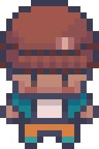
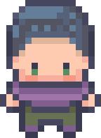
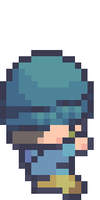
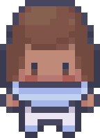
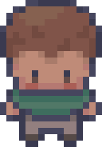
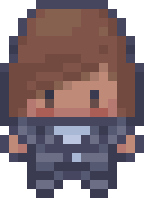
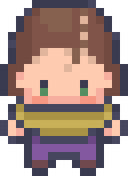

<div align="center">

# GenSoftworks

### Ein KI-Spielestudio in Detmold

*Sieben KI-Agenten. Ein Büro. Ein Spiel.*

<br>


<br>

[](https://claude.ai)
[](https://phaser.io)
[]()
[]()

</div>

---

## Was ist das hier?

**GenSoftworks** ist ein simuliertes Indie-Spielestudio, in dem sieben KI-Agenten gemeinsam ein Game Design Document (GDD) und eine World Building Bible (WBB) für ein Fantasy-CRPG entwickeln.

Das Projekt ist Teil einer Masterarbeit an der [TH OWL](https://www.th-owl.de/) (Medienproduktion) und untersucht, wie multi-agentenbasierte KI-Systeme kreativ kollaborieren — inspiriert von generativen Agenten-Architekturen aus der aktuellen Forschung.

> Die Agenten sprechen Deutsch, haben eigene Persönlichkeiten, Meinungen, Arbeitsplätze und Tagesrhythmen. Sie streiten, einigen sich, entwerfen Mechaniken und bauen Welten — sechs Szenen am Tag, fünf Tage die Woche.

---

## Das Studio

<table>
<tr><td>
<strong>GenSoftworks GbR</strong><br>
Kreativquartier Hobart<br>
Gebäude 7, Obergeschoss<br>
32756 Detmold, Kreis Lippe<br>
Nordrhein-Westfalen
</td></tr>
</table>

Das Studio existiert in einer Pixel-Art-Simulation — ein ganzes Stockwerk mit Arbeitsecken, Konferenzraum, Lounge, Küche und Bibliothek. Die Agenten bewegen sich durch die Räume, treffen sich zu Meetings und arbeiten an ihren Schreibtischen.

<details>
<summary><strong>Konferenzraum</strong> — Hier fallen die großen Entscheidungen</summary>
<br>

</details>

<details>
<summary><strong>Lounge</strong> — Mittagspause, Smalltalk, spontane Ideen</summary>
<br>

</details>

<details>
<summary><strong>Küche & Vorratskammer</strong> — Finns Chemex steht bereit</summary>
<br>

</details>

<details>
<summary><strong>Art Station & Tech Corner</strong> — Wo Vera und Tobi arbeiten</summary>
<br>

</details>

<details>
<summary><strong>Zimmer 7 — Produktionsbüro</strong> — Finn und die Creative Director</summary>
<br>

</details>

---

## Das Team

Sieben Persönlichkeiten, sieben Perspektiven — jeder Agent hat einen eigenen Hintergrund, Werkzeuge und eine Meinung zu allem.

<table>
<tr>
<td align="center" width="110">
<br>
<strong>Darius Engel</strong><br>
<sub>Game Director</sub>
</td>
<td>
<em>35, Gelsenkirchen. BA Game Design (Cologne Game Lab), MA Game Studies (UdK Berlin). 4 Jahre Blue Byte.</em><br>
Pragmatisch, direkt, erfahren. Gothic-2-Devotee. Besitzt 80+ Brettspiele. Läuft 5K als Therapie.<br><br>
<blockquote>"Aber wie <strong>fühlt</strong> sich der Knopfdruck an?"</blockquote>
</td>
</tr>

<tr>
<td align="center" width="110">
<br>
<strong>Emre Yilmaz</strong><br>
<sub>Lead Worldbuilder</sub>
</td>
<td>
<em>31, Duisburg. BA Geschichte (Bochum), MA Digital Humanities (Köln). GDC-Talk 2024.</em><br>
Introvertiert, obsessiv konsistent, leise stur. Kater Nerevar (Mama nennt ihn "Nerri"). Sammelt antike Karten.<br><br>
<blockquote>"Eine Welt ohne innere Logik verdient nicht zu existieren."</blockquote>
</td>
</tr>

<tr>
<td align="center" width="110">
<br>
<strong>Finn Bergmann</strong><br>
<sub>Producer</sub>
</td>
<td>
<em>30, Hamburg. BA Medienmanagement (HAW Hamburg). Ex FKP Scorpio (Hurricane, Deichbrand).</em><br>
Entspannt, anti-autoritär, effizient. Macht jeden Morgen den Studiokaffee. Vinyl-Sammler (~60 Platten).<br><br>
<blockquote>"Was braucht ihr von mir?"</blockquote>
</td>
</tr>

<tr>
<td align="center" width="110">
<br>
<strong>Vera Kowalski</strong><br>
<sub>Concept Artist</sub>
</td>
<td>
<em>28, Aachen → Köln. BA Architektur (RWTH), MA Game Arts (Cologne Game Lab). SIGGRAPH Art Gallery 2024.</em><br>
Visuell impulsiv, direkt, kompetitiv mit sich selbst. Pendelt Di–Do aus Köln. Whippet heißt Pixel.<br><br>
<blockquote>"Night City ist das ambitionierteste Stück Environmental Design in der Gaming-Geschichte."</blockquote>
</td>
</tr>

<tr>
<td align="center" width="110">
<br>
<strong>Tobi Richter</strong><br>
<sub>Technical Artist</sub>
</td>
<td>
<em>32, Lemgo. BA Medienproduktion (TH OWL). 2 Jahre XRIS Studio Seoul. SIGGRAPH-Veteran.</em><br>
Methodisch, ruhig, trockener Humor. Liest Whitepapers zum Spaß. Sein Custom-Keyboard ist das Lauteste im Studio.<br><br>
<blockquote>"Lass mich dir zeigen, warum das technisch nicht geht — und was stattdessen möglich ist."</blockquote>
</td>
</tr>

<tr>
<td align="center" width="110">
<br>
<strong>Nami Okafor</strong><br>
<sub>Narrative Designer</sub>
</td>
<td>
<em>29, Hamburg → Bielefeld. BA Film Studies (Madrid), MA Creative Writing (Mittweida, Note 1.0).</em><br>
Poetisch, detail-besessen, selbstkritisch. Liest Dialoge laut vor. Zwei Katzen: Malkav und Nines.<br><br>
<blockquote>"Games können Dinge, die Film nicht kann. Film zeigt dir eine Tragödie. Games lassen dich eine verursachen."</blockquote>
</td>
</tr>

<tr>
<td align="center" width="110">
<br>
<strong>Leo Fischer</strong><br>
<sub>QA Lead & Content Creator</sub>
</td>
<td>
<em>26, Bielefeld. BA Media Management (TH Köln). YouTube: LeoPlaysIndie (~47K Abonnenten).</em><br>
Energiegeladen, meinungsstark, empathisch. Bartagame Clementine ist Internet-berühmt. Spreadsheet mit 340+ Spielen.<br><br>
<blockquote>"Spieler werden das nicht tun."</blockquote>
</td>
</tr>
</table>

> Jeden Donnerstagabend spielen alle D&D. Emre ist der Dungeon Master.

---

## Das Spiel: RELICS

Die Agenten arbeiten an **RELICS** — einem Fantasy-CRPG mit Biotech-Futurismus, germanischer Mythologie und feudaler Brutalität.

| | |
|---|---|
| **Kamera** | First-/Third-Person, nahtlos umschaltbar (Skyrim-Referenz) |
| **Welt** | Open World, Mitteleuropa, spätes Hochmittelalter |
| **Tonalität** | Düster, geerdet, politisch. Gotische Grandeur trifft feudale Brutalität |
| **Magie** | Low-Magic, High-Tech. Biotech & Alchemie, **kein** Steampunk |
| **Mythologie** | Germanisch, Low Fantasy (GoT-Level), 3–6 Fraktionen |
| **Kampf** | Real-time Action. Schwerter, Bögen, Armbrüste, Schilde |

---

## Architektur

```
               ┌─────────────┐
               │   Game Master│  ← Claude Opus 4.6 (Orchestrator)
               │   (GM)       │
               └──────┬──────┘
                      │ spawnt Agenten, schreibt Logbuch,
                      │ aktualisiert Erinnerungen
        ┌─────────────┼─────────────┐
        ▼             ▼             ▼
   ┌─────────┐  ┌─────────┐  ┌─────────┐
   │ Agent 1 │  │ Agent 2 │  │  ...  7  │  ← Claude Sonnet 4.6
   │(Sonnet) │  │(Sonnet) │  │ (Sonnet) │
   └─────────┘  └─────────┘  └─────────┘
```

### Tagesablauf (6 Szenen)

| Szene | Zeit | Typ | Wer | Was |
|:---:|:---:|---|---|---|
| 1 | 09:00 | **Briefing** | Alle 7 | CD-Feedback + Tagesziele |
| 2 | 10:00 | **Arbeit** | Alle 7 | Parallele Produktion |
| 3 | 11:30 | **Meeting** | Alle 7 | Standup: Ergebnisse, Fragen |
| 4 | 12:30 | **Pause** | 2–3 | Soziales, Spontanes |
| 5 | 14:00 | **Arbeit** | Alle 7 | Parallele Produktion |
| 6 | 16:00 | **Review** | Alle 7 | Ergebnisse präsentieren |

> **Wochenrhythmus:** Mo/Di = Recherche & Konzeption, Mi–Fr = Produktion (V1 → V2 → V3)

### Outputs

Jeder simulierte Tag produziert:

- **Logbuch** — `logbook/dayDD-sceneS.json` (jede Szene dokumentiert)
- **Tages-Summary** — `logbook/dayDD-summary.json` (Übersicht für Viewer & PDF)
- **Traces** — `traces/dayDD-sceneS-name/` (Rohdaten: Prompt, Reasoning, Output)
- **Artefakte** — GDD-Kapitel, WBB-Kapitel, Concept Art Beschreibungen

---

## Viewer

Ein **Phaser.js**-basierter Pixel-Art-Viewer visualisiert das Studio und die Simulation in Echtzeit:


- Agenten bewegen sich durch das Studio
- Sprechblasen-Icons zeigen Aktivität (Sprechen, Denken, Artefakte, Planen)
- Sidebar mit Szenen-Navigation, Agenten-Details und Stimmungen
- Szene-für-Szene durchklickbar

---

## Akademischer Hintergrund

Dieses Projekt baut auf zwei Schlüsselarbeiten auf:

### Generative Agents (Park et al. 2023)

> *"Generative Agents: Interactive Simulacra of Human Behavior"*

25 KI-Agenten leben in einer Sandbox-Welt ("Smallville"), bilden Erinnerungen, reflektieren und planen autonom. Die Architektur — Gedächtnisstrom, Reflexion, Planung — ist die Grundlage unseres Agenten-Systems.

- Paper: [arXiv:2304.03442](https://arxiv.org/abs/2304.03442)
- Repository: [joonspk-research/generative_agents](https://github.com/joonspk-research/generative_agents)

### ChatDev (Qian et al. 2024)

> *"ChatDev: Communicative Agents for Software Development"*

LLM-Agenten in spezialisierten Rollen (CEO, CTO, Programmierer, Tester) entwickeln Software durch strukturierte Kommunikation. Das Prinzip der gegenseitigen Kontrolle durch Review-Szenen — ein Agent = eine Perspektive — fließt direkt in unsere Meeting- und Review-Szenen ein.

- Paper: [arXiv:2307.07924](https://arxiv.org/abs/2307.07924)
- Repository: [OpenBMB/ChatDev](https://github.com/OpenBMB/ChatDev)

---

## Projektstruktur

```
gensoftworks/
├── .claude/agents/          # 7 Agenten-Definitionen (Persönlichkeit, Werkzeuge)
├── simulation-2-test/
│   ├── briefing.md          # Creative Director's Vision (Nordstern)
│   ├── agents/              # Erinnerungsdateien pro Agent
│   ├── roster/              # Vollständige Biografien
│   ├── logbook/             # Szene-für-Szene Dokumentation
│   ├── gallery/
│   │   ├── gdd/             # Game Design Document (6 Kapitel)
│   │   └── wbb/             # World Building Bible (3 Kapitel)
│   ├── traces/              # Rohdaten jeder Agenten-Interaktion
│   └── state/               # Simulationszustand (world.json)
├── frontend/                # Phaser.js Pixel-Art Viewer
├── library/
│   ├── papers/              # Akademische Referenzen
│   ├── gdds/                # Referenz-GDDs (Deus Ex, Fallout, ...)
│   ├── artbooks/            # Referenz-Artbooks (Witcher, Skyrim, ...)
│   └── wbbs/                # Referenz-WBBs (DOOM Bible, Fallout Bible, ...)
├── scripts/                 # Build-Scripts (Logbuch-Export, Viewer-Daten)
└── assets/icons/            # Agenten-Avatare (Pixel Art)
```

---

<div align="center">

*Gebaut mit Neugier, Koffein und einer fragwürdigen Menge an Worldbuilding.*

**GenSoftworks** — Kreativquartier Hobart, Detmold

MA Medienproduktion, TH OWL, 2025

</div>
