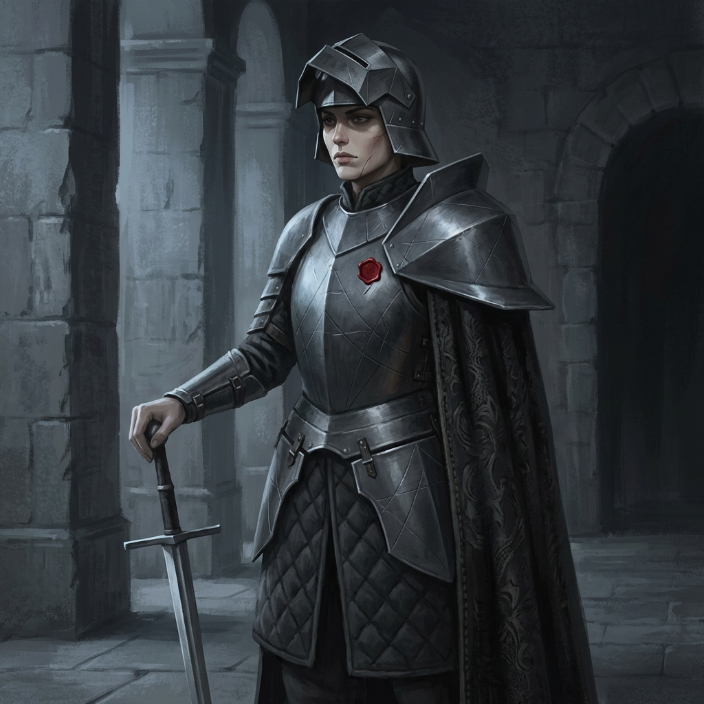
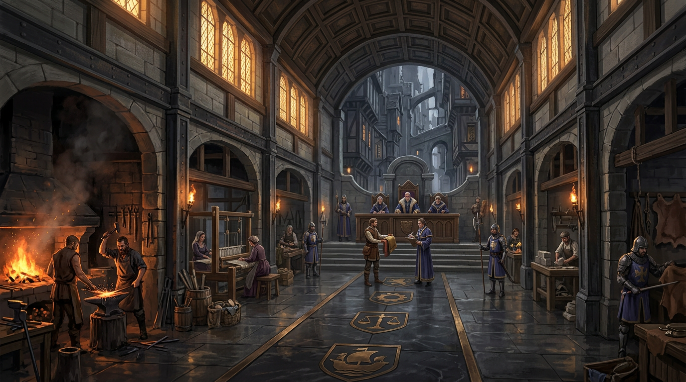
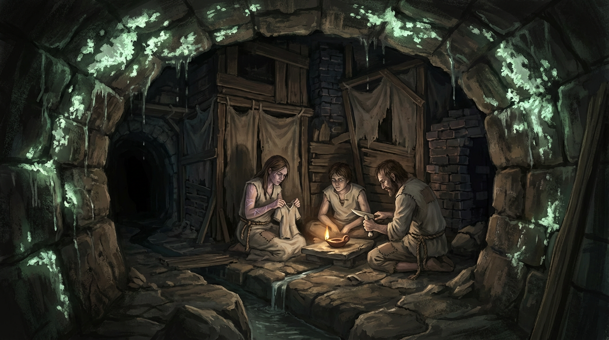
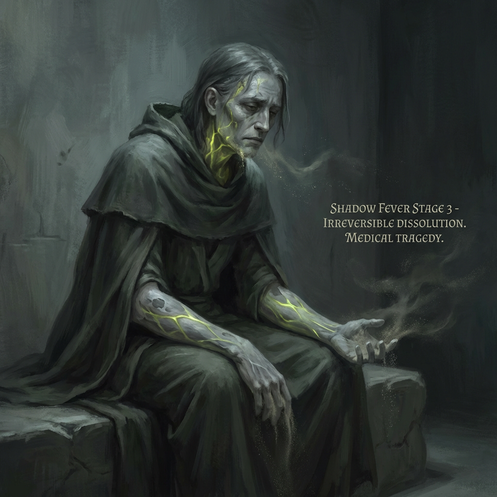

# GDD Kapitel 01 — Spielübersicht & Design-Säulen

<!-- Darius: v3 — Kürzung für Seitenbudget (83→60 PDF-Seiten). Keine neuen Inhalte. Abschnitte gestrafft, Abgrenzungstabelle komprimiert, Tabelle 10 auf Kernfakten reduziert. Bilder von Pinnwand eingebaut. Orden-Symbol: SIEGEL (bestätigt, kein Kreuz). -->

---

## 1. Projekttitel & Format

**Serientitel:** RELICS
**Erste Iteration:** RELICS: Der Schwellenanker
**Format:** Single-Player Computer-Rollenspiel
**Perspektive:** Third-Person / First-Person, nahtlos umschaltbar
**Monetarisierung:** Premium — keine Mikrotransaktionen. Große DLCs nach Full Release.

---

## 2. High Concept Statement

RELICS fragt: *Wem gehört diese Welt — und was bist du bereit zu tun, um darin zu überleben?*

Du bist ein Fremder. Die Stadt vor dir funktioniert ohne dich — sie hat Regeln, Mächte, Hierarchien, die sich über Jahrhunderte eingeschliffen haben. Drei Fraktionen teilen die Welt: die Krone mit ihrem Militär und leeren Kassen, die Gilden mit ihren Monopolen, der Orden mit seinem Wissen und seiner Inquisition. Keine ist gut. Keine ist böse. Alle sind konsequent.

Und dann gibt es das Schattenfieber. Eine Seuche, die den Körper verändert. Jede Fraktion hat eine andere Erklärung — alle liegen falsch, aber jede liegt anders falsch. Unter der Stadt wartet der **Schwellenanker**: das, was die Grenze zwischen den Ebenen des Seins zusammenhält. Er schwächt sich ab. Das Fieber breitet sich aus.

Du wirst hineingezogen, ob du willst oder nicht. Was du daraus machst — das ist das Spiel.

---

## 3. Spieler-Fantasie-Statement

**"Ich betrete als Fremder eine aufregende Sandbox."** *(Briefing, unveränderlich)*

Drei konkrete Fantasien:

1. **Agentschaft:** Ich löse jedes Problem auf meine Weise — schleichen, kämpfen, verhandeln.
2. **Aufstieg:** Vom Eisengerät zu Titan-Legierungen. Mein Körper ist mein Fortschrittsanzeiger.
3. **Konsequenz:** Meine Entscheidungen formen die Welt. Wer für die Gilden arbeitet, dem verschließt der Orden Türen.

---

## 4. Game Feel

*Ich stehe am Rand einer lebendigen, gefährlichen Welt und spüre, dass meine nächste Entscheidung etwas verändert.*

- **Schwere.** Kämpfe kosten etwas. Schwerthieb fordert Kraft, Parade fordert Timing.
- **Reibung.** Die Stadt gibt sich nicht preis. Gilden-Tore sind gesperrt. Ordenswächter beobachten.
- **Staunen + Bedrohung.** Biolumineszenz in den Kanälen leuchtet schön — weil dort das Fieber am stärksten ist.
- **Dichte.** Jeder NPC hat eine Funktion, einen Tagesablauf. Niemand steht als Dekoration herum.

---

## 5. Genre & Perspektive

| Parameter | Wert |
|---|---|
| Genre | Action-RPG / Immersive Sim |
| Ton | Dark Fantasy — düster, geerdet, politisch |
| Setting | Medieval Cyberpunk: frühes Spätmittelalter + High-Tech-Materialien |
| Perspektive | Third-Person (Standard) / First-Person (umschaltbar) |
| Weltstruktur | Semi-Open-World: dichte, handgefertigte Kernregion |
| Kampf | Real-Time Action, Melee-fokussiert, gewichtig |
| Magie | Keine. Alchemie + Schattenfieber-Transformationen (je nach Körperreaktion) |
| Referenzen | Gothic 2, Deus Ex, VtM: Bloodlines, Prey 2017 |

Medium-Fantasy — Low-Magic, High-Tech. Biotech-Futurismus, der sich von innen wie Alchemie anfühlt.

---

## 6. Die vier Design-Säulen

Jedes Feature muss gegen mindestens zwei Säulen bestehen. Features, die keine stärken, werden gestrichen.

### Säule I — Immersive Simulation

*"Diese Welt reagiert auf mich. Ich bin nicht auf einem Schienen-Trip."*

Jedes Problem hat mehr als eine Lösung. NPCs verhalten sich nach eigener Logik. Verschlossene Türen bleiben verschlossen, bis der Spieler den Schlüssel hat, sie aufbricht oder einen anderen Eingang findet. Fraktionsentscheidungen haben echte systemische Konsequenzen. Mehrere Lösungswege entstehen aus dem Zusammenspiel von Fähigkeiten, Umgebung und Fraktionsstand.

**Referenz:** Warren Spector, Deus Ex GDD v5.3e: "The world simulation allows players to solve problems in a variety of ways."

### Säule II — Fraktionspolitik als Kernspannung

*"Ich wähle nicht die gute Fraktion. Ich wähle meine Fraktion."*

| Fraktion | Ressource | Gameplay-Zugang |
|---|---|---|
| **Die Krone** | Territorium, Militärpassagen, Rechtsstatus | Schutz, Bewegungsfreiheit, Ehrentitel |
| **Die Gilden** | Materialien, Handwerksrezepturen, Schwarzmarkt | Crafting-Tiefe, Upgrade-Pfade, Händler-Netzwerke |
| **Der Orden** | Wissen, Fertigkeitsbücher, Bildungsmonopol | Skill-Upgrades, Lore-Zugang, Heilkunde |

Fraktionsruf ist der Schlüssel zu konkreten Spielsystemen. Kein moralischer Zeigefinger.


*Konzeptbild: Krone-Materialpalette — Titan-Legierungen, Edelstahl, Damaszener-Stahl. Militärischer Anspruch, leere Grandeur.*


*Konzeptbild: Gilden-Materialpalette — Erdtöne, Malachit, Bernstein, Bronzehammer. Material als Macht.*


*Konzeptbild: Orden-Materialpalette — Indigo-Siegel, versiegelte Dokumente, blutroter Siegellack. Wissen als Kontrolle.*

### Säule III — Körperlicher Fortschritt

*"Mein Körper ist mein Fortschrittsanzeiger. Ich sehe, was ich trainiert habe — und was es mich gekostet hat."*

Nervensystem-Leveling ersetzt klassische Attribut-Grids. Drei Subsysteme (Cardio, Muskel, Lymph), vier Qualitätsstufen (Untrained / Geübt / Fortgeschritten / Meister). Skill-by-Use — keine Erfahrungspunkte. Das Schattenfieber als dritte Progressionsachse: Lymph-Subsystem koppelt an Fieber-Stadien. Transformation je nach Körperreaktion — kein Spieler durchläuft sie identisch.

**Referenz:** Warren Spector, Deus Ex GDD v5.3e: Skill-Granularität über vier Qualitätsstufen.

### Säule IV — Dichte vor Breite

*"Diese Welt existierte, bevor ich ankam. Sie wird nach mir weiterexistieren."*

**Schwarzrand** ist der Kern. Eine Stadt, vertikal geschichtet (Obere Ränder / Mittelwand / Schlund), dicht belebt. Jede Zone hat eigene Materialsprache, Architektur, NPC-Typen. NPCs haben Tagesabläufe. Kein Loot-Bloat — Damaszener-Stahl ist ein Ereignis.

**Der Gothic-Kontrast zu Skyrim:** Skyrim hat 300 Orte, Gothic 2 hat Khorinis — und Khorinis *lebt*. Das ist RELICS' Versprechen.

---

## 7. Tonalität

**Düster, geerdet, politisch. Gotische Grandeur trifft feudale Brutalität.**

Die Welt ist dunkel, weil die Verhältnisse dunkel sind — nicht um des Grimdark willen. Das Schattenfieber ist das einzige Übernatürliche und wird nie trivialisiert.

- Oberschicht: All-Black, Monochrom — ein einzelner Neon-Akzent
- Unterschicht: Grau, Braun — gelegentlich ein gestohlenes Stück Farbe
- Biolumineszenz: schön und bedrohlich zugleich
- Kein Zahnrad. Keine Dampfmaschine. Keine Hexagone.

---

## 8. Zielgruppe

1. **Immersion-First Players** — Kingdom Come, Disco Elysium, Outer Wilds
2. **Faction Players** — VtM: Bloodlines, Fallout: New Vegas
3. **Crafting/Progression Freaks** — Dark Souls, Stardew Valley
4. **Medieval Aesthetics Obsessed** — Kingdom Come, Mount & Blade

**Kritisches Risiko:** Die erste Stunde ist kein Tutorial — sie ist ein Angebot. Minute fünfzehn muss vermitteln, was dieser Ort *ist*.

---

## 9. Abgrenzung

| RELICS IST | RELICS IST NICHT |
|---|---|
| Handgefertigte, dichte Welt | Leere Open World |
| Körperlicher Fortschritt sichtbar | Abstraktes Level-up |
| Drei Fraktionen ohne Moralkeulen | Gut gegen Böse |
| Schattenfieber als biologische Wahrheit | Magiesystem mit Label |
| Medieval Cyberpunk: Material als Macht | Steampunk / High Fantasy |
| Immersive Sim: mehrere Lösungswege | Schienenspiel |

---

## 10. Geklärte Design-Fragen

| # | Frage | Antwort |
|---|---|---|
| 1 | Schauplatz | EINE vertikale Stadt: **Schwarzrand** (Felssporn, drei Zonen) |
| 2 | Schattenfieber-Scope | Hauptquest + dritte Progressionsachse. Transformation je nach Körperreaktion. |
| 3 | Tiervolk | Kosmologisch-fremde Wesen in dauerhafter Symbiose mit Tieren. NPC-Händler, nicht spielbar. |
| 4 | Release-Modell | Streamer-Alpha → Beta (6–12 Mo.) → Full Release → große DLCs |
| 5 | Relikt-Name | **Der Schwellenanker** — CD-bestätigt. Fragment beim Spieler. |
| 6 | Ablehn-Option | Ja — Spieler darf Fragment ablehnen. Echte Verzweigung (→ Kap. 3). |

<!-- Darius: Alle Design-Fragen geschlossen. Orden-Symbol = SIEGEL (nicht Kreuz) — in allen Texten durchgängig korrekt. Fantasie-Spalte aus Fraktionstabelle entfernt für Kürze — lebt in Kap. 2 weiter. -->

\clearpage

# GDD Kapitel 02 — Kernmechaniken

<!-- Darius: v3 — Massive Kürzung für Seitenbudget (83→60 PDF-Seiten). Tiervolk-Abschnitt 2.6 auf Tabelle komprimiert. Systeminteraktionen 2.7 von 7 auf 4 Kerninteraktionen gekürzt. Balancing-Detailwerte in HTML-Kommentare. Bilder von Pinnwand eingebaut. Keine neuen Inhalte. Orden-Symbol = SIEGEL (kein Kreuz). -->

---

## Überblick

Sechs Kernsysteme, jedes direkt aus den Design-Säulen abgeleitet:

1. **Kampfsystem** — Säule I + III
2. **Nervensystem-Leveling** — Säule III + I
3. **Crafting & Materialsystem** — Säule II + IV
4. **Fraktionsruf-System** — Säule II + I
5. **Schattenfieber-Progression** — Säule III + II
6. **Händlernetz & Tiervolk** — Säule II + IV

---

## 2.1 Kampfsystem

### Spieler-Fantasie

*"Jeder Kampf kostet mich etwas. Wenn ich gewinne, habe ich es mir verdient."*

### Designprinzipien

Kämpfe sollen sich anstrengend anfühlen, nicht befriedigend-flüssig. Das Kampfsystem ist eine mechanische Umsetzung von Schwere und Konsequenz.

**Referenz:** Gothic 2 (Kampf als Risiko), Dark Souls (Positionierung, Gewicht, Kosten).

### Kernmechaniken

**Ausdauersystem (Stamina):** Zentrale Kampfressource. Jede Aktion kostet Ausdauer — leichte Angriffe wenig, schwere viel, Parade moderat. Erschöpfung macht anfällig. Kapazität und Regeneration sind mit dem Cardio-Subsystem verknüpft (→ 2.2).

**Positionierung:** Angriffe von hinten ignorieren Vorderrüstung, Seitenangriffe umgehen Paraden. Engpässe sind überlebensnotwendig gegen Gruppen.

**Waffenklassen:**

| Klasse | Stärke | Besonderheit |
|---|---|---|
| Einhandschwert | Ausgewogen, schnell | Schildkombination |
| Zweihandschwert | Hoher Schaden, Reichweite | Rüstungsdurchdringung |
| Dolch | Sehr schnell, niedrige Kosten | Schleich-Finisher |
| Axt | Stark gegen Rüstung | Ignoriert anteilig Rüstungsschutz |
| Streitkolben | Effektiv gegen Platte | Betäubungseffekt |
| Bogen | Distanz, leise | Schwachstellen-Targeting |
| Armbrust | Höchste Durchschlagskraft | Durchdringt schwere Rüstung |

Keine Waffe ist "die beste" — Auswahl hängt von Gegner, Umgebung und Muskel-Stand ab.

**Alchemie im Kampf:** Stärkungstränke mit Nachkater, langsame Heilmittel, Schwellensubstrat-Extrakte mit Lymph-Kosten.

**Kampf vs. Ausweichen:** Das System belohnt nicht maximale Kämpfe. Soziale Lösungen, Stealth, alternative Routen existieren als gleichwertige Optionen.

---

## 2.2 Nervensystem-Leveling

### Spieler-Fantasie

*"Ich sehe meinen Fortschritt. Ich sehe, was er mich gekostet hat."*

### Das System

Drei Subsysteme ersetzen klassische Erfahrungspunkte vollständig. Skill-by-Use, vier Qualitätsstufen (Untrained / Geübt / Fortgeschritten / Meister). Visualisierung: halbtransparente Körperansicht mit leuchtenden Nervenbahnen.


*Konzeptbild: Die drei Relikt-Zustände — ruhend, aktiviert, aufgelöst. Die biolumineszente Gefäßsprache gilt auch für das Nervensystem-Leveling-Interface.*

### Die drei Subsysteme

| Subsystem | Trainiert durch | Mechanische Auswirkung | Stufe IV (Meister) |
|---|---|---|---|
| **Cardio** | Sprinten, Ausdauerkämpfe, Klettern, Flucht | Ausdauer, Bewegungsgeschwindigkeit, Regeneration | Ausdauer kein limitierender Faktor |
| **Muskel** | Nahkampf, Tragen, physische Arbeit | Schadenswerte, Tragegewicht, Rüstungseffizienz | Schwere Zweihandwaffen bevorzugt |
| **Lymph** | Alchemika, Schwellensubstrat-Exposition, Heilrituale | Fieber-Widerstand, Transformationen, Risiko | Irreversibel, massiver Power-Spike + Kontrollverlust |

<!-- Darius: Balancing-Detailwerte pro Stufe: Cardio I→IV Ausdauerkapazität 100/150/220/300, Regeneration 5/8/14/22 pro Sek. Muskel I→IV Schadensmodifikator ×1.0/×1.3/×1.7/×2.2, Tragegewicht 30/50/75/110. Lymph-Akkumulation: Schwellensubstrat-Extrakt +8 Lymph, Dünnstellen-Aufenthalt +2/min, Ordensritual +4 (kontrolliert). Stufenschwellen: I→II bei 100 Nutzungspunkten, II→III bei 350, III→IV bei 800. -->

**Qualitätsstufen-Übergänge:** Kein Fanfare, keine Leveling-Bildschirme. Die Nervensystem-Ansicht leuchtet kurz auf. Der Spieler merkt es an der Performance.

**Muskel III+ ist Voraussetzung** für sinnvolle Nutzung von Materialklasse IV — die besten Materialien kaufen reicht nicht, der Körper muss folgen.

**Körperreaktion als Variable (Lymph):** Stufe II und III verlaufen nicht identisch. Die Transformation hängt von Expositionsquelle, Fraktionspfad und körperlicher Baseline ab. *"Das Fieber macht etwas aus mir — etwas, das kein anderer Spieler sieht."*

---

## 2.3 Crafting & Materialsystem

### Spieler-Fantasie

*"Ein Stück Damaszener-Stahl ist ein Ereignis."*

### Materialklassen

| Klasse | Beispiele | Zugang | Status |
|---|---|---|---|
| **I** | Eisen, Zinn, Knochen | Frei verfügbar | Gesetzlos |
| **II** | Tiegelstahl, Silber, Malachit | Gilden-Markt | Handwerker |
| **III** | Damaszener-Stahl, Bergkristall | Gilden-Ruf: Anerkannt | Gilden-Mitglied |
| **IV** | Titan-Legierungen, Roségold | Gilden-Ruf: Vertraut + Krone-Pass | Oberschicht |
| **V** | Schwellenlegierungen, -fäden, -linsen | Gilden: Meister ODER Schlund-Schwarzmarkt | Verboten |

Keine Loot-Inflation. Ein Klasse-III-Schwert mit Muskel III übertrifft ein Klasse-IV-Schwert mit Muskel I.

### Handwerk-Mechanik

- **Aktives Crafting:** Werkbank, vereinfachte Handwerks-Sequenz
- **Werkzeug-Erfordernisse:** Meister-Schmieden sind Gilden-Territorium
- **Rezepturen:** Wissensgegenstände, nicht automatische Freischaltungen. Klasse I–II frei, III–IV erfordern Gilden-Zugang, V liegt in Gilden/Orden-Archiven.
- **Qualitätsvarianten:** Grundlegend / Ordentlich / Meisterwerk — abhängig von Material, Werkzeug und Erfahrung

### Rüstung als sozialer Ausdruck

Rüstungsklasse beeinflusst Ausdauerkosten, Material definiert Schutzwerte und NPC-Reaktionen. Jedes Körperteil unabhängig ausrüstbar. Verfall und Reparatur als Alltagshandlung.

---

## 2.4 Fraktionsruf-System

### Spieler-Fantasie

*"Ich habe mir diese Tür verdient. Oder ich habe sie mir verbaut."*

### Ruf-Stufen

| Stufe | Bezeichnung | Zugang |
|---|---|---|
| 0 | **Feindselig** | Tore geschlossen, NPCs greifen an |
| I | **Unbekannt** | Öffentliche Bereiche |
| II | **Bekannt** | Basisaufgaben, erste innere Tore |
| III | **Anerkannt** | Mittlere Materialien, Fraktions-Infrastruktur |
| IV | **Vertraut** | Elite-Materialien, Insider-Informationen |
| V | **Meister** | Vollzugang (Schwellen-Materialien / Kronpassagen / Orden-Archive) |

**Kommunizierende Röhren:** Was bei der Krone gewinnt, verliert bei Gilden oder Orden. Maximierung bei allen drei gleichzeitig ist nicht möglich.

**Ruf-Quellen:** Fraktionsquests (Hauptquelle), Welthandlungen (stiller Buchhalter), Dialoge, Handels-Reputation.

**Point of No Return:** Jede Fraktion hat einen quest-spezifischen Punkt, der sich erst rückwirkend als solcher zeigt.

<!-- Darius: Ruf-Schwellenwerte (Balancing): Unbekannt→Bekannt bei 50 RP, Bekannt→Anerkannt bei 200, Anerkannt→Vertraut bei 500, Vertraut→Meister bei 1000. Feindselig-Schwelle bei -100. Cross-Faction-Verlust: +10 Krone = -3 Gilden, -5 Orden (asymmetrisch je nach Quest). -->

### Gilden-Mikropolitik

Neben dem Gesamt-Gildenruf gibt es Einzel-Ruf bei spezifischen Gilden (Schmiede, Glasmacher, Gerber, Weber). Wer gezielt eine Gilde hofiert, bekommt spezifische Tiefe statt generischen Zugang.

---

## 2.5 Schattenfieber-Progression

### Spieler-Fantasie

*"Ich sehe, was das Fieber aus mir macht. Es macht etwas anderes als aus anderen."*

Das Schattenfieber ist keine Krankheit, die man heilt — es ist ein biologischer Zustand, den man navigiert. Direkt an das Lymph-Subsystem gekoppelt (→ 2.2).


*Konzeptbild: Schwellenanker in aktiviertem Zustand — biolumineszente Gefäßlinien, die visuelle Sprache der Schattenfieber-Transformation.*

### Die drei Fieber-Stadien

| Stadium | Lymph-Stufe | Vorteile | Kosten | Reversibilität |
|---|---|---|---|---|
| **Flüstern** | II | Erweiterte Sinne, Schwellen-Objekte sichtbar | Wahrnehmungsstörungen, leichte Veränderungen | Vollständig reversibel |
| **Wandlung** | III | Physische Buffs, Immunität gegen leichte Exposition | Erinnerungsfragmentierung, sichtbare Veränderungen, Krone-Ruf sinkt | Nicht heilbar, managebar |
| **Entgrenzung** | IV | Extremer Power-Spike, direkte Schwellen-Interaktion | Kontrollverlust, narrative Einengung | Irreversibel ohne Schwellenanker |

**Körperreaktions-Varianz:** Dasselbe Stadium sieht bei drei Spielern verschieden aus. Transformation hängt ab von: Expositionsquelle, Fraktionspfad, körperlicher Baseline.

### Drei Fraktions-Antworten

| Fraktion | Strategie | Gameplay |
|---|---|---|
| **Krone** | Unterdrückung — Lymph-Wert aktiv senken | Kein Fieber-Vorteil/Kosten, kompensiert durch Ausrüstung |
| **Gilden** | Verwertung — Plateau bei Stadium I, kurzzeitig Stadium II | Ressourcenintensiv, bindet an Wirtschaftsmechanik |
| **Orden** | Destillation — kontrollierter Aufstieg mit Stabilisierung | Kostenlos (Preis: Zeit, Verpflichtung, Schuld) |

**Der Schwellenanker als Stabilisator:** Ein Spieler mit Fragment kann Stadium III partiell stabilisieren — keine Heilung, aber Schutz vor Identitätsverlust. Das ist der mechanische Kern des Hauptquests.

---

## 2.6 Händlernetz & Tiervolk

### Spieler-Fantasie

*"Es gibt Händler, die andere nicht kennen — und Waren, die nur sie führen."*


*Konzeptbild: Tiervolk-Händler — kosmologisch-fremde Wesen in dauerhafter Symbiose mit Tieren. Leicht alien, nicht tribal.*

Das Tiervolk sind kosmologisch-fremde Wesen in dauerhafter, irreversibler Symbiose mit Tieren. Ihre Handelsmotivation: Sie brauchen Materialien zur Stabilisierung der Symbiose.

| Eigenschaft | Fraktionshändler | Tiervolk |
|---|---|---|
| Standorte | Fest, territorial | Fluktuierend, schwellennah |
| Ruf-System | 5 Stufen, skalierbar | Binäres Vertrauen (fair/unfair) |
| Fraktionsbindung | An eine Fraktion gebunden | Unabhängig — versorgt auch verbrannte Spielfiguren |
| Spezialwaren | Materialklasse I–V via Ruf | Symbiose-Materialien, Navigations-Wissen, Körperreaktions-Alchemika |

**Salva** (→ Kap. 4) ist der Haupt-Kontakt: Informationsbroker, Kontext-Lieferant, Einführung ins Tiervolk-System. Er erscheint nicht immer — sein Bewegungsmuster ist erlernbar.


*Konzeptbild: Tiervolk-Marktszene — fluktuierende Handelspositionen an Übergangszone Gürtel/Schlund.*

<!-- Darius: Tiervolk-Warenkategorien (Detail): A = Symbiose-Materialien (Import — Tiervolk kauft vom Spieler: Schwellensubstrat-Konzentrationen, Schwellenpilz-Derivate, biologische Proben). B = Exklusive Waren (Export — organische Materialien, Dünnstellen-Navigationswissen, Alchemika die Körperreaktion modifizieren). C = Informationen (Dünnstellen-Verbindungen, Schwellen-Fauna, Gerüchte jenseits Schwarzrand). Symbiose-Stabilisierungs-Quests: Beschaffung, Erkundung, seltene Schutzaufträge. -->

---

## 2.7 Systeminteraktionen

Die sechs Kernsysteme wirken zusammen. Vier Kerninteraktionen:

**Kampf × Nervensystem × Schattenfieber:** Jeder Kampf trainiert Cardio und Muskel. Wer mit Schwellensubstrat-Extrakten kämpft, gewinnt Macht und trainiert ungewollt das Lymph-System. Die ultimative Abwägung: kurzfristige Kampfkraft gegen langfristige Transformation.

**Crafting × Fraktionsruf:** Bessere Materialien erfordern höheren Fraktionsruf. Das bindet Crafting an Fraktionsentscheidungen. Muskel III+ ist Voraussetzung für Klasse-IV-Ausrüstung — "Day-One-Endgame-Gear" ist ausgeschlossen.

**Schattenfieber × Fraktionsruf:** Fieber-Status verändert Fraktions-Reaktionen. Stadium II schließt Krone-Zugänge. Die Gilden sind die einzige Fraktion, die Fieber-Träger ohne Stigma bedient.

**Tiervolk × Alle Systeme:** Das Tiervolk ist das systemische Sicherheitsnetz: unabhängig von Fraktionsruf, liefert Klasse-V-Materialien (Sonderweg), kauft Schattenfieber-Produkte, bietet Körperreaktions-Alchemika. Für verbrannte Spielfiguren der einzige verbleibende Zugang.

<!-- Darius: v3 vollständig. Gekürzt von ca. 14 auf ca. 8 Seiten. Tiervolk-Abschnitt 2.6 von Fließtext auf Tabelle + Kernaussagen. Systeminteraktionen 2.7 von 7 auf 4 konsolidiert. Balancing-Werte in Kommentare verschoben. Bilder von Pinnwand eingebaut. -->

\clearpage

# GDD Kapitel 03 — Erzählkonzept

<!-- Darius: v3 — Massive Kürzung für Seitenbudget. Zeitlinie 3.1 auf halbe Länge komprimiert. Nebenquests auf Stichpunkte reduziert. Redundanzen mit Kap. 4 (Schlüsselfiguren) entfernt — NPC-Details leben dort. Erzählerische Prinzipien 3.7 gestrafft. Bilder von Pinnwand eingebaut. Keine neuen Inhalte. -->

---

## Überblick

Das Erzählkonzept definiert, *wie* die Geschichte erzählt wird. Die Handlung ist ein Werkzeug, um die vier Design-Säulen erfahrbar zu machen.

**Zentrales Prinzip:** Der Spieler ist kein Held. Er ist ein Fremder in einer Situation, die ohne ihn bereits bestand.

**Struktur:** Drei Akte, drei Fraktionspfade, mehrere sich überschneidende Questlinien. Kein Akt ist vollständig linear.

---

## 3.1 Zeitlinie der Öffnung

Vor rund fünfundzwanzig Jahren öffnete eine Koalition aus Orden, Gilden und Krone die Ankerkammer. In den ersten Jahren schien wenig zu passieren. Das Schattenfieber — vorher eine seltene Kuriosität im Schlund — wurde häufiger. Dann nicht mehr ignorierbar.

Schwarzrands Reaktion war Verwaltung, nicht Alarm: Quarantänezonen als schrittweise Normalisierung, Berichte, Komitees, Sonderzonen. Heute ist der Schlund ein vergessener Ort. Das Fieber eine Realität, die alle kennen und niemand ausspricht.

**Erzählerische Funktion:** Der Fremde kommt nicht in eine akute Krise, sondern in eine Stadt im Dauerzustand verwalteter Katastrophe. Die Routine ist der erste Riss: die Normalität des Abnormalen.


*Konzeptbild: Schwarzrand Kanalzone — wo Oberwelt und Schlund sich treffen. Die vertikale Schichtung als Erzählraum.*

---

## 3.2 Intro-Sequenz — "Was er in der Hand hielt"

### Spieler-Fantasie

*"In den ersten fünfzehn Minuten muss ich verstehen, was dieser Ort ist — nicht durch Exposition, durch Erleben."*

### Die Szene

Früher Morgen, Nebel. Hieronymus Vael liegt am Stadtrand — Schattenfieber Stadium III. Er hält eine biolumineszente Scherbe. Die Szene dauert maximal drei Minuten.

### Die Ablehn-Option

**CD-Entscheid:** Der Spieler darf das Fragment ablehnen. Echte Verzweigung, keine Illusion.

| | Annehmen (Standard) | Ablehnen |
|---|---|---|
| Fragment | Sofort im Inventar | Ein Fraktionsbote nimmt es |
| Schattenfieber | Lymph-Wert steigt sofort | Langsamer, aus der Umgebung |
| Fraktionskontakt | Angebote | Verhör (Spieler ist Zeuge) |
| Akt 1 | Direkter Hauptquest-Zugang | Fragment aufspüren, mehr Stadtkenntnis |
| Langfristig | Gleiche zentrale Frage ab Beat 3 | Perspektive: Träger vs. Zeuge |

### Beat-Struktur

1. **Ankunft** — Stadtrand, Nebel, sterbender Mann
2. **Die Scherbe** — Vael spricht, Spieler entscheidet
3. **Drei Boten** — Krone (Uniformierte), Orden (ziviler Brief), Gilden (Kast "zufällig" am Markt)
4. **Erster Kontakt** — Spieler spricht mit einem Boten zuerst. Erste nicht-erzwungene Entscheidung.
5. **Schwarzrand** — Die Stadt. Vertikale Schichtung. Der Spieler hat keine Ahnung, wo er steht.

---

## 3.3 Akt 1 — Das Fragment

*"Ich verstehe gerade, was dieser Ort bedeutet — eine Stadt, die sich seit Jahren langsam verändert."*

**Umfang:** 8–12 Spielstunden. Die Welt atmen lassen, bevor der erste Kulminationspunkt kommt.

**Schlüssel-Beats:**

- **Drei Fraktionskontakte** — Brenn (Krone) will das Fragment, Scherer (Orden) will es untersuchen, Kast (Gilden) will es analysieren. Reihenfolge frei. Alle haben gute Argumente, keines vollständig wahr.
- **Verwaltungs-Alltag** — Quarantäne-Protokolle, die Jahre laufen. Händler, die Schwellenmaterialien routiniert verkaufen. Die Normalität des Abnormalen.
- **Erste Fraktionsentscheidung** — Eine Fraktion verlangt ein Bekenntnis. Verweigerung möglich, aber Fraktionen werden ungeduldig.
- **Salva** — Tiervolk-Kontakt, Kontext-Lieferant. Kennt das Muster der langsamen Eskalation aus eigener Erfahrung (→ Kap. 4).
- **Erstes Fieberflüstern** — Organische Konsequenz des Lymph-Anstiegs, kein Story-Trigger.
- **Kulminationspunkt** — Fraktionsspezifisch. Beispiel Krone: Brenn schickt Spieler in den Schlund. Dort sieht er, was "kontrollierte Quarantäne" nach fünfundzwanzig Jahren bedeutet.

**Lernbogen:** Der Spieler lernt die Katastrophe rückwärts — zuerst den Istzustand, dann durch NPCs und Dokumente, was vor fünfundzwanzig Jahren geschah.

---

## 3.4 Hauptquest — "Der Schwellenanker"

*"Ich verfolge ein Objekt und merke, dass ich mich selbst verfolge."*

**Narrative Grundfrage:** *War ich immer hier, oder hat der Schwellenanker mich gerufen?* — wird nie direkt beantwortet.

### Akt-Struktur

| Akt | Gameplay-Ziel | Narrative Frage | Kulminationspunkt |
|---|---|---|---|
| **1 — Das Fragment** | Ursprung des Fragments verstehen | Was habe ich in der Hand? | Fragment ist Teil von etwas Größerem unter Schwarzrand |
| **2 — Das Muster** | Andere Fragmente finden | Wer hat den Schwellenanker zerstört? | Koalitions-Enthüllung: Alle drei Fraktionen haben die Kammer geöffnet |
| **3 — Die Schwelle** | Schwellenanker wiederherstellen, zerstören oder halten | Was tue ich mit dem, was ich weiß? | Ankerkammer, finale Entscheidung |

**Akt 2 — Mechanische Verknüpfung:** Jedes Fragment erhöht den Lymph-Wert. Wer sucht, nähert sich der Schwelle.

**Akt 2 — Koalitions-Enthüllung:** Die Koalition handelte nicht aus einem Entscheid, sondern aus hundert kleinen Entscheidungen über Jahre. Kein Moment der Entscheidung — Akkumulation.

### Die drei Hauptenden

**Ende 1 — Restauration (Krone-affin):** Fragmente zurücklegen, Schwelle stabilisieren. Die Krone kontrolliert die Kammer. Stabiler, ungerechter. Notmaßnahmen werden Struktur.

**Ende 2 — Destillation (Gilden-affin):** Fragmente den Gilden übergeben. Schwellenanker wird Rohstoff. Schwelle wird handelbar. Konsequentester Medieval-Cyberpunk-Ausdruck: Natur wird Ware.

**Ende 3 — Öffnung (Schwellenaffin):** Keine Übergabe, Spieler hält und bleibt. Schwelle öffnet sich weiter. Transformation statt Kontrolle. Schattenfieber als Kommunikation, nicht nur Krankheit. Die Unterschicht wird sichtbar.

**Mechanischer Hauptquest-Anker:** Lymph-Wert bestimmt Schwellenanker-Resonanz. Ohne ausreichenden Lymph-Wert: Ende 3 nicht erreichbar. Mit feindseligen Gilden: Ende 2 nicht wählbar.

---

## 3.5 Fraktionsquests

### Krone — "Das Erste Siegel"

**Kontakt:** Marschall Adelhaid Brenn
**Fantasie:** *"Legitimität erkauft — jetzt den Preis zahlen."*

1. **"Passierschein"** — Ohne Kronstempel in die Unterstadt. Schwarzmarkt-Scherbe sichern. *Einführung: Bewegungsfreiheit als Ressource.*
2. **"Quarantäne"** — Gesperrte Zone, vierzig Zivilisten, siebzehn tot. Brenn will Vertuschung. *Entscheidung: Befolgen / Zone öffnen / Information verkaufen.*
3. **"Das Archiv"** — Kronarchiv-Akten zum Schwellenanker. Die Krone weiß seit Generationen Bescheid. Nie gehandelt.
4. **"Point of No Return"** — Brenn erfährt die Wahrheit und verlangt Übergabe. Ab hier: Verbündete oder Hindernis.

### Gilden — "Der Rohstoff"

**Kontakt:** Gildenmeisterin Vreni Kast
**Fantasie:** *"Echte Macht aufbauen — sehen, was sie kostet."*

1. **"Das Angebot"** — Kast bietet Fragment-Analyse, nicht Besitz. Zugang zur Werkstatt. *Einführung: Gilden-Infrastruktur.*
2. **"Kanalrecht"** — Gerber-Gilde blockiert tiefen Kanal. Verhandeln, kaufen, erzwingen. *Einführung: Gilden-Mikropolitik.*
3. **"Das Destillationsarchiv"** — Kasts Kellerarchiv: Versuche ohne Überlebende. "Das waren Freiwillige." *Moralischer Bruchpunkt.*
4. **"Synthese"** — Kast kann Schattenfieber synthetisieren. Braucht den Schwellenanker. *Point of No Return.*

### Orden — "Die Prüfung"

**Kontakt:** Bruder Ivo Scherer
**Fantasie:** *"Mehr verstehen als alle — der Preis wird später fällig."*

1. **"Der Archivist"** — Zugang zum Archiv, erste Fertigkeitsbücher. *Jede Information hat einen Preis.*
2. **"Die Kopie"** — Scherers Ur-Text. Fehlende Stellen beschreiben die Zerstörung des Schwellenankers. Auslassung oder Vergessen?
3. **"Deutungshoheit"** — Abweichler-Priester predigt näher an der Wahrheit. Scherer will ihn schweigen lassen. *Ordenslehre vs. Realität.*
4. **"Der Hochritus"** — Ritual stabilisiert Stadium III. Preis: der Schwellenanker selbst. *Point of No Return.*

---

## 3.6 Nebenquests


*Konzeptbild: Tiervolk-Diebin mit Marder-Symbiose — die vierte Kosmologie am Rand der Stadt.*

**"Der Zeuge"** (Character-Quest)
- NPC: Benedikt Haas, alter Tunnel-Arbeiter, Schlund
- Kern: War bei der Öffnung der Ankerkammer dabei. Erkennt alle drei Koalitionsvertreter.
- Zugang über Salvas Hinweisnetz. Vertrauenstest: Beweisen, dass man für keine Fraktion arbeitet.
- Belohnung: Zerbrochenes Siegel mit drei Fraktionszeichen — Beweis der Koalition.

**"Die Weber-Gilde und das, was leuchtet"** (Gilden-Seitenquest)
- NPC: Weberin Greth Saal, Mittelrang Weber-Gilde
- Kern: Schwellenfäden in Textilien — begehrt von der Oberschicht, giftig für die Weber.
- Beschaffung im Schlund, wo Weber in Stadium II leben. Die Gilde weiß das.
- Belohnung: Weber-Werkstatt-Zugang, biolumineszente Textil-Rezepturen (Klasse III–IV).

**"Salvatore und die Karawane"** (Tiervolk-Lorequest)
- NPC: Salva
- Kern: Salva verschwindet. Findet den Ursprungsort seiner verlorenen Karawane — ein Frühwarnzeichen, das niemand ernst nahm.
- Verfallener Handelsposten außerhalb Schwarzrands. Die Karawane löste sich von innen auf.
- Belohnung: Weiteres Fragment (Hauptquest-Fortschritt) + Salvas vollständiges Vertrauen.

---

## 3.7 Erzählerische Prinzipien

**Das epistemische Prinzip:** Kein NPC kennt die vollständige Wahrheit. Die "Wahrheit" des Endes hängt davon ab, welche Quellen der Spieler befragt und welchen er geglaubt hat.

**Unreliable Memory:** Ab Stadium II werden Erinnerungen fragmentarisch. Das Spiel zeigt Szenen gelegentlich anders als beim ersten Erleben — mechanikvermittelter Kontrollverlust.

**Die Zeitlinie als Erzählgerüst:**
- Akt 1: Istzustand verstehen. Das Abnormale ist normal geworden.
- Akt 2: Prozess verstehen. Die Normalisierung ablief — Entscheidung für Entscheidung.
- Akt 3: Entscheiden. Weitermachen oder aufhören.

**Erzählgeschwindigkeit:** Akt 1 langsam (Welt kennenlernen), Akt 2 mittel (Informationsdichte steigt), Akt 3 hoch (Ankerkammer, kein Ausweichen).

<!-- Darius: v3 vollständig. Gekürzt von ca. 13 auf ca. 8 Seiten. Zeitlinie 3.1 halbiert. Nebenquests auf Stichpunkte. Ablehn-Option als Tabelle statt Fließtext. Redundante NPC-Details entfernt (leben in Kap. 4). Erzählerische Prinzipien komprimiert. Bilder eingebaut. -->

\clearpage

# GDD Kapitel 04 — Schlüsselfiguren & NPCs

<!-- Version 4 — Tag 5, Freitag — FINAL -->
<!-- Änderungen gegenüber v3: Abschnitt 4.6 (Fraktionskosmologien) auf Querverweis zu WBB Kap 1+3 reduziert, Abschnitt 4.8 (offene Punkte) komplett entfernt, Abschnitt 4.3 (Ablehn-Option) gestrafft, Bilder eingebaut (Tiervolk für Salva, Fraktionspaletten für NPC-Abschnitte), Düsterkeit-Entscheid bestätigt — keine Tonalitätsänderung nötig -->

---

## Strukturprinzip

Figuren werden nicht von innen nach außen beschrieben. Die Stimme kommt zuerst, dann die Funktion. Ein NPC ohne eigene Stimme hat kein Recht auf Existenz im Spiel.

Jede Figur wird beschrieben nach:

1. **Wer sie ist** — in drei Sätzen, kein Infodump
2. **Was sie vom Fremden will** — explizit und versteckt
3. **Was sie nie zugeben würde** — die Risse in der Fassade
4. **Ihre Stimme** — ein Muster, eine Eigenheit, ein charakteristischer Satz
5. **Spielerrelevanz** — Quest-Anker, Reaktion auf Fraktionswahl, Schattenfieber-Verhältnis
6. **Dramatischer Wendepunkt** — der Moment, in dem die Figur kompliziert wird

---

## 4.1 Der Fremde — Spielercharakter

*Kein vollständiger NPC-Eintrag, da spielergesteuert. Aber die Leerstelle muss benannt werden.*

Der Fremde ist kein Held. Er ist eine **Frage in Menschengestalt.**

Er kommt von woanders — woher, das wählt der Spieler bei der Charaktererstellung, und es beeinflusst, wie die Welt auf ihn reagiert, aber nicht, was er "ist." Er hat einen Namen, den wir nie aussprechen. Er hat eine Vergangenheit, die wir in Dialogoptionen andeuten, aber nie erzählen. Er ist **Blank Slate mit Textur** — kein leeres Blatt, sondern ein Blatt, das schon beschrieben war und abgewischt wurde.

**Das epistemische Prinzip:** Der Fremde lernt die Welt durch Missverständnisse. Ein Gildenmeister, der ihm die Hand schüttelt, hat gerade eine Verpflichtung eingefordert — der Fremde weiß das nicht, noch nicht. Ein Ordensbote, der "ehrenwert" sagt, meint "gebunden." Die Krone bittet nicht — sie erwartet. Der Spieler lernt das langsam. Zu langsam, manchmal.

**Schattenfieber-Status:** Stufe 1 (Rauschen) ab Minute fünfzehn des Spiels. Nach dem Fragment. Das Rauschen gehört zum Charakter — er soll es erst sehr viel später als Symptom erkennen, wenn überhaupt.

**Visuelle Leitlinie:** Keine definierte Silhouette. Keine festgelegte Körperhaltung. Die Ausrüstung zu Beginn ist Unterschicht — Eisen, ungefärbtes Leinen, aufgearbeitetes Leder. Das wird sich verändern, aber das erste Bild muss das sein.

---

## 4.2 Der Sterbende — Intro-NPC

**In-World-Name:** Hieronymus Vael
**Funktion:** Intro-Sequenz, Quest-Auslöser, erster Schattenfieber-Spiegel

### Wer er ist

Hieronymus Vael war Bote. Nicht Krone, nicht Orden, nicht Gilden — er war **freier Bote**, einer der wenigen, die zwischen allen Lagern liefen, weil alle Lager solche Leute brauchen. Er wusste zu viel von zu vielen. Und er hat etwas transportiert, das er nicht hätte transportieren sollen: die Scherbe des Schwellenankers. Jetzt stirbt er daran.

Er ist ca. fünfzig Jahre alt, sieht achtzig aus. Die Haut an seinen Händen ist dünn geworden wie Papier, darunter laufen Muster, die aussehen wie tinte-eingeschriebene Adern, aber dunkler. Er riecht nach Erde. Sein Atem geht in kurzen Stößen.

Er liegt am Stadtrand, im Gras zwischen zwei ausrangierten Karrengeleisen. Es ist früher Morgen. Nebel. Er hat sich hierhin geschleppt, weil er wusste: die Stadt war nicht sicher. Nicht mit dem, was er trägt.

### Der schleichende Beginn

Hieronymus Vael ist nicht heute Nacht krank geworden.

Vael zeigt seit Monaten Symptome — zunächst das Flimmern an den Rändern des Sichtfelds, dann der veränderte Geruchssinn, dann die langsam dunkler werdenden Adern an den Schläfen. Die Stadtbevölkerung kennt diese Progression. Es gibt keinen Moment, in dem jemand sagt: *"Das Schattenfieber ist ausgebrochen."* Es gibt nur den Moment, in dem jemand sagt: *"Er sieht schlimmer aus als letzte Woche."*

Vael liegt nicht hier, weil er heute Nacht kollabiert ist. Er liegt hier, weil er noch einen letzten Auftrag hatte und nicht mehr die Kraft aufgebracht hat zurückzukehren. Er ist einfach stehengeblieben. Irgendwann. Und dann hat das Gras ihn aufgenommen.

### Was er vom Fremden will

Explizit: Dass der Fremde die Scherbe nimmt. Dass jemand anderes weiterlebt, wenn er nicht mehr kann.

Versteckt: Absolution. Hieronymus hat jemandem vertraut, dem er nicht hätte vertrauen dürfen. Das Stück Schwellenanker war ein Auftrag — bezahlt, legal, professionell. Aber er hat die Fragen nicht gestellt, die er hätte stellen sollen. Der Fremde ist nicht sein Retter. Er ist Hieronymus' letzter Zeuge.

### Was er nie zugeben würde

Dass er weiß, wer den Auftrag gegeben hat. Er sagt es nicht, weil er Angst hat, dass dieses Wissen den Fremden umbringt, bevor er überhaupt angefangen hat. Vielleicht. Oder weil er sich schämt.

### Seine Stimme

Hieronymus spricht in kurzen Sätzen. Er hat keine Energie für lange Erklärungen. Aber er ist kein Rätsel-NPC — er versucht zu erklären, scheitert aber an Zeit und Atem. Die Lücken in seinem Sprechen sind keine Absicht, sondern Erschöpfung.

**Charakteristischer Satz:**

> "Nimm das. Geh nicht zurück, wo du herkamst — dort kennen sie deinen Weg. Versteh das nicht als Warnung. Versteh das als das Einzige, was ich dir noch geben kann."

### Spielerrelevanz

Die Fragment-Übergabe — die Scherbe des Schwellenankers — ist der **Clip-Moment**. Sie muss in den ersten fünfzehn Minuten passieren.

Kurz danach erscheinen die drei Fraktionsboten. Dass der Fremde die Scherbe hat, ist entweder schon bekannt — oder wird innerhalb von Minuten bekannt.

Der Spieler kann Hieronymus nach seinem Tod durchsuchen. Er findet wenig: ein zerrissenes Pergamentstück mit drei Siegeln (Krone, Orden, Gilden — alle drei, was unmöglich sein sollte). Das ist eine Spur, die erst viel später aufgelöst wird.

**Unreliable-Narrator-Moment:** In Stufe 2 (Risse) erinnert sich der Spieler an die Begegnung mit Hieronymus. Was er "erinnert," stimmt nicht exakt mit dem überein, was passiert ist. Der Spieler weiß nicht, welche Version wahr ist.

### Dramatischer Wendepunkt

Hieronymus stirbt in den ersten zwanzig Minuten. Aber: Wenn der Spieler im späteren Spielverlauf herausfindet, wer den Auftrag gegeben hat, verändert das die Erinnerung an diesen ersten Moment. Hieronymus wird rückwirkend komplizierter. Das ist sein Wendepunkt — post-mortem.

---

## 4.3 Die Ablehn-Option — Wenn der Spieler das Fragment verweigert

Dies ist kein Nebenpfad. Es ist eine vollwertige Möglichkeit mit eigener narrativer Logik.

Hieronymus hält die Scherbe des Schwellenankers aus. Der Spieler hat eine Dialogoption: **Das Fragment nicht nehmen.** Wenn der Spieler ablehnt, legt Hieronymus die Scherbe ins Gras neben sich. Er stirbt. Eine Gestalt erscheint — ein Fraktionsbote, der im Hintergrund gewartet hat. Er nimmt die Scherbe. Der Spieler hat jetzt kein Fragment und einen Toten und drei Fraktionsboten, die auf ihn warten.

**Konsequenzen:** Der Spieler beginnt das Spiel als Zeuge, nicht als Fragment-Träger. Die Fraktionen behandeln ihn als Ressource — jemanden, der weiß, wo die Scherbe zuletzt war. Das erste Fraktionsgespräch ist ein Verhör, kein Angebot. Der Spieler muss das Fragment aufspüren, bevor der Hauptquest-Strang beginnt — eine vertiefte Tutorial-Phase, in der er mehr von Schwarzrand sieht und mehr über die Fraktionen lernt.

**Schattenfieber-Variante:** Wer das Fragment nicht nimmt, bekommt trotzdem Schattenfieber — langsamer, aus der Umgebung, ohne Clip-Moment, ohne Ankerpunkt. Der Spieler erkennt es nicht als Moment. Das ist die härtere Version.

**Emotionale Signatur:** Der Standard-Pfad sagt: *Ich wurde in etwas hineingezogen.* Die Ablehn-Option sagt: *Ich habe mich entschieden, mich nicht einzumischen — und bin trotzdem drin.* Hieronymus Vael stirbt auf beiden Pfaden. Auf dem Standard-Pfad ist der Fremde sein Empfänger. Auf dem Ablehn-Pfad ist er sein Zeuge.

---

## 4.4 Fraktionsvertreter — Schlüssel-NPCs

*Je ein Hauptkontakt pro Fraktion. Kein Gut/Böse. Jede Figur hat einen sympathischen Einstiegspunkt und einen Moment der Kompliziertheit.*

---

### 4.4.1 Krone — Marschall Adelhaid Brenn

**Funktion:** Erster Kontakt zur Krone, Militärbehörde, potenzielle Auftraggeberin in Act 1


#### Wer sie ist

Adelhaid Brenn ist fünfundvierzig. Sie hat dreiundzwanzig Jahre in der Kronarmee gedient, davon acht als Marschall der Stadtgarnison. Sie trägt Tiegelstahl-Rüstung, gebürstet, ohne Verzierung — nicht aus Bescheidenheit, sondern weil Verzierungen im Nahkampf Angriffspunkte sind. Sie ist die Person, die den Schwellenanker als erste offiziell zur Kenntnis nimmt.

Sie ist kein Schurke. Sie ist jemand, der Ordnung aufrechterhalten hat, weil Ordnung das Einzige ist, das die Schwächsten schützt. Wenn die Krone fällt, fallen zuerst die Menschen in den untersten Stadtschichten. Das glaubt sie.

#### Was sie vom Fremden will

Explizit: Die Scherbe des Schwellenankers. Wenn sie den Fremden nicht überzeugen kann, sie freiwillig abzugeben, dann zumindest seine Zusammenarbeit.

Versteckt: Einen Vorwand, um das Schattenfieber-Problem zu lösen, ohne dass ihre Vorgesetzten wissen, dass es ein Problem gibt. Die Garnison verliert Soldaten — Schattenfieber-Exposition in den Unterkanal-Bereichen. Sie hat es bisher nicht gemeldet, weil ein offizieller Bericht eine Quarantäne bedeuten würde.

#### Was sie nie zugeben würde

Dass die Kronbehörde selbst den Schwellenanker seit Jahren kennt. Nicht das Fragment — das Original. Und dass sie aus dieser Kenntnis nie eine Pflicht abgeleitet hat. Sie weiß nicht, was der Schwellenanker *ist* — aber sie weiß, dass Akten darüber existieren, die sie nicht lesen durfte.

#### Ihre Stimme

Brenn spricht direkt und ohne Umwege. Sie sagt nie "vielleicht," sie sagt "es wäre denkbar." Bürokratische Sprache als Selbstschutz, nicht als Täuschung. Sie fragt viele Gegenfragen — nicht als Verhörtaktik, sondern weil sie keine Entscheidung trifft, die sie nicht vollständig versteht.

**Charakteristischer Satz:**

> "Ich bitte Sie nicht, mir zu vertrauen. Das wäre unvernünftig. Ich bitte Sie, die Konsequenzen der Alternative zu verstehen."

#### Spielerrelevanz

**Boten-Szene:** Brenns Bote erscheint als einer der drei Boten nach Hieronymus' Tod. Höflich, uniformiert, unauffällig — und hartnäckig.

**Fraktions-Aufnahme:** Der Spieler kann sich Brenn und der Krone anschließen. Unterkunft in der Kaserne, Zugang zu Kronpassagen, Ausrüstung aus Kronbeständen.

**Moral-Komplikation:** Im mittleren Spielverlauf stellt der Spieler fest, dass Brenn einen Unterkanal-Bereich hat sperren lassen — mit Menschen drin. Schattenfieber-Exposition. Sie nennt es "kontrollierte Quarantäne." Vierzig Menschen. Siebzehn sind gestorben.

**Ablehn-Option-Variante:** Wenn der Spieler das Fragment nicht genommen hat, ist Brenns Bote der, der es aufhebt. Brenn ist im Vorteil — der erste Kontakt ist ein Verhör, kein Angebot.

#### Dramatischer Wendepunkt

Brenn erfährt, was der Schwellenanker wirklich ist — ein Schwellen-Stabilisator. Sie zieht sofort die politische Konsequenz: Der Schwellenanker ist eine Waffe. Eine, die die Krone besitzen muss. Nicht aus Bosheit — aus militärischer Logik. Das ist der Moment, in dem sie aufhört, eine Verbündete zu sein und anfängt, ein Hindernis zu werden — ohne dass sie sich verändert hat.

---

### 4.4.2 Orden — Bruder Ivo Scherer

**Funktion:** Erster Kontakt zum Orden, Deutungs-Instanz, Informationsbroker (mit Preis)


#### Wer er ist

Ivo Scherer ist zweiunddreißig. Er sieht jünger aus und weiß das — er nutzt es. Mittelrang: ein Forschungsbruder mit Archivzugang und genug Bildung, um gefährlich zu sein, aber zu wenig Status, um unangreifbar zu sein. Er ist klug genug, den Machtspielern im Orden zu helfen, ohne je selbst einer zu werden. Das nennt er Demut. Es ist Selbstschutz.

Er trägt schwarze Ordensgewänder mit einem einzelnen indigofarbenen Ordenssiegel. Die Hände sind tintenbeschmiert. Er lächelt oft — aber das Lächeln erreicht die Augen nur, wenn er etwas Interessantes hört.

#### Was er vom Fremden will

Explizit: Das Fragment zu untersuchen. Nicht zu besitzen — er ist clever genug, diese Formulierung zu wählen. Er will Zugang, nicht Kontrolle. Vorerst.

Versteckt: Wissen, das er monopolisieren kann. Ein Schwellenanker-Fragment, das auftaucht und kursiert, ist eine Wissenslücke. Lücken machen ihn nervös.

#### Was er nie zugeben würde

Dass er einen Ur-Text über den Schwellenanker gesehen hat. Fragmentarisch, unvollständig — aber er hat ihn gesehen, vor drei Jahren, in den Archivuntergeschossen, und er hat ihn nicht gemeldet. Er hat ihn kopiert. Die Kopie liegt in seinem Quartier.

#### Seine Stimme

Scherer spricht in langen, präzisen Sätzen mit Zwischensätzen, die immer etwas sagen, das er direkt nicht sagen möchte. Er wiederholt Formulierungen des Gesprächspartners, leicht verändert — "Sie sagten, er drückte Ihnen etwas in die Hand. *Drückte.* Das ist ein Wort mit Druck dahinter."

**Charakteristischer Satz:**

> "Was Sie da beschreiben, ist entweder sehr gefährlich oder sehr wichtig. In meiner Erfahrung ist es meistens beides."

#### Spielerrelevanz

**Boten-Szene:** Scherers Kontaktmann — kein uniformierter Bote, ein zivil gekleideter junger Mann — übergibt ein versiegeltes Briefchen mit einer Adresse.

**Fraktions-Aufnahme:** Der Orden bietet Zugang zum Archiv (Fertigkeitsbücher, Upgrade-Pfade), Unterkunft in einem Ordenshaus, und Scherers persönliche Deutungsleistung.

**Informationsbroker-Mechanik:** Scherer ist der NPC, über den der Spieler am meisten über die Weltgeschichte erfährt. Jede Information hat einen Preis — nicht notwendigerweise Geld. Manchmal eine Gunst.

#### Dramatischer Wendepunkt

Scherer zeigt dem Spieler seinen Ur-Text-Fragmentfund. Aber: Der Spieler kann sehen, dass die Kopie unvollständig ist — und dass die fehlenden Stellen genau das sind, was erklärt, wie man den Schwellenanker *zerstört.* Scherer hat das nicht kopiert. Vielleicht aus Vergessen. Vielleicht nicht.

---

### 4.4.3 Gilden — Gildenmeisterin Vreni Kast

**Funktion:** Erster Kontakt zu den Gilden, Wirtschaftsmacht, Vermittlerin und Händlerin


#### Wer sie ist

Vreni Kast ist zweiundfünfzig. Meisterin der Glasmacher-Gilde — optische Instrumente, Alchemie-Phiolen, Bergkristall-Linsen. Sie ist kurz, unscheinbar, trägt immer eine Lupe an einer Kette. Ihre Hände sind vernarbt von Jahrzehnten an Werkbänken. Sie hat aus einer Familie ohne Gildenstatus in den Gildenrat aufgestiegen. Das war nicht Glück. Das war dreißig Jahre kalkuliertes Handeln.

#### Was sie vom Fremden will

Explizit: Das Fragment analysieren. Dienstleistungen und Information im Tausch für Zugang. Kein Besitz — Analyse.

Versteckt: Zu verstehen, was der Schwellenanker von sich abstrahlt. Die Gilden wollen das Messbare — und wenn etwas mit dem Fragment passiert, das messbar ist, will Kast das erste Messinstrument sein, das es misst.

#### Was sie nie zugeben würde

Dass die Glasmacher-Gilde bereits seit zwei Generationen versucht, das Schattenfieber zu synthetisieren. Nicht heilen — synthetisieren. Als Rohstoff. Die Experimente haben keine Überlebenden hinterlassen. Sie nennt es intern "das Destillationsarchiv."

#### Ihre Stimme

Kast redet schnell, präzise, und lässt dem Gesprächspartner keine Zeit zum Innehalten. Sie gibt viele Informationen, bevor der andere eine Frage stellen kann — das ist keine Offenheit, das ist Überflutung. Wen sie mag, gibt sie Spitznamen. Wen sie nicht mag, nennt sie "Kollege."

**Charakteristischer Satz:**

> "Sie halten das gerade in der Hand und wissen nicht, was es ist. Das ist die unangenehmste Position, in der man sich befinden kann — wertvolles Unwissen. Ich kann das ändern. Nicht umsonst, natürlich."

#### Spielerrelevanz

**Boten-Szene:** Kast schickt keinen Boten. Sie wartet. Der erste Kontakt ist zufällig inszeniert, aber nicht zufällig.

**Fraktions-Aufnahme:** Die Gilden bieten Zugang zu Materialien (bessere Ausrüstung, Alchemie-Rezepturen), ein Handelsnetz das Informationen liefert, und Geld. Direkter als Krone und Orden.

**Handels-Mechanik:** Vreni Kast ist der NPC, über den Spieler Zugang zu Nicht-Standard-Ausrüstung bekommen. Viele ihrer besten Angebote sind mit Bedingungen verknüpft, die erst später relevant werden.

#### Dramatischer Wendepunkt

Der Spieler entdeckt das Destillationsarchiv. Kast verteidigt es nicht moralisch. Sie sagt: "Das waren Freiwillige. Das Schattenfieber hätte sie trotzdem getötet." Das kann wahr sein. Das ändert nichts daran, was das Archiv ist.

---

## 4.5 Die Reisenden — Salva

**Funktion:** Informationsbroker, Verbindung zur Unterstadt und zu Netzwerken außerhalb der Fraktionen, vierte Kosmologie

<!-- Nami: Tiervolk-Eigenname für Salva — Platzhalter geblieben, Emres Namenssystem kam nicht rechtzeitig. Ehrliche Lücke. -->


### Was das Tiervolk wirklich ist

"Tiervolk" ist ein Stadtbegriff. Abwertend, ungenau, falsch. Die Wesen, die man so bezeichnet, sind **kosmologisch fremde Entitäten in dauerhafter, irreversibler Symbiose mit einem Tier der Stoffwelt.** Das Fremde hat sich mit einem Tier als Materialanker verbunden. Das Tier gibt Form und Verwurzelung; das Fremde gibt ein Bewusstsein, das über Tierinstinkt hinausgeht. Die Symbiose ist nicht Fusion — die beiden Teile bleiben unterscheidbar, aber untrennbar.

Das Ergebnis ist eine eigene ontologische Kategorie — zwischen Stoff und Kosmologischem, zwischen Tier und etwas, für das die Stadtsprache kein Wort hat. Sie nennen sich intern "die Reisenden."

Zur kosmologischen Grundlage der Reisenden, ihrem Ursprung und der Natur der Symbiose: siehe WBB Kapitel 1 (Mythos) und Kapitel 3 (Ethos, Abschnitt 3.3).

### Wer Salva ist

Salva trägt einen Habicht — im Körper. Der Habicht lebt in Salva und Salva lebt in ihm, und die Grenze zwischen beiden ist so durchlässig geworden, dass Salvas Pupillen sich bei Gefahr weiten wie die eines Raubvogels, seine Hörwahrnehmung in einem Frequenzband liegt, das Menschen nicht erreichen, und seine Orientierung im Raum so präzise ist, dass die Schlundbewohner sagen, er sehe mit Augen, die nicht in seinem Gesicht sitzen.

Salva ist zwischen dreißig und fünfzig. Er ist Informationsbroker und Kontaktvermittler. Keine Gilde-Mitgliedschaft, keine Kronen-Akkreditierung, kein Ordensstatus. Ein Netz aus Kontakten, das alle drei Fraktionen umspannt.

**Körperliche Erscheinung:** Auf den ersten Blick unremarkabel — mittelgroß, das Gesicht in bewusst gepflegter Neutralität. Beim zweiten Blick stimmt etwas nicht. Die Schulterstruktur verschiebt sich beim Gehen anders als bei einem Menschen. Die Haut um Schläfen und Hals hat ein feines Gefiederrelief, das im Licht schimmert. Augen: amber. Pupillen rund — außer in bestimmten Momenten.

Er trägt immer etwas Gestohlenes aus der Oberschicht — eine Faser Brokatseide als Tuchstreifen, eine einzelne Lapislazuli-Applikation. Das ist Kompass: wo der Wert ist, war Salva zuerst.


### Was er vom Fremden will

Explizit: Einen Kunden, der zahlt. Der Fremde ist neu, schuldet niemandem etwas, kennt keine lokalen Regeln.

Versteckt: Schutz. Salva ist in einer gefährlichen Position. Der Fremde, der keine Fraktion hat, ist vorübergehend unberührbar. Das ist nützlich.

Noch tiefer versteckt: Salva weiß, was das Fragment ist. Nicht intellektuell — das kosmologisch Fremde in ihm empfängt etwas, wenn der Schwellenanker in der Nähe ist. Eine Art Resonanz. Er will wissen, was das bedeutet, ohne zugeben zu müssen, dass er es empfindet.

### Was er nie zugeben würde

Dass er den Schwellenanker schon einmal "gehört" hat. Vor Jahren, auf einer Handelsroute weit südlich der Stadt. Eine Karawane. Er war das einzige Überlebende. Er hat nie darüber gesprochen, weil er keine Erklärung hat, die nicht verrückt klingt.

Und: er weiß nicht, ob er der Fremde ist, der einen Habicht trägt — oder der Habicht, der einen Menschen trägt.

### Salva und das Schattenfieber

Das kosmologisch Fremde in Salva ist **nicht dasselbe** wie das Schwellensubstrat. Verschiedene Quellen, verwandtes Empfinden. Das Schwellensubstrat ist blind — es reagiert auf organisches Gewebe ohne Bewusstsein. Das Fremde in Salva *wählt*. Die Symbiose war keine Infektion, sie war eine Begegnung.

Wo ein Mensch mit Stufe-1-Schattenfieber Verwirrung erfährt, nimmt Salva *Bedeutungsstruktur* wahr — nicht Sprache, nicht Inhalt, aber Muster. Das ist die Basis seiner "vierten Kosmologie": Das Schattenfieber ist Kommunikation. Er sagt das selten und leise. Aber er meint es wörtlich.

### Seine Stimme

Salva redet in Konjunktiven. "Man könnte sagen." "Es wäre denkbar, dass." Wenn er etwas als Fakt bezeichnet, ist es ein Fakt. Er macht manchmal eine lange Pause mitten in einem Satz — er hört gerade etwas, das andere nicht hören.

Salva lacht selten. Wenn er lacht, ist es ein einziger scharfer Atemzug durch die Nase. Das ist sein Habicht.

**Charakteristischer Satz:**

> "Was Sie in der Hand halten, hat drei verschiedene Preisschilder — je nachdem, wen Sie fragen. Ich rate Ihnen, nicht alle drei zu fragen. Nicht gleichzeitig."

### Spielerrelevanz

- Salva ist der NPC, der dem Fremden am frühesten erklärt, wie die Stadt *wirklich* funktioniert.
- Er ist kein Quest-Geber. Er ist ein **Kontext-Lieferant**. Seine Informationen verändern nicht den Verlauf von Quests, sondern wie der Spieler sie versteht.
- Er reagiert auf Fraktionswahl: Wenn der Spieler einer Fraktion beitritt, wird Salva vorsichtiger.
- Er ist der einzige NPC, der den Fremden beim ersten Treffen beim korrekten Namen nennt — obwohl der Fremde ihn ihm nicht gesagt hat.

**Ablehn-Option-Variante:** Wenn der Spieler das Fragment nicht genommen hat, weiß Salva es — er war dort. *"Ich habe gesehen, was Sie getan haben. Das war ungewöhnlich."*

### Dramatischer Wendepunkt

Salva verschwindet für eine längere Spielperiode. Wenn er zurückkommt, ist das Fremde in ihm präsenter geworden. Seine Pausen werden länger. Er antwortet manchmal auf Sätze, die noch nicht zu Ende gesprochen wurden. Er riecht das Schattenfieber an Menschen, bevor sie selbst es bemerken.

Was er gefunden hat: Den Ursprungsort des Fragments — und etwas Unerwartetes. Der Schwellenanker resoniert mit dem Fremden in ihm. Nicht als Gefahr. Als Verwandtes. Er gibt diese Information gegen einen sehr hohen Preis weiter — nicht aus Geldgier, sondern weil er sicherstellen will, dass der Spieler weiß, wie ernst das ist.

---

## 4.6 Fraktionskosmologien — Verweis

Die kosmologischen Grundlagen der drei Fraktionen und der Reisenden — ihre Schöpfungserzählungen, ihre Deutung des Schattenfiebers, ihre jeweiligen Verschwiegenen — sind vollständig in der World Building Bible dokumentiert: **WBB Kapitel 1 (Mythos)** für die kosmologische Ebene, **WBB Kapitel 3 (Ethos, Abschnitte 3.2 und 3.3)** für die kulturellen und philosophischen Ausprägungen.

Jede der drei Fraktionen erzählt eine andere Geschichte über dieselbe Welt. Keine ist vollständig wahr. Die vierte Kosmologie der Reisenden wird von keinem Text bestätigt und von keinem widerlegt. Das ist kein Erzählfehler — es ist die Erzählung.

---

## 4.7 Quest-Skizzen

### Intro-Quest: "Was er in der Hand hielt"

**Trigger:** Spieler betritt die Spielwelt. Früher Morgen, Stadtrand von Schwarzrand, Nebel.
**Einstieg:** Hieronymus Vael stirbt. Die Übergabe der Scherbe. Drei Boten erscheinen.
**Erste Entscheidung:** Zu welchem Boten geht der Spieler zuerst?

Dies ist keine Moral-Entscheidung. Der Spieler kennt die Fraktionen noch nicht. Er geht zu dem Boten, dessen Angebot sich zuerst richtig anfühlt. Die Welt merkt es sich.

**Struktur:**

- **Beat 1 — Hieronymus.** Der Spieler findet den Sterbenden. Nicht durch einen Pfeil, nicht durch einen Marker — durch Geräusch, durch Schatten. Vael liegt einfach da, als wäre das der logische Abschluss von etwas, das vor Monaten begonnen hat. Das schleichende Erkennen: *Das Schattenfieber sieht so aus.*
- **Beat 2 — Die Scherbe.** Vael spricht. Kurz, erschöpft, klar. Die Übergabe. Spieler entscheidet: Nehmen oder ablehnen. Clip-Moment: die Schatten stimmen für eine Sekunde nicht.
- **Beat 3 — Erste Adresse.** Der Spieler betritt die Stadt zum ersten Mal richtig. Er bemerkt die Schichtung. Er hat keine Ahnung, wo er steht.

**Ablehn-Variante:**

- Beat 1 — Hieronymus. Der Spieler weigert sich. Die Scherbe liegt im Gras.
- Beat 1b — Ein Fraktionsbote nimmt die Scherbe. Der Clip-Moment passiert trotzdem, gedämpft.
- Beat 2 — Die drei Boten behandeln den Spieler als Zeugen, nicht als Fragment-Träger. Erster Kontakt ist Verhör.
- Beat 3 — Der Spieler muss das Fragment aufspüren, bevor der Hauptquest-Strang beginnt.

---

### Hauptquest-Strang: "Der Schwellenanker"

Die zentrale Frage des Hauptquests: **War ich immer hier, oder hat der Schwellenanker mich gerufen?**

Diese Frage wird nie direkt beantwortet. Das ist keine Schwäche der Story, das ist die Story.

**Act 1 — Die Scherbe:** Der Spieler hat ein Stück von etwas, das viele wollen und keiner versteht. Die drei Fraktionen wollen es aus unterschiedlichen Gründen. Salva will es für Geld. Der Spieler beginnt, Schwarzrand zu verstehen.

**Act 2 — Das Muster:** Die Scherbe ist nicht einzigartig. Es gibt andere. Hinweise darauf, dass der Schwellenanker in Stücke zerbrochen wurde — wann, durch wen, warum. Die Fraktionen haben unterschiedliche Stücke. Der Spieler navigiert ein Netz aus Halbwahrheiten.

**Act 3 — Die Schwelle:** Der Spieler erreicht den Ursprungsort — die Ankerkammer in den Tiefen von Schwarzrand. Was er dort findet, hängt von seinen Entscheidungen ab. Der Schwellenanker stabilisiert die Schwelle. Wenn er zerstört wird, öffnet sich die Schwelle weiter. Wenn er erhalten wird, bleibt das Schattenfieber kontrollierbar — aber nichts ändert sich an den Bedingungen, unter denen die Stadt die Schwächsten behandelt.

**Endkonsequenzen (drei Hauptäste):**

1. Den Schwellenanker der Krone übergeben. Die Schwelle bleibt stabil. Die Krone kontrolliert das Schattenfieber militärisch. Die Stadt überlebt. Die untersten Schichten bleiben, wo sie sind.
2. Den Schwellenanker dem Orden übergeben. Die Schwelle wird durch Ordenswissen verwaltet. Das Schattenfieber wird zur Theologie. Wer nicht unter Ordensdeutungshoheit lebt, ist ungeschützt.
3. Den Schwellenanker niemandem geben. Die Schwelle öffnet sich weiter. Das Schattenfieber eskaliert. Aber etwas kommt durch — und was durchkommt, ist nicht nur Krankheit. Es ist das, wovon die Reisenden immer gesprochen haben.


\clearpage

# GDD Kapitel 05 — Visuelle Designsprache & Art Direction

<!-- Vera: v3 | Tag 5, Freitag | Content-Lock-Version -->
<!-- Status: v3 — Finale Fassung. Alle freigegebenen Pinnwand-Bilder + 23 neue Tag-5-Bilder eingebettet. Orden-Symbol = Siegel (kein Kreuz). Gestrafft gegenüber v2: Referenz-Kanon gekürzt, redundante Beschreibungen entfernt. Neue Abschnitte: Schattenfieber-Progression (5.6) mit Bildern, Waffen/Ausrüstung (5.7), Spieler-Silhouetten (5.4.3). -->

---

## 5.0 Prämisse

RELICS ist kein generisches Mittelalter. **Materialien bedeuten Macht** — und das muss sofort lesbar sein. Wer welches Material trägt, aus welchem Stein sein Haus gebaut wurde, mit welchem Werkzeug er hantiert: das sagt mehr als jeder Dialog.

**Leitfrage für jede Design-Entscheidung:**
*Ist das auf 50 Meter lesbar?* (Silhouette-Regel, Dark Souls)

---

## 5.1 Visuelle Vision — Medieval Cyberpunk als Materialsprache

"Medieval Cyberpunk" ist Strukturprinzip, nicht Ästhetik-Label:

| Cyberpunk-Konzept | Visuelle Übersetzung |
|---|---|
| Megacorporations | Gildenheraldik in Stein, eisenbeschlagene Gildentore, Zunftzeichen an Fassaden |
| Neon-Ästhetik | Alchemische Laternen, phosphoreszierende Mineralkanäle, Biolumineszenz in Fugen |
| Vertikalität | Vier Stadtschichten — jede eine eigene Epoche, ein eigener Stil |
| High-Tech, Low-Life | Damaszener-Stahl oben, gestohlene Eisenreste unten — gezeigt, nie beschriftet |
| Überwachung | Ordenssiegel auf Torbögen, versiegelte Dokumente, Kapuzenträger an Weggabelungen |
| Augmentierung | Alchemische Narbenzeichnungen, Schattenfieber-Gefäßlinien, Knocheneinlagen |

**Verbindliche Ausschlüsse:**
- Keine Hexagone, kein Steampunk, keine Anachronismen (kein Schießpulver, kein Buchdruck)
- Keine Sci-Fi-Materialien, keine leuchtenden Augen als Magie-Signifier

---

## 5.2 Farbpalette & Materialsprache nach Fraktion

### 5.2.1 Die Krone — Kosmologie des Blutes

Einschüchterung durch Perfektion. Kein überflüssiges Element.

**Palette:** All-Black / Anthrazit. EIN Blutrot-Akzent. Kaltes Weißlicht auf poliertem Metall.

**Materialien:** Titan-Legierungen, Damaszener-Stahl (gebürstet), geschliffener Obsidian, schwere Brokatseide in Schwarz, Kristallglas-Phiolen, blutroter Siegellack als einziger Farbakzent.


**Architektur:** Massiver Stampflehm/Kalkstein in brutalisierten Blöcken. Keine Ornamentik außer Wappenzeichen. Cantilevierte Plattformen. Kristallglas-Lichtschächte — Licht von oben als Herrschaftssymbol.


<!-- Vera: Kronbastion erstmals als Concept Art — bisher nur beschrieben. Die cantilevierte Architektur und die gerichtete Stadtgeste (Lehnung zur Schwelle) sind das zentrale visuell-narrative Statement der Krone. -->

**Silhouette-Regel:** Kronensoldaten: breitere Schulterplatten, kürzere Silhouette, kein weißer Stoff sichtbar.




---

### 5.2.2 Der Orden — Kosmologie des Wissens

Reinheit als Drohung. Weiß, das keinen Fleck toleriert.

**Palette:** All-White / Hellgrau. EIN blassgrüner Lumineszenz-Akzent. Silberne Präzisionsdetails.

**Symbol:** Das Ordenssiegel — ein gepresstes Wachssiegel mit einem stilisierten Augen-Motiv (das Auge des Wissens) im Zentrum, umgeben von konzentrischen geometrischen Kreisen. Kein Kreuz. Das Siegel wird gestempelt auf Dokumente, gebrannt in Türstürze, gepresst in grünes Wachs auf Schriftrollen.


<!-- Vera: GEKLÄRT — Orden-Symbol ist SIEGEL, nicht Kreuz. Das Siegel-Designsheet zeigt Anwendungsvarianten: gestempelt, gebrannt, gepresst, getragen. Das Auge-im-Kreis-Motiv transportiert "Wissensmonopol als Überwachung" visuell stärker als ein religiöses Kreuz. -->

**Materialien:** Gebleichtes schweres Leinen, Kristallglas-Optiklinsen, Vellum, blassgrüne Alchemiephiolen, Knochen-Rosenkranz mit Obsidian-Mittelelement.

**Architektur:** Romanische Rundbögen, heller geschliffener Kalkstein, schmale Schlitzfenster, Bibliotheken in Turmform.


**Silhouette-Regel:** Ordensboten: hochgeschlossene schmale Silhouette, weißer Umhang, kein Metall sichtbar.


---

### 5.2.3 Die Gilden — Ontologie des Materials

Akkumulierter Reichtum. Jedes Objekt hat einen Preis.

**Palette:** Tiefbraun, Warmamber, Mitternachtsindigo, Malachitgrün. Bronze und Gold als Akzente.

**Materialien:** Brokatseide in Nachtindigo, polierter Malachit-Cabochon, Bernsteinkette, Bronzewerkzeug als Statussymbol, vegetabil gegerbtes Sattlerleder, Keramiktiegel mit Pigmenten.


**Architektur:** Bauhaus-Inspiration — klare Linien, Funktionalität als Ästhetik. Integrierte Werkstätten, Bronzebeschläge, modulare Fassaden.



**Silhouette-Regel:** Gildenmeister: breiter Stand, Lederschürze oder schweres Brokattuch, Werkzeughalter sichtbar.


---

## 5.3 Architektur — Die vier Schichten Schwarzrands

Schwarzrand ist eine **gerichtete Stadt**. Sie orientiert sich zur Schwelle hin — die Architektur schwillt, lehnt und greift in Richtung des Abgrunds.


### Schicht 1 — Slums (Untergrund, Schwellennähe)

Schwelle am nächsten. Realität porös. Biolumineszenz überall.

- **Material:** Gestohlene Ziegel, Holzreste, Lappen als Trennwände
- **Licht:** Biolumineszente Ablagerungen in Mörtelfugen — grünlich, schwach, unzuverlässig
- **Atmosphäre:** Deckenhöhe unter 2m. Tunnel, keine Straßen

**Designregel:** Slums dürfen NICHT pittoresk sein. Wenn es schön ist, ist es bedrohlich — die Biolumineszenz signalisiert das Fieber.




### Schicht 2 — Mittelstadt (Fachwerk und Romanik)

Historisches Herzstück. Hier verbringt der Spieler die meiste Zeit.

- **Material:** Fachwerk aus Eiche, Sandstein-Fundamente, Talgkerzenlicht
- **Hybridzonen:** Edelstahlbeschläge am Fachwerk, Bauhaus-Fensterrahmen in romanischen Bögen
- **Kanalzone:** Handelsader und Geruchskanal, Quais als informeller Markt


### Schicht 3 — Gilden- und Ordensdistrikte (Brutalistisch/Bauhaus)

Machtarchitektur. Hier wirkt der Spieler klein.

- **Material:** Geschlagener Kalkstein, Metallintarsien, geometrische Formen
- **Gildenhallen:** Offen nach vorn (Produktion sichtbar)
- **Ordensbibliotheken:** Geschlossen, schmale Schlitzfenster nach oben

### Schicht 4 — Kronenfestung (Geometrischer Brutalismus)

Das absolute Oben. Kein Ornament. Cantilevierte Plattformen über dem Abgrund. Licht als Privileg.

---

## 5.4 Charakter-Design

### 5.4.1 Hauptprinzip: Comme des Garcons trifft mittelalterliche Rüstung

Silhouetten: tailored, körperbetont, geschichtet. Kein Übergewicht an Schmuck. Jedes Detail hat Funktion.

**Schichtung:** Gambeson → Kettenhemd-Segmente → Platten-Elemente (nie vollständig)

**Oberfläche:** Gebürstetes Metall, geätzte Marker, Patina an Kanten

**Asymmetrie als Prinzip:** Avant-garde Silhouetten — eine Schulter breiter, eine Seite Kettenhemd, andere Seite Platte.

### 5.4.2 Spieler-Silhouetten

Drei Grundkonfigurationen, auf 50 Meter unterscheidbar:


**Leicht** (Scout/Alchemist): Quilted Gambeson, Lederbracers, kurzer asymmetrischer Umhang, Werkzeuggürtel. Silhouette: schlank, eckig, mobil.


**Mittel** (Standard): Kettenhemdsegmente, asymmetrische Schulterplatte, Halbgreaves. Silhouette: ausgewogen, funktional.

**Schwer** (Infanterie): Überlappende dunkle Plattensegmente, Großhelm, Schild am Rücken. Silhouette: breit, geerdet, festungsartig.


### 5.4.3 Das Tiervolk — Subtile anatomische Verschiebung

Das Tiervolk lebt in dauerhafter kosmologischer Symbiose. Das Tier ist erkennbar — Fuchs, Marder, Habicht — aber es trägt etwas in sich, das nicht hineingehört. Die Fremdheit ist nie theatralisch. Sie ist **subtil und präzise**.

**Designprinzipien:**
- **Augen:** Pupillen stimmen nicht — vertikal, horizontal oder interne Tiefe
- **Fell/Feder:** Konter-Wirbelmuster, sekundäre geometrische Schicht
- **Proportionen:** Fraktionell verschoben — Arme zu lang, Hals dreht zu weit
- **Stillstand:** Zu still. Kein Blinzeln im normalen Rhythmus

**Was es NICHT ist:** Kein Tribal, kein Monster, kein Disney, keine Furry-Ästhetik.


**CD-Feedback (Tag 5):** Tiervolk-Bilder etwas zu cartoon-y/anthropomorph. Neue Iteration: subtiler, menschlicher, weniger offensichtlich tierisch.


<!-- Vera: Salva ist der erste benannte Tiervolk-NPC als Concept Art. Die Feder-zu-Haut-Transition am Kiefer ist das Kerndesign-Element — nicht Fell, nicht Federkleid, sondern ein Übergang, der nicht ganz schlüssig ist. Die horizontalen Stabpupillen sind das Uncanny-Valley-Signal. -->

**Farbpalette Tiervolk:** Anthrazit, Kohleschwarz, Aschgrau (Kleidung). Warmes Sienna, Ochre (Fell). Maximal EIN gedämpfter Akzent. Keine Fraktionsfarben.

---

## 5.5 Relikt — Der Schwellenanker

### Formsprache

Eine **komprimierte gefaltete geologische Formation** — nicht Knochen, nicht Kristall. Zu regelmäßig für Zufall, zu organisch für Handwerk. Oberfläche: dichtes Netz von ossifizierten Mikro-Kanälen als visuelles Key-Feature.

### Drei Zustände


**Null — Ruhend:** Aschgrau, kein Licht. Mikro-Kanäle leer. Auf 10m ein Stein.

**Eins — Aktiviert:** Biolumineszenz von innen. Pale Blue-Violett füllt die Kanäle. Schön. Tief unsettling.

**Drei — Auflösung:** Ränder evaporieren. Gelbgrün, überhell, kränklich. Das Schöne ist weg.

### Hero-Shot


---

## 5.6 Schattenfieber — Visuelle Progression

Das Schattenfieber ist biologisch. Keine magische Aura, keine Spektraleffekte. Es verändert den Körper von innen.

### Stufe 1 — Sensorisch (reversibel)

Hauchfeine blassviolette Gefäßlinien unter der Haut an Handgelenken und Hals. Kaum sichtbar. Der Charakter wirkt nicht krank — er wirkt **interessant**. Das ist die Falle.


### Stufe 2 — Mutativ (managebar)

Gefäßlinien treten hervor als erhabene Kanäle. Hautton kühler, grauer. Lila Pulsieren sichtbar bei Tageslicht. In dieser Stufe ist Schattenfieber **spielbar** — Spezialfähigkeiten mit Körperkosten.


### Stufe 3 — Auflösung (irreversibel)

Haut wird transluzent. Darunter: kränklich gelbgrüne Kanäle (identisch mit Schwellenanker-Zustand-Drei). Die Person evaporiert an den Rändern als feiner Mineralstaub. Selten sichtbar. Immer isoliert. Immer traurig. Nie Monster.



### Farbkorrespondenz Schattenfieber ↔ Schwellenanker

| Stufe | Fieber-Farbe | Schwellenanker-Zustand |
|-------|-------------|----------------------|
| 1 | Blassviolett (kaum sichtbar) | Null → Eins (Aktivierung) |
| 2 | Violett (deutlich leuchtend) | Eins (stabil aktiv) |
| 3 | Kränklich Gelbgrün | Drei (Auflösung) |

Das ist kein Zufall. Der Spieler lernt die Farbsprache am Relikt und erkennt sie dann am eigenen Körper.

### UI-Korrespondenz

Die Levelingsicht (halbtransparentes Nervensystem — Cardio/Muskel/Lymph) entspricht der Schattenfieber-Visualisierung. Das Lymph-Subsystem leuchtet blassviolett bei aktivem Fieber.

---

## 5.7 Waffen & Ausrüstung — Material als Statussignal

Waffen und Ausrüstung erzählen soziale Herkunft. Derselbe Gegenstandstyp existiert in drei Qualitätsstufen:


| Schicht | Material | Oberfläche | Akzente |
|---------|----------|------------|---------|
| Oberschicht | Damaszener-Stahl, Titan-Legierung | Fließendes Faltmuster, poliert | Obsidian-Intarsien, Goldfaden, Wachssiegel |
| Mittelschicht | Tiegelstahl, Bronze | Geätzte Gildenmarken, geölt | Eschenholz, Ledergirff, Messingbeschlag |
| Unterschicht | Rohes Eisen, Zinn | Hammerspuren, ungleichmäßig | Geschnitzter Knochen, Kordel-Umwicklung |

### Rüstungsvergleich


### Alchemie-Ausrüstung


<!-- Vera: Der Alchemiegürtel ist gleichzeitig Spieler-Equipment und Weltbau — er zeigt, dass Alchemie die "Magie" dieser Welt ist, und dass sie handwerklich ist, nicht mystisch. Die grün leuchtende Phiole ist der einzige Farbakzent und verknüpft visuell mit der Orden-Palette. -->

---

## 5.8 Art Direction-Checkliste

Jedes Asset muss gegen diese Liste geprüft werden:

- [ ] **Fraktion lesbar?** — Welche Fraktion "spricht" dieses Asset?
- [ ] **Schicht lesbar?** — Materialien müssen Ober-/Mittel-/Unterschicht eindeutig zeigen
- [ ] **50m-Silhouette?** — Auf Distanz lesbar?
- [ ] **Farbpalette:** Dominante Neutralfarbe + max. EIN kräftiger Akzent
- [ ] **Keine Verbote:** Kein Hexagon, kein Zahnrad, kein Dampf, kein Sci-Fi
- [ ] **Materiallogik:** Material passt zum Wohlstand?
- [ ] **Schattenfieber:** Blassviolett-Kanäle bei relevanten Charakteren?
- [ ] **Licht als Privileg:** Beleuchtungshierarchie stimmt?
- [ ] **Tiervolk-Test:** Fremdheit subtil? Kein Tribal? Fraktionslos?

---

## 5.9 Referenz-Kanon

| Referenz | Relevanz für RELICS |
|----------|-------------------|
| Dark Souls / Elden Ring | Licht aus dem Körper, Architektur als Emotion, 50m-Silhouette |
| Control (Remedy) | Brutalismus als Raumsprache, Unheimliches durch Geometrie |
| Hollow Knight | Vertikalität, Biolumineszenz, Größenverhältnisse |
| Dishonored | Soziale Schichtung, Vertikalität im Level-Design |
| Gaudi | Organisch-strukturelle Formen (Biolumineszenz-Kanäle) |
| Le Corbusier / Bauhaus | Gilden-Architektur, Funktion als Ästhetik |
| Brutalismus (Smithson, Lasdun) | Kronenfestung, Ordensgebäude, Macht durch Masse |

**Anti-Referenzen:** WoW (übergesättigte Farben), Generic Fantasy Stock (Schmutz ohne Design), Steampunk-Ornamentik, Furry-Ästhetik.

---

<!-- Vera: GDD Kap 5 v3 — Content-Lock-Version für Freitag.

Neuerungen gegenüber v2:
- Orden-Symbol = SIEGEL (kein Kreuz) — mit dediziertem Designsheet
- Kronbastion erstmals als Concept Art (Außen + Cinematic Hero)
- Stille Bibliothek des Ordens
- Gildenhof-Innenansicht
- Schlund/Unterstadt-Atmosphäre
- Markt der Tausend Treppen
- 3 Fraktions-NPCs: Krone-Soldatin, Ordensbruder, Gildenmeisterin
- 3 Spieler-Silhouetten (leicht/mittel/schwer)
- Schlund-Bewohner als Unterschicht-Charakter
- Schattenfieber-Progression: 3 Stufen mit Bildern
- Waffen/Ausrüstung: Material-Hierarchie, Rüstungsvergleich, Alchemie-Set
- Tiervolk-Iteration: subtilere Variante + Salva (Habicht)
- Gestrafft: Referenz-Kanon als Tabelle, redundante Beschreibungen entfernt

Gesamtzahl eingebetteter Bilder: 30 (11 Pinnwand + 19 inline aus allen Tagen)
Gesamtzahl produzierte Concept Art (alle Tage): 31 Bilder
-->

\clearpage

# GDD Kapitel 6: Technische Spezifikation & Produktion

**RELICS: Schwellenanker**

<!-- Tobi: v5-Änderungen gegenüber v4: (1) 6.7 Tiervolk-Symbiose-Shader auf ein Drittel gekürzt — nur Dual-Layer-Konzept, Abgrenzungstabelle, Asset-Konvention. Pipeline-Details (Layer-Einzelbeschreibungen, Blend-Maske-Hypothesen, Aufwandsschätzung, Animations-Verknüpfung) in Pipeline-Bibel ausgelagert. (2) 6.4.2–6.4.5 Schattenfieber-PP-Stufen: konkrete Parameter-Werte in HTML-Kommentare verschoben, Stufen-Logik/Konzept bleibt sichtbar. (3) 6.10.2 Pre-Alpha-Timeline komplett entfernt — Produktionsplanung, nicht GDD. (4) Redundante Inline-Erklärungen gestrafft. (5) "Orden-Kreuz" → "Orden-Siegel" in 6.12. (6) Bilder eingebaut: Schwellenanker drei Zustände und Hero-Shot bei 6.6. (7) Keine neuen Inhalte. -->

<!-- Tobi: Verfasser Kap. 6: Tobias Richter, Technical Artist. v1: Tag 2. v2: Tag 3 Briefing. v3: Tag 3 WORK. v4: Tag 4 WORK. v5: Tag 5 WORK (Finalisierung). -->

---

> **Anmerkung zur Dokumentstruktur**
> Dieses Kapitel ist die technische Antwort auf das kreative Briefing. Jede Entscheidung hier hat einen Grund — und den schreibe ich dazu.

---

## 6.1 Engine & Technologiebasis

### 6.1.1 Unreal Engine 5 — Begründung

RELICS wird in **Unreal Engine 5** entwickelt. Das Kernszenario — eine vertikal geschichtete Stadt mit extremer Geometriedichte, biolumineszenten Materialien, dynamischer Globalbeleuchtung und einem Post-Process-System, das die Spielwahrnehmung schrittweise deformiert — erfordert eine Kombination aus Nanite, Lumen und World Partition. Kein anderes aktuell verfügbares System bietet alle drei in Integration.

**Engine-Version**: UE5.4 LTS. Kein Upgrade während der Alpha-Phase.

**Ziel-Plattform (primär)**: Windows PC (DirectX 12)
**Ziel-Plattform (sekundär)**: PlayStation 5, Xbox Series X (nach Full-Release evaluiert)

**Hardware-Mindestanforderungen (PC, Zielzustand):**
| Stufe | GPU | RAM | Einstellung |
|---|---|---|---|
| Minimum | NVIDIA RTX 2070 / AMD RX 6700 XT | 16 GB | Lumen Software RT, mittlere Qualität |
| Empfohlen | NVIDIA RTX 3080 / AMD RX 7900 XT | 32 GB | Lumen Hardware RT, hohe Qualität |
| Ultra | NVIDIA RTX 4080 / AMD RX 7900 XTX | 32 GB | Full Hardware RT, maximale Qualität |

---

### 6.1.2 Kernkomponenten der Engine

**Nanite** — Virtualisierte Geometrie

Nanite ist für die gesamte statische Architekturgeometrie aktiviert. Die Materiallesbarkeit der Welt — Zunftzeichen-Reliefs, Titan-Legierung-Oberflächendetail, Knochen-Schnitzereien der Unterschicht — funktioniert nur mit Nanite-Detailauflösung. Einsparung gegenüber traditioneller Pipeline: 40–60% des Modellierungs-Aufwands.

*Bekannte Schwächen und Kompensation:*
- **Dünne Geometrien** (Ketten, Gitterstäbe, Pflanzenstiele, Stoff-Überhänge): traditionelle LODs und Imposter-Billboards ab Distanzklasse 3.
- **Wasser, Transluzenz**: Nanite unterstützt keine transluzenten Materialien. Alle Wasseroberflächen und Glas-Elemente sind non-Nanite mit eigenem LOD-Setup.
- **Moving Meshes**: Kampf-Props mit Destruction-Proxy als Nanite-Fallback-Mesh.

---

**Lumen** — Dynamische Globalbeleuchtung und Reflexionen

Lumen ist das wichtigste und gleichzeitig riskanteste System im Projekt. Eine biolumineszente Stadt mit Runtime-Zustandswechseln — Schwellenanker-Aktivierung, Schattenfieber-Eskalation, Klasse-A-Emitter — braucht echte dynamische GI. Statisches Baked Lighting wäre optisch inkonsistent.

*Lumen-Konfiguration nach Stadtschicht:*

| Schicht | Modus | Begründung |
|---|---|---|
| **Layer 3** (Türme, Gilden-Hochbau) | Hardware Raytracing | Offener Himmel, Bergkristall-Linsen-Reflektionen |
| **Layer 2** (Brücken, Arkaden) | Hardware Raytracing | Buntglas-Farbflecken, Metall-Intarsien-Reflexionen |
| **Layer 1** (Straßenebene) | Software Raytracing (hohe Qualität) | Kerzenlicht-Atmosphäre, Budget-schonend |
| **Layer 0** (Untergrund, Kanäle) | Software RT + Hybrid Baked | Lumen degeneriert ohne Himmelssicht — Baked Irradiance für statische Bereiche |

<!-- Tobi: Lumen-Tuning-Parameter für Pipeline-Bibel: r.Lumen.ScreenProbeGather.ScreenSpaceBentNormal 1, r.Lumen.Reflections.MaxRoughnessToTrace 0.4, r.Lumen.DiffuseIndirect.Allow 1. Lumen-Importance-Volumes manuell in Gildenhallen, Ordenskorridoren, Ratsräumen. -->

*Lumen-Emitter-Klassifizierung* (→ detailliert in 6.3.2):
- Klasse A: echte GI-Emitter (wenige, hero lights)
- Klasse B: visuell emissiv, kein GI-Beitrag
- Klasse C: Niagara-Partikel-Glow

---

**World Partition** — Streaming und vertikale Architektur

UE5 World Partition ist horizontal konzipiert. Die vertikale Stadtstruktur von RELICS (vier Schichten auf der Z-Achse) erfordert manuelle Data Layers als vertikale Strukturierung.

| Layer | Inhalt | Lichtstimmung | Schattenfieber-Ambience |
|---|---|---|---|
| **Layer 0** | Untergrund, Kanal-System, Slum-Keller | Phosphoreszierendes Blau-Grün, vereinzelt Feuerschein | Hoch |
| **Layer 1** | Straßenebene, Handwerkerviertel, Marktplätze | Warmes Kerzenlicht, Buntglas-Farbflecken | Mittel |
| **Layer 2** | Brücken, Arkaden, niederer Gilden-Bereich | Diffuses Tageslicht durch Bergkristall-Linsen | Niedrig |
| **Layer 3** | Türme, Gildenhochbau, Ordensanlagen, Kronenpalast | Klares Tageslicht, Metallic-Reflektionen | Minimal |

*Technische Implementierung:*
- Jeder Data Layer ist eine eigenständige Streaming-Einheit mit eigenem Post-Process-Volume-Stack
- Manuelle Occlusion-Volumes an allen Schicht-Übergängen
- Ebenen-Übergänge (Treppen, Lifte, Schächte): beide angrenzenden Layer gleichzeitig geladen für 60m Radius
- **Schichtgrenzen**: oben fließend (Blend-Volumes), unten diskret (harte Data-Layer-Cuts)
- **Tiervolk-Siedlungen**: statisch, an festen kosmologisch dünnen Orten. Ambient-Werte Layer-gebunden.

<!-- Tobi: Vera-Abstimmung zu Schichtgrenzen erledigt (Tag 2). Emre-Abstimmung zu Tiervolk-Siedlungen erledigt (Tag 4): statisch → World Partition bleibt Layer-gebunden, keine Dynamik-Komplexität. -->

---

## 6.2 Kamerasystem

### 6.2.1 Third/First Person — nahtloser Übergang

Der Übergang zwischen Third und First Person muss nahtlos sein — kein Ladebildschirm, kein sichtbarer Kamera-Swap. Eine einzige Camera-Component, zwei Offset-Zustände, interpoliert.

- **Third-Person-Position**: 200 cm hinter dem Charakter, 80 cm über der Schulter
- **First-Person-Position**: Exakte Head-Socket-Koordinate
- **Blend-Dauer**: 0.3 Sekunden, Ease-In/Out-Kurve
- **Context-Trigger**: Enge Gänge lösen optionalen Auto-Wechsel aus

**FOV-Konfiguration:**
| Modus | Standard-FOV | Spieler-Range |
|---|---|---|
| Third Person | 90° | 75° – 100° |
| First Person | 95° | 80° – 110° |
| Vertikaler Raum (z.B. Turm-Inneres) | +5° automatisch | — |

---

### 6.2.2 Cinematik-Modus (Sequencer)

Für Cutscenes, Dialoge und Schwellenanker-Aktivierungs-Sequenzen: **UE5 Sequencer** mit separaten Kamera-Akteuren.

- DOF: echtes Bokeh-DOF im Cinematic-Modus
- **Kamera-Führungsprinzip**: Statische Langzeiteinstellungen, langsame Zooms. Die Kamera ruht — die Welt bewegt sich in ihr.

<!-- Tobi: Tarkowski als Einfluss für Kamerastil. Im Fließtext kein Autorname. -->

---

## 6.3 Rendering-Pipeline: Materialien & Biolumineszenz

### 6.3.1 Material-Philosophie

Jedes Material in RELICS muss auf drei Ebenen funktionieren:
1. **Materiallesbarkeit** — sozialer Status des Trägers/Besitzers erkennbar
2. **Physikalische Plausibilität** — PBR-Werte innerhalb physikalischer Grenzen
3. **Performance-Budget** — definiertes Instruction-Count-Limit pro Material

**Material-Hierarchie nach sozialer Schicht:**

| Schicht | Materialklasse | Roughness-Range | Metallic | Besonderheit |
|---|---|---|---|---|
| Oberschicht | High-Fidelity PBR | 0.05 – 0.25 | Ja (Titan, Edelstahl, Gold) | Clearcoat-Layer, Emissive optional |
| Mittelschicht | Standard PBR | 0.3 – 0.6 | Partiell (Bronze, Silber) | Malachit-Einlagen via Masked-Layer |
| Unterschicht | Dirty/Layered PBR | 0.6 – 0.95 | Selten | Wear-Maps, Schmutz-Parameter |

---

### 6.3.2 Biolumineszenz — Dreiklassen-System

Biolumineszenz ist das Neon-Äquivalent dieser Welt. Technisches Problem: viele Emitter = Performance-Kollaps. Lösung: striktes Klassifizierungssystem.

| Klasse | Funktion | Lumen-GI | Budget | Beispiele |
|---|---|---|---|---|
| **A — Hero Lights** | Echte GI-Emitter | Ja | Max. 8–12 gleichzeitig sichtbar | Bergkristall-Linsen, Schwellenanker (aktiv), Tiervolk-Emissive (aktiv) |
| **B — Ambient Glow** | Visuell emissiv | Nein | Unbegrenzt | Phosphoreszierende Patches, Alchemie-Phiolen, Tiervolk-Ruhezustand |
| **C — Particle Glow** | Niagara-Partikel | Nein | GPU-skalierbar | Pilz-Cluster, Kanal-Algen, Schattenfieber-Pusteln |

*Dokumentationspflicht*: Jeder Klasse-A-Emitter wird in einer Scene-Light-Bible dokumentiert.

---

## 6.4 Schattenfieber — Post-Processing-System

### 6.4.1 Systemarchitektur

Das Schattenfieber-PP-System bildet drei Stufen mit smoothem Übergang ab. Alle Parameter sind Blueprint-seitig steuerbar.

**Blueprint-Architektur:**

```
BP_Schattenfieber
├── Timeline-Komponente (Float-Kurve, 0.0 – 3.0 = Stufe-Werte)
├── PostProcessComponent (Stack)
│   ├── PP_Stage_0 (Base — immer aktiv)
│   ├── PP_Stage_1 (Blend-Weight 0→1 bei 0.0–1.0)
│   ├── PP_Stage_2 (Blend-Weight 0→1 bei 1.0–2.0)
│   └── PP_Stage_3 (Blend-Weight 0→1 bei 2.0–3.0)
├── ScalarParameter: "ShadowFever_Intensity" (0.0 – 3.0)
├── Event: OnStageThresholdReached (1.0 / 2.0 / 3.0)
└── Accessibility-Override: "DisableVertexAnimation" (Bool)
```

**Übergänge**: Immer geblended über die Timeline-Kurve. Kein Hard-Switch. Minimum-Blend-Zeit: 2 Sekunden pro Stufe.

---

### 6.4.2 Stufe 0 — Basis (kein Schattenfieber)

Normaler Spielzustand. ACES-Tonemapping mit leicht kühlen Schattenbereichen — latente Kälte schon im Normalzustand. Technische Narratologie.

<!-- Tobi: Parameter Stufe 0 — Color Grading: Shadow Gain RGB 0.95/0.95/1.02. Film Grain: 0.2 Intensität, 1.0 Körnung. Bloom: Schwellwert 1.2. TAA-Schärfe-Boost 0.2. -->

---

### 6.4.3 Stufe 1 — Frühinfiltration (sensorisch, subtil)

Der Spieler soll unsicher sein, ob er etwas sieht. Minimale Chromatic Aberration am Rand, leichter Cyan-Bloom-Tint, feineres Film Grain, Vignette. Optisches Echo — das Bild "klingt nach".

<!-- Tobi: Parameter Stufe 1 — Chromatic Aberration: Rand +0.4px, zentral 0. Bloom-Tint RGB-Multiplikator: 0.95/1.0/1.05. Film Grain: 0.45, Körnung 0.7. Shadow Gain +0.05 Blaukanal. Vignette: 0.15. -->

---

### 6.4.4 Stufe 2 — Mutative Phase (eindeutig, riskant)

Ab hier ist das Schattenfieber bewusst spürbar. Pulsierende Chromatic Aberration, Nahbereichs-DOF, Indigo-Verschiebung in Schattenbereichen, Vertex-Animation an organischen Umgebungsobjekten (±1.5 cm, 15m Radius).

**Accessibility-Option (Pflicht)**: "Schattenfieber-Bewegungseffekte reduzieren" — deaktiviert Vertex-Animation und DOF-Pulsieren, reduziert Vignette auf statisch. Dokumentation im Spielhandbuch obligatorisch.

<!-- Tobi: Parameter Stufe 2 — Chromatic Aberration: 0.8px, Oszillation 0.5 Hz Sinus. Vignette: 0.35, pulsierend 0.25 Hz, Amplitude 0.1. DOF Focal Length 400cm, F-Stop 1.8. Color Grading: Shadow-Midpoint RGB -0.03/-0.03/+0.08. Vertex-Animation: 0.3–0.8 Hz. -->

---

### 6.4.5 Stufe 3 — Auflösung (Grenze zur anderen Seite)

Das einzige Übernatürliche im Spiel. Full-Screen-Overlay (`M_Schattenfieber_Overlay`) mit organischen Rissstrukturen, Geometrie-Lücken via Custom Stencil Buffer, starker Indigo-Bloom, chaotische Chromatic Aberration. Nervensystem-Visualisierung startet automatisch (→ 6.5).

**Verbindung Schwellenanker**: Der kritische Schwellenanker-Zustand (→ 6.6) nutzt dasselbe visuelle Vokabular — Rissstrukturen, Innen-Leuchten, Indigo-Tönung. Intentionale Ambiguität.

*Accessibility-Option*: Geometrie-Lücken deaktivierbar, Overlay-Intensität reduzierbar.

<!-- Tobi: Parameter Stufe 3 — Bloom-Radius 8.0, Indigo/Violett. Chromatic Aberration: 1.5px, Rauschwert statt Sinus. Overlay-Reduktionswert: 0.6. -->

---

### 6.4.6 Schattenfieber-Ambient (Layer-gebunden)

Unabhängig vom Spieler-Infektionslevel haben die Data Layers eine Baseline Schattenfieber-Ambience:

| Layer | Ambient-Wert | Begründung |
|---|---|---|
| Layer 0 (Untergrund) | 0.15 | Die Schwelle ist hier dünn |
| Layer 1 (Straße) | 0.05 | Schwach spürbar |
| Layer 2 (Arkaden) | 0.0 | — |
| Layer 3 (Türme) | 0.0 | — |

Der Ambient-Wert addiert auf den Spieler-Wert. Die Architektur erzählt die Kosmologie.

---

### 6.4.7 Interface-Spezifikation: Lymph-Subsystem → PP-Trigger

<!-- Tobi: Vollständige Blueprint-Interface-Definition. Gesetzt in v3, Tag 3. -->

Das Lymph-Subsystem (Gameplay) und das Schattenfieber-PP-System (Tech-Art) kommunizieren über ein klar definiertes Blueprint-Interface. Das Gameplay-System schreibt `ShadowFever_Intensity`. Das PP-System feuert Events zurück. Keine Gegenrichtungs-Abhängigkeit.

```
Gameplay-Seite (Darius):          Tech-Art-Seite:
BP_LymphSubsystem                 BP_Schattenfieber
    │                                     │
    │── schreibt ──►  ShadowFever_Intensity (0.0–3.0)
    │                                     │
    │◄── liest ──────  OnStageThresholdReached(float Stage)
    │
    └── schreibt ──►  ShadowFever_Ambient (addiert, Layer-gebunden, READ ONLY für Gameplay)
```

**Mapping Lymph-Stufe → PP-Stufe:**

| Lymph-Stufe | ShadowFever_Intensity | PP-Stufe | Spielerlebnis |
|---|---|---|---|
| Untrained | 0.0 – 0.2 | Stufe 0 | Kein sichtbares Fieber |
| Geübt | 0.2 – 0.8 | Stufe 0 → 1 (gleitend) | Peripherie-Rauschen |
| Fortgeschritten | 0.8 – 1.8 | Stufe 1 → 2 (gleitend) | Eindeutige Symptome |
| Meister | 1.8 – 3.0 | Stufe 2 → 3 (gleitend) | Auflösung, Schwellen-Erfahrung |

**Wert-Zusammensetzung:**
```
ShadowFever_Intensity = Lymph_BaseValue + Exposure_Delta + ShadowFever_Ambient
```

<!-- Tobi: Exposure_Delta ist ein Vorschlag — Darius entscheidet. Das PP-System braucht nur den finalen kombinierten Float. -->

**Interface-Funktionen:**

| Funktion | Signatur | Richtung |
|---|---|---|
| Intensität setzen | `SetShadowFeverIntensity(float Value)` — geclampt [0.0, 3.0] | Gameplay → PP |
| Stufen-Event | `OnStageThresholdReached(float Stage)` — Werte 1.0 / 2.0 / 3.0 | PP → Gameplay |
| Abfrage | `GetCurrentShadowFeverStage()` — read-only | PP → Gameplay |
| Fraktions-Preset (optional) | `SetFactionPPPreset(EFaction)` — Krone / Gilden / Orden | Gameplay → PP |

<!-- Tobi: Fraktions-PP-Presets sind optionaler Vorschlag — Nami muss bestätigen. Kein gesetztes Feature. -->

---

## 6.5 Nervensystem-Visualisierung

### 6.5.1 Konzept und Umsetzung

Das Leveling-System nutzt eine halbtransparente Nervensystem-Sicht. Drei Subsysteme — Cardio, Muskel, Lymph — werden als Overlay auf den Charakter-Körper projiziert.

**Modi:**
1. **Statistik-Ansicht** (Menü): Vollbild-Overlay, alle drei Systeme sichtbar, interaktiv
2. **Echtzeit-Overlay** (kontextabhängig): aktiv in Stufe 3 Schattenfieber, nach schweren Verletzungen, optional permanent

**Technische Umsetzung:**
- **Third-Person**: Overlay via Custom-Depth-Pass. Drei Materialschichten (Cardio = warmrot, Muskel = bernsteingelb, Lymph = kühles Grün-Weiß) mit Emissive-Kanal. Fortschritt sichtbar als Textur-Dichte und Emissive-Intensität.
- **First-Person**: Separates Arm-Mesh-Set (`SK_FP_Arms`), synchron animiert via Animation-Blueprint. Aufwand: 3 Wochen.

**Shader-Struktur (M_Nervensystem_Base):**
```
Inputs:
  - BaseColor: Charakter-Skin
  - NervensystemMask_Cardio (R), _Muskel (G), _Lymph (B)
  - Fortschritt_Cardio / _Muskel / _Lymph (Scalar 0–1)
  - Overlay_Opacity (Scalar 0–1)
Outputs:
  - Emissive: Farb-kodiertes Nervensystem-Leuchten
  - Custom Depth: für Compositing-Pass
```

---

## 6.6 Schwellenanker-Shader — Master Material System

<!-- Tobi: Asset-Namen: M_Schwellenanker_Master, MI_Schwellenanker_Dormant, MI_Schwellenanker_Resonant, MI_Schwellenanker_Critical, T_Schwellenanker_Riss_01, BP_Schwellenanker. -->

### 6.6.1 Konzept

Der Schwellenanker existiert als ein einziges Mesh mit einem Master-Material und drei Material-Instanzen. Übergänge sind immer geblended, nie hart. **Zur Form**: eine gefaltete, komprimierte, verknöchert-mineralische Formation (Vera, Tag 3).


---

### 6.6.2 Drei Zustände


**Zustand 1 — Ruhezustand (dormant):**
Subsurface Scattering aktiv (warme Untertöne, mineralisch komprimierter Radius). Keine Emission. Das SSS erzeugt innere Lebendigkeit — etwas ist da, schläft aber.

**Zustand 2 — Aktiver Zustand (resonant):**
Emissive-Layer aktiviert (warmes Indigo-Weiß), Lumen-Emitter Klasse A. Sofort als Lichtquelle erkennbar — wichtigste dynamische Lichtquelle in jeder Szene, in der er aktiv ist.

**Zustand 3 — Kritischer Zustand (überlastet):**
Riss-Overlay öffnet sich stufenlos (`T_Schwellenanker_Riss_01`), Innenleuchten an Riss-Kanten (kalt-violett), flackernder Lumen-Emitter. Visuelles Vokabular entspricht PP-Stufe 3 — der Schwellenanker und das Schattenfieber sprechen dieselbe Sprache. Riss-Blend-Parameter erlaubt sequenzielles Aufziehen für Act 3.

<!-- Tobi: Namis "ein Anker kann reißen" (Tag 3) ist angelegt. Kein neuer Shader-Aufwand — nur Blueprint-Kurven-Authoring. -->
<!-- Tobi: Vera hat Form auf "folded geological formation, compressed ossified mineral cluster" spezifiziert (Tag 3). SSS-Radius und Riss-Topologie entsprechend kalibriert. -->
<!-- Tobi: Detaillierte Shader-Parameter (SSS-Farbe, Radius, Emissive-Intensitäten, Flicker-Frequenzen, Vertex-Animation) → Pipeline-Bibel. -->

---

### 6.6.3 Master-Material-Struktur (M_Schwellenanker_Master)

```
Parameter-Gruppen:
  [Base]        Roughness (Scalar), BaseColor (Vector)
  [SSS]         SSS_Enabled, SSS_Color, SSS_Radius, SSS_Intensity
  [Emissive]    Emissive_Enabled, Emissive_Color, Emissive_Intensity,
                Emissive_Flicker, Emissive_FlickerFrequency
  [Riss]        Riss_Enabled, Riss_Mask (Texture2D),
                Riss_BlendAmount (0–1), Riss_EmissiveBoost
  [State_Blend] State_Alpha (0–2.0)
                -- 0.0 = Zustand 1, 1.0 = Zustand 2, 2.0 = Zustand 3
```

**Drei Material-Instanzen**: `MI_Schwellenanker_Dormant`, `MI_Schwellenanker_Resonant`, `MI_Schwellenanker_Critical` — alle vom selben Master. Blueprint interpoliert über `State_Alpha`.

---

## 6.7 Tiervolk-Symbiose-Shader

<!-- Tobi: v5 massiv gekürzt. Layer-Detailbeschreibungen, Blend-Maske-Hypothesen, Aufwandsschätzung, Animations-Details → Pipeline-Bibel. Hier nur Konzept, Abgrenzung, Asset-Konvention. -->

### 6.7.1 Konzept und Abgrenzung

Das Tiervolk ist dauerhaft, kosmologisch anders — keine Infektion, keine Mutation, sondern ontologischer Normalzustand. Die Symbiose zwischen tierischem Wirt und dem Fremden erfordert eine eigenständige Materialklasse.

**Abgrenzung zu verwandten Systemen:**

| System | Zustand | Natur | Shader-Basis |
|---|---|---|---|
| Schattenfieber | Infektion, prozessual | pathologisch | PP-Blueprint + Overlay |
| Schwellenanker | Instrument, drei Zustände | kosmologisch | M_Schwellenanker_Master |
| Tiervolk-Symbiose | Dauerhafter Normalzustand | ontologisch fremd | M_Tiervolk_Symbiose_Master |

Alle drei Systeme teilen dasselbe visuelle Vokabular (kalt, transluzent, von innen leuchtend) — weil sie denselben kosmologischen Ursprung haben. Technisch getrennte Systeme. Das ist Absicht.

### 6.7.2 Dual-Layer-Architektur

Ein **Dual-Layer-System** in einem einzigen Master-Material:

- **Layer 1 — Tier-Biologie**: SSS, Mikrooberfläche, organische Textur-Variation. Das tierische Substrat — Fell, Schuppe, Knochen.
- **Layer 2 — Das Fremde**: Emissive-Maske, transluzentes Durchleuchten von innen. Kühl, leicht violett-weiß — dieselbe kosmologische Farbtemperatur wie Schwellenanker-Resonanz und Schattenfieber Stufe 3.
- **Blend-Maske** (`Symbiose_Mask`): bestimmt pro Charakter, wo sich das Fremde angesammelt hat. Parametrisiert im Master-Material.

**Zwei Zustände** (kein Float — das Tiervolk hat keine Progression):
- **Ruhig**: Pulsiert langsam, Klasse B (kein GI-Overhead)
- **Aktiv** (Bedrohung, Ritual): Emissive-Intensität erhöht, Klasse A, Pulsfrequenz steigt

### 6.7.3 Asset-Konvention

| Typ | Namens-Schema | Beispiel |
|---|---|---|
| Master-Material | `M_Tiervolk_Symbiose_Master` | — |
| Material-Instanz | `MI_TV_{TierTyp}_{Zustand}` | `MI_TV_Wolf_Ruhig` |
| Symbiose-Maske | `T_TV_{CharName}_Symbiose_Mask` | `T_TV_Salva_Symbiose_Mask` |
| Blueprint-Controller | `BP_Tiervolk_Symbiose_Controller` | — |
| Interface | `SetTiervolkSymbioseState(ETiervolkState)` | `Ruhig` / `Aktiv` |

<!-- Tobi: Instanz-Anzahl und Tier-Typen nicht final — abhängig von Emre/Vera. Detaillierte Layer-Parameter, Blend-Maske-Muster, Aufwandsschätzung (3–4 Wochen), PCG-Crowd-Varianten → Pipeline-Bibel. -->

---

## 6.8 Houdini-Pipeline — Terrain und Prozedurale Systeme

### 6.8.1 Terrain-Generierung

**Workflow:**
1. Basis-Terrain in **Houdini** procedural generiert (Heightfield-System)
2. Export als `.hdr`-Heightmap nach UE5 (16-bit, 4096x4096 für Kernregion)
3. In UE5: Landscape-System mit Nanite-Tessellation für Nahbereich
4. Automatisches Foliage-Placement via PCG

**Houdini-Setup**: Hydraulische Erosion, Stadtplattform-Sculpting via Kontrollkurven, Heightfield-Vexnet für Flussbettgenerierung. Auflösungen: 4k Kern (2km Radius), 2k äußere Bereiche (10km Radius).

<!-- Tobi: Houdini-Terrain wartet auf Emres Topos-Kapitel (Stadtname, Sichtachsen, Gebirgs-Kontext). -->

---

### 6.8.2 Prozedurale Stadtdetails (PCG-Systeme)

PCG-Systeme für wiederholende Stadtdetails:

- **Pflaster-Variation**: Stein-Typ, Rotation, Abnutzungsgrad nach Schicht-Tiefe
- **Fassaden-Ageing**: prozedurale Wear-Maps (Houdini → PCG)
- **Biolumineszenz-Cluster**: Niagara via PCG in Layer-0-Bereichen
- **Vegetation-Infiltration**: prozedurale Pflanzen-Cluster in Slum-Bereichen

---

## 6.9 Color Science & Display-Pipeline

### 6.9.1 Color-Management

RELICS nutzt **ACES** (Academy Color Encoding System). Pipeline: ACEScg Arbeitsraum → ACES Tonemapping → Display-Transform (sRGB/DCI-P3).

- Alle Texturen in sRGB gespeichert, im Shader linear konvertiert
- Emissive-Werte in physikalischen Einheiten (cd/m²)
- Basis-LUT für den RELICS-Look, drei Varianten (Normal / Stufe 2 / Stufe 3)

**Warum kein AgX?** AgX komprimiert Highlights zu weich. Bergkristall-Linsen und Schwellenanker müssen leuchten, nicht weich werden. ACES gibt uns das.

### 6.9.2 Display-Kalibrierung

Alle Arbeitsstationen kalibriert (Delta-E < 2.0). Emissive-Werte auf Standard-SDR (sRGB, 200 cd/m² Peak) kalibriert. HDR-Displays: separater Display-Transform.

---

## 6.10 Produktion & Release-Pipeline

### 6.10.1 Milestone-Übersicht

| Milestone | Technischer Status | Schlüssel-Deliverables |
|---|---|---|
| **Pre-Alpha** | Prototyp-Pipeline | Rendering-Architektur, Material-Master-Systeme, World Partition stabil |
| **Alpha** (Streamer) | Feature-Freeze Rendering | Data Layers gesetzt, Lumen fixiert, PP-System stabil, alle Shader-Master stabil |
| **Beta** | Tuning-Phase | Performance-Optimierung, visuelle Feinheit, Accessibility vollständig |
| **Full Release** | Feinschliff + Setpieces | Abschließender Lighting-Pass, Cinematic-Sequenzen final |
| **DLC** | Erweiterung auf stabiler Basis | Neue Assets auf bestehenden Systemen — kein neues technisches Risiko |

**Alpha ist der härteste Freeze.** Nach Alpha-Abgabe nicht mehr änderbar:
- Data Layer-Struktur (Schichtanzahl, Naming, Streaming-Logik)
- Lumen-Konfiguration (RT-Modus pro Layer)
- Schattenfieber-PP-System-Architektur (Blueprint-Struktur, Parameter-Namen)
- Schwellenanker- und Tiervolk-Symbiose-Master-Material-Strukturen
- Kamerasystem-Grundstruktur
- Interface-Spezifikationen (Lymph → PP-Trigger, Tiervolk → Gameplay)

---

### 6.10.2 Monetarisierung — Technische Implikation

**Klassisch Premium, keine Mikrotransaktionen.** Offline-first, Save-Game lokal, kein Always-Online. DLC als Pak-Files. Kein Platzhalter für DLC im Basis-Spiel.

---

## 6.11 Risiko-Register

| System | Priorität | Risiko | Mitigation |
|---|---|---|---|
| Lumen vertikale GI | HOCH | Degeneriert in tiefen Kanälen | Hybrid Baked für Layer 0, Importance-Volumes |
| World Partition vertikal | HOCH | UE5 primär horizontal | Manuelle Data Layers, Occlusion Volumes |
| Schattenfieber PP Accessibility | HOCH | Vertex-Animation / DOF = Motion-Sickness | Accessibility-Option Pflicht, intern getestet |
| Nanite dünne Geometrien | MITTEL | Absturz bei dünnen Meshes | Fallback-LOD-Workflow, Asset-Klassifizierung |
| Biolumineszenz Performance | MITTEL | Viele Emitter = GI-Overhead | Dreiklassen-System, Klasse-A-Budget |
| Nervensystem Arm-Mesh | MITTEL | Hoher FP-Animations-Aufwand | Eigenständiger Task, 3-Wochen-Schätzung |
| Tiervolk-Symbiose-Shader | MITTEL | Masken-Qualität abhängig von Referenzbildern | Vera-Referenzen vor Shader-Finalisierung |

---

\clearpage
