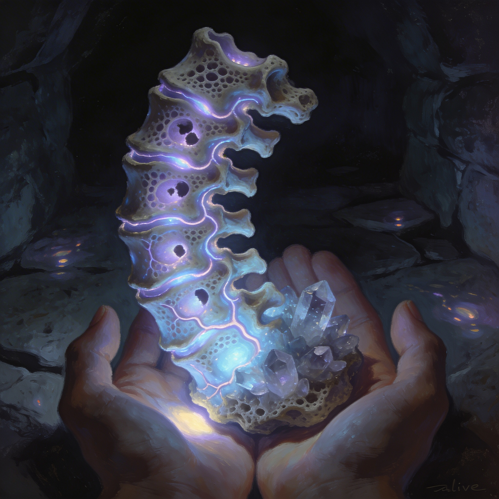
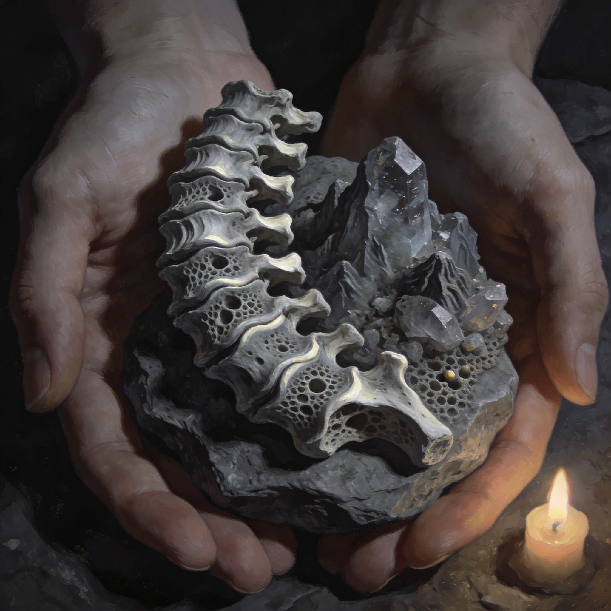

# GDD Kapitel 02 — Kernmechaniken

<!-- Darius: v2 — Wesentliche Änderungen gegenüber v1: (1) Tiervolk als eigenständiger sechster Händlertyp integriert — dauerhaft-symbiotische Wesen mit spezifischem Handelsinteresse (Symbiose-Stabilisierungs-Materialien). (2) Schattenfieber als körperreaktionsabhängig ausgearbeitet — gleiche Exposition, individuelle Transformation, kein einheitlicher Pfad. (3) Autorenvermerke und Recherche-Kommentare bereinigt. (4) Seitenvolumen gekürzt. -->

---

## Überblick

Dieses Kapitel beschreibt die sechs Kernsysteme von RELICS: Der Schwellenanker. Jedes System ist direkt aus den Design-Säulen von Kapitel 1 abgeleitet und muss gegen mindestens zwei Säulen bestehen:

1. **Kampfsystem** — Säule I (Immersive Sim) + Säule III (Körperlicher Fortschritt)
2. **Nervensystem-Leveling** — Säule III (Körperlicher Fortschritt) + Säule I (Immersive Sim)
3. **Crafting & Materialsystem** — Säule II (Fraktionspolitik) + Säule IV (Dichte vor Breite)
4. **Fraktionsruf-System** — Säule II (Fraktionspolitik) + Säule I (Immersive Sim)
5. **Schattenfieber-Progression** — Säule III (Körperlicher Fortschritt) + Säule II (Fraktionspolitik)
6. **Händlernetz & Tiervolk** — Säule II (Fraktionspolitik) + Säule IV (Dichte vor Breite)

---

## 2.1 Kampfsystem

### Spieler-Fantasie

*"Jeder Kampf kostet mich etwas. Wenn ich gewinne, habe ich es mir verdient."*

### Designprinzipien

Das Kampfsystem von RELICS ist kein Showroom für Combo-Systeme. Es ist eine mechanische Umsetzung von Schwere und Konsequenz. Kämpfe sollen sich anstrengend anfühlen, nicht befriedigend-flüssig. Der Spieler soll nach einem schweren Kampf *erschöpft* sein.

**Referenz:** Gothic 2 (Piranha Bytes, 2002) — Kampf als Risiko, nicht als Komfort. Dark Souls (FromSoftware, 2011) — Positionierung, Gewicht, Kosten.

### Kernmechaniken des Kampfes

**Ausdauersystem (Stamina)**

Die zentrale Ressource im Kampf ist nicht Gesundheit, sondern Ausdauer. Jede Aktion kostet Ausdauer: leichte Angriffe wenig, schwere Angriffe viel, Parade und Ausweichen moderat. Ist die Ausdauer erschöpft, wird der Spieler anfällig — Paraden schlagen durch, Bewegung bricht ein. Ausdauer regeneriert mit kurzer Verzögerung nach der letzten Aktion.

Ausdauerkapazität und Regenerationsrate sind direkt mit dem Cardio-Subsystem verknüpft (→ Abschnitt 2.2).

**Trefferzonen & Positionierung**

Positionierung ist eine direkte taktische Variable: Angriffe von hinten ignorieren Rüstungsschutz der Vorderseite, Angriffe von der Seite umgehen aktive Paraden. Der Spieler kämpft in der Regel alleine gegen Gruppen. Positionierung an Engpässen ist keine Spielhilfe, sondern überlebensnotwendig.

**Waffenklassen und ihre Eigenlogik**

| Waffenklasse | Stärke | Schwäche | Besondere Eigenschaft |
|---|---|---|---|
| **Einhandschwert** | Ausgewogen, schnell | Mittlere Reichweite | Kann mit Schild kombiniert werden |
| **Zweihandschwert** | Hoher Schaden, gute Reichweite | Hohe Ausdauerkosten, langsamer | Rüstungsdurchdringung |
| **Dolch** | Sehr schnell, niedrige Kosten | Geringer Schaden, kurze Reichweite | Finisher-Angriffe im Schleich |
| **Axt** | Hoher Schaden gegen Rüstung | Langsam, keine Parade | Ignoriert anteilig Rüstungsschutz |
| **Streitkolben** | Effektiv gegen Plattenrüstung | Langsam, hohe Kosten | Betäubungseffekt bei vollem Treffer |
| **Bogen** | Distanzangriff, leise | Nachladezeit | Schwachstellen-Targeting möglich |
| **Armbrust** | Hohe Durchschlagskraft | Sehr lange Nachladezeit | Durchdringt schwere Rüstung |

Keine Waffe ist "die beste". Die Auswahl hängt von Gegnertyp, Umgebung und dem eigenen Muskel-Subsystem-Stand ab.

**Alchemie im Kampf**

Alchemika sind Hilfsmittel mit Nebenwirkungen: Stärkungstränke geben Temporärboni mit Nachkater, Heilmittel wirken langsam (nicht im aktiven Kampf), Schwellensubstrat-Extrakte erzeugen temporäre Stärke durch Fieberexposition. Jede Extrakt-Einnahme erhöht den Lymph-Wert (→ Abschnitt 2.5).

**Kampf vs. Ausweichen**

Das System belohnt den Spieler nicht dafür, möglichst viele Kämpfe zu gewinnen. Viele Begegnungen haben Umgehungswege: Soziale Lösungen (Fraktionsruf-basiert), Stealth-Wege, alternative Routen. Das Kampfsystem ist für die Fälle, in denen das nicht klappt.

---

## 2.2 Nervensystem-Leveling

### Spieler-Fantasie

*"Ich sehe meinen Fortschritt. Ich sehe, was er mich gekostet hat."*

### Das System im Überblick

Das Nervensystem-Leveling ersetzt klassische Erfahrungspunkte-Balken und Attribut-Grids vollständig. Der Spieler hat keinen "Level". Er hat drei Subsysteme, die sich durch tatsächliches Tun entwickeln.

**Philosophie:** Skill-by-Use nach Gothic-2-Logik, verfeinert durch das Deus-Ex-Modell der Qualitätsstufen: vier Qualitätsniveaus statt graduellem Zahlenfortschritt.

Das Nervensystem visualisiert sich durch eine halbtransparente Körperansicht: leuchtende Nervenbahnen zeigen aktive Subsysteme, trübe zeigen inaktive. Die Fieber-Infiltration des Lymphsystems ist in Echtzeit sichtbar.

*Konzeptbild: Biolumineszente Gefäßlinien — diese visuelle Sprache gilt für das Nervensystem-Leveling-Interface. Lymph-Kontamination folgt vergleichbaren Mustern.*

### Die drei Subsysteme

**Cardio — Das Ausdauersystem**

Trainiert durch: Ausdauerkämpfe, Sprinten, Klettern, Flucht-Sequenzen, Erkundung größerer Strecken ohne Rast.

| Stufe | Bezeichnung | Auswirkung |
|---|---|---|
| I | Untrainiert | Erschöpft schnell, langsame Regeneration |
| II | Geübt | Moderate Ausdauer, schnellere Regeneration |
| III | Fortgeschritten | Hohe Ausdauer, rapide Regeneration |
| IV | Meister | Ausdauer kein limitierender Faktor — Pausen werden taktisch, nicht notwendig |

**Muskel — Das Kraftsystem**

Trainiert durch: Nahkampfangriffe, schwere Gegenstände tragen, physische Arbeit (Schmieden helfen, Ladungen schleppen — auch das trainiert).

| Stufe | Bezeichnung | Auswirkung |
|---|---|---|
| I | Untrainiert | Minimaler Schaden, niedriges Tragegewicht |
| II | Geübt | Ordentlicher Schaden, Rüstung schränkt weniger ein |
| III | Fortgeschritten | Deutlicher Schadensbonus, schwere Rüstungen voll nutzbar |
| IV | Meister | Spitzenwerte, schwere Zweihandwaffen bevorzugt |

Muskel III+ ist Voraussetzung für sinnvolle Nutzung von Materialklasse IV. Der Spieler kann sich die besten Materialien kaufen — aber erst nutzen, wenn der Körper folgt.

**Lymph — Das Fieber-System**

Das Lymph-Subsystem ist das komplexeste der drei. Es bildet die biologische Schnittstelle zwischen Spielercharakter und Schwellenrealität.

Trainiert durch: Einnahme von Alchemika und Schwellensubstrat-Extrakten, Exposition in Dünnstellen, Heilrituale des Ordens, Kontakt mit dem Schwellenanker.

| Stufe | Bezeichnung | Auswirkung |
|---|---|---|
| I | Unangetastet | Baseline. Keine Symptome, keine Transformation, aber auch keine Lymph-Vorteile |
| II | Exponiert (*Flüstern*) | Sensorische Erweiterungen, Wahrnehmung versteckter Schwellen-Objekte |
| III | Kontaminiert (*Wandlung*) | Physische Buffs, aber kognitive Kosten; sichtbare körperliche Veränderungen |
| IV | Durchdrungen (*Entgrenzung*) | Irreversibel, massiver Power-Spike, zunehmender Kontrollverlust |

**Kritisch — Körperreaktion als Variable:** Stufe II und III verlaufen nicht für jeden Spieler identisch. Die spezifische Transformation hängt von der individuellen Expositionsgeschichte ab (welche Substanzen, welche Dünnstellen, welcher Fraktionspfad). Kein Spieler durchläuft dieselbe Wandlung. Das ist die Spieler-Fantasie: *"Das Fieber macht etwas aus mir — etwas, das kein anderer Spieler sieht."*

Reduktions-Mechanismen: Krone-Weg (medizinische Unterdrückung), Gilden-Weg (Plateau-Stabilisierung), Orden-Weg (kontrollierter Aufstieg mit Verständnis).

### Qualitätsstufen-Übergänge

Ein Qualitätsstufenwechsel ist ein Moment im Spiel. Keine Fanfare, keine Leveling-Bildschirme. Die Nervensystem-Ansicht zeigt kurz das aktive Subsystem aufleuchten. Der Spieler merkt es an der veränderten Performance, nicht durch eine UI-Meldung.

Der Spieler kann aktiv "investieren": Wer einen schweren Kampf erwartet, kann vorab das Muskel-Subsystem stimulieren (Kampfübungen, Schmiedearbeit). Kein Pflichtprogramm — aber ein strategischer Hebel.

---

## 2.3 Crafting & Materialsystem

### Spieler-Fantasie

*"Ein Stück Damaszener-Stahl ist ein Ereignis. Ich weiß, was ich tue, wenn ich es verarbeite."*

### Designprinzipien

Das Crafting-System von RELICS ist keine Item-Fabrik. Es ist ein Ausdruck der Fraktionspolitik und der Materialsprache der Welt. Materialien sind keine Zahlen — sie sind Hierarchien.

**Keine Loot-Inflation.** Ein Stück Tiegelstahl ist selten. Damaszener-Stahl ist eine Rarität. Schwellenlegierungen sind die gefährlichste und mächtigste Materialklasse, mit einem echten Preis.

### Materialklassen

| Klasse | Material-Beispiele | Zugang | Sozialer Status |
|---|---|---|---|
| **I — Unterschicht** | Eisen, Zinn, Knochen, ungefärbtes Leinen | Frei verfügbar, Markt und Schwarzmarkt | Gesetzlos, mittellos |
| **II — Handwerker** | Gehärteter Tiegelstahl, Silber, Malachit, gefärbtes Leinen | Gilden-Markt (kein Ruf nötig) | Respektabler Handwerker |
| **III — Meister** | Damaszener-Stahl, Bronzeguss, Bergkristall | Gilden-Zugang (Ruf: Anerkannt) | Gilden-Mitglied |
| **IV — Elite** | Titan-Legierungen, Roségold, Lapislazuli | Gilden-Zugang (Ruf: Vertraut) + Krone-Passierschein | Oberschicht |
| **V — Schwellen** | Schwellenlegierungen, Schwellenfäden, Schwellentalg, Schwellenlinsen | Gildenruf: Meister ODER Schlund-Schwarzmarkt (mit Fieber-Risiko) | Verboten / Begehrt |

Ein gut gefertigtes Tiegelstahl-Schwert von einem Spieler mit Muskel III übertrifft ein schlecht gehandhabtes Damaszener-Schwert von einem Spieler mit Muskel I. Das System belohnt Können, nicht nur Material.

**Materialklasse V (Schwellen-Materialien)** sind das Endgame-Crafting. Zwei Zugangswege: Gilden-Weg (langer Ruf-Aufbau, sicher, legal, teuer) oder Schwarzmarkt-Weg (sofort, illegal, jede Verarbeitung erhöht den Lymph-Wert).

<!-- Darius: Tiervolk als dritter Zugangsweg zu Klasse-V-Materialien ist möglich — aber nur für spezifische Symbiose-Materialien (Tiervolk-Spezialroute), nicht generisch. Das ist in Abschnitt 2.6 ausgearbeitet. -->

### Handwerk-Mechanik

Crafting ist aktiv, nicht passiv. Der Spieler steht an einer Werkbank oder einem Schmiedefeuer und führt eine vereinfachte Handwerks-Sequenz durch.

**Werkzeug-Erfordernisse:** Damaszener-Stahl braucht eine Meister-Schmiede — die in der Regel Gilden-Territorium ist. Der Spieler muss Zugang erkaufen oder eine eigene Werkbank ausbauen.

**Rezeptur-System:** Rezepturen sind Wissensgegenstände, keine automatischen Freischaltungen. Öffentliches Wissen (Klasse I–II) ist frei verfügbar. Gilden-Wissen (Klasse III–IV) erfordert Zugang oder Entwendung. Geheimes Wissen (Klasse V) liegt in Gilden- und Orden-Archiven oder bei bestimmten NPCs.

**Qualitätsstufen beim Crafting:** Ein Produkt kann in drei Qualitätsvarianten erzeugt werden — Grundlegend / Ordentlich / Meisterwerk. Die Variante hängt von Materialqualität, Werkzeugqualität und Wiederholungserfahrung ab.

### Rüstungsdesign als sozialer Ausdruck

- **Rüstungsklasse** (leicht / mittel / schwer) beeinflusst Ausdauerkosten und Beweglichkeit
- **Material** definiert Schutzwerte und NPC-Reaktionen
- **Ausrüstungsmix:** Jedes Körperteil unabhängig ausrüstbar
- **Verfall und Reparatur:** Rüstungen und Waffen nehmen Schaden — Reparatur ist eine Alltagshandlung

---

## 2.4 Fraktionsruf-System

### Spieler-Fantasie

*"Ich habe mir diese Tür verdient. Oder ich habe sie mir verbaut."*

### Designprinzipien

Das Fraktionsruf-System ist eine Buchführung von Handlungen und ihren Konsequenzen. Jede Fraktion bewertet den Spieler nach eigener Logik — und die Logiken widersprechen sich.

Das System funktioniert nach dem Prinzip der kommunizierenden Röhren: Was bei der Krone gewinnt, verliert in der Regel bei den Gilden oder beim Orden. Echte Maximierung bei allen drei gleichzeitig ist nicht möglich.

### Ruf-Stufen

Jede der drei Hauptfraktionen kennt fünf Ruf-Stufen:

| Stufe | Bezeichnung | Zugang |
|---|---|---|
| I | **Unbekannt** | Basiszugang zu öffentlichen Bereichen |
| II | **Bekannt** | Einfache Aufgaben, Basispreise, erste innere Tore |
| III | **Anerkannt** | Mittlere Materialien, Fraktions-Infrastruktur (Schlafplatz, Werkstätte) |
| IV | **Vertraut** | Elite-Materialien, Insider-Informationen, spezifische Ausrüstung als Geschenk |
| V | **Meister** | Vollzugang — Schwellen-Materialien (Gilden), Kronpassagen (Krone), geheime Orden-Archive |

| Sonderstufe | Bezeichnung | Konsequenz |
|---|---|---|
| 0 | **Feindselig** | Tore geschlossen, NPCs greifen an. Nur über spezifische Quest-Lösung auflösbar. |

### Ruf-Quellen

Ruf wird erzeugt durch: Fraktionsquests (Hauptquelle), Handlungen in der Welt (stiller Buchhalter), Dialoge und Entscheidungen (nicht immer explizit), Handels-Reputation (klein, aber akkumulierend).

### Konflikt-Mechanik

Ab einem bestimmten Ruf-Niveau in zwei konkurrierenden Fraktionen verlangen beide, dass der Spieler Farbe bekennt. Das ist keine erzwungene Entscheidung — aber die Situation hält sich nicht. **Point of No Return:** Jede Fraktion hat einen quest-spezifischen Punkt, der sich erst rückwirkend als solcher zeigt.

### Gilden-Monopolstruktur und Crafting-Zugang

Die Gilden sind kein monolithischer Block. Der Gesamt-Gildenruf beeinflusst den Basisrand. Darüber hinaus gibt es Einzel-Ruf bei spezifischen Gilden:

- **Schmiede-Ruf:** Waffen und Rüstungen der Klasse III–IV
- **Glasmacher-Ruf:** Schwellenlinsen, Alchemie-Phiolen
- **Gerber-Ruf:** Physischer Zugang zu Kanälen und dem Schlund
- **Weber-Ruf:** Schwellenfäden und Elite-Textilien

Wer nur Gilden-Gesamtruf sammelt, bekommt generischen Zugang. Wer gezielt eine Gilde hofiert, bekommt spezifische Tiefe.

---

## 2.5 Schattenfieber-Progression

### Spieler-Fantasie

*"Ich sehe, was das Fieber aus mir macht. Es macht etwas anderes als aus anderen."*

### Designprinzipien

Das Schattenfieber ist keine Krankheit, die man heilt. Es ist ein biologischer Zustand, den man navigiert. Die Körperreaktion ist individuell: gleiche Exposition, verschiedene Transformation. Das ist der Kern des Systems.

Das Fieber ist direkt an das Lymph-Subsystem gekoppelt (→ Abschnitt 2.2).

*Konzeptbild: Der Schwellenanker in Ruhezustand — die visuelle Entsprechung von Lymph-Stufe I: Unangetastet.*

### Körperreaktions-Varianz

Dasselbe Schattenfieber-Stadium sieht bei drei Spielern verschieden aus. Die spezifische Transformation (welche Sinne sich schärfen, welche Fähigkeiten entstehen, welche Kosten der Körper zahlt) hängt ab von:

1. **Expositionsquelle:** Schwellensubstrat-Extrakte erzeugen andere Muster als Dünnstellen-Aufenthalt
2. **Fraktionspfad:** Orden-Rituale kanalisieren die Transformation anders als ungefilterte Exposition
3. **Körperliche Baseline:** Muskel- und Cardio-Stand beeinflussen, welche physischen Transformationen dominant werden

Das hat gameplay-mechanische Konsequenzen: Spieler können nicht vorab wissen, welche spezifischen Fähigkeiten ihre Transformation freischaltet. Das erzeugt Entdeckungsdruck und echte Differenzierung.

### Die drei Fieber-Stadien im Gameplay

**Stadium I — Flüstern (Lymph-Stufe II)**

Das erste Stadium ist die Einladung. Vorteile: Erweiterte Sinneswahrnehmung (Schwellen-Objekte sichtbar, die für andere unsichtbar sind), leichte intuitive Kampfunterstützung (Körperreaktion-abhängig). Kosten: Gelegentliche Wahrnehmungsstörungen, leichte sichtbare Veränderungen unter bestimmtem Licht.

*Reversibilität:* Vollständig reversibel durch Entfernung von Fieberquellen und Krone-Medizin.

**Stadium II — Wandlung (Lymph-Stufe III)**

Das zweite Stadium ist der Preis für Macht. Vorteile: Physische Buffs (Stärke, Ausdauer), tiefere Schwellen-Wahrnehmung, Immunität gegen leichte Exposition. Kosten: Erinnerungsfragmentierung, sichtbare körperliche Veränderungen (dunkle Adern, Transparenz der Haut — individuell variierend), soziale Kosten (Krone-Ruf sinkt passiv).

*Reversibilität:* Nicht heilbar, aber managebar. Gilden: Stabilisierungspräparate (laufende Kosten). Orden: Kontroll-Rituale (mit Dankesschuld).

**Stadium III — Entgrenzung (Lymph-Stufe IV)**

Das dritte Stadium ist das Ende der kontrollierten Progression. Vorteile: Extremer Power-Spike, direkte Schwellen-Interaktion, Zugang zu bestimmten Questenden. Kosten: Kontrollverlust (Spieleraktionen durch Schwellen-Impulse überlagert), narrative Einengung, Irreversibilität ohne Schwellenanker-Intervention.

*Der Schwellenanker als Stabilisator:* Ein Spieler, der den Schwellenanker hält (Hauptquest-Fortschritt), kann Stadium III partiell stabilisieren. Das ist keine Heilung — aber es verhindert den unkontrollierten Identitätsverlust. Dies ist der narrative und mechanische Kern des Hauptquests.

*Konzeptbild: Zustand Drei. Der Schwellenanker in Auflösung — die visuelle Entsprechung von Lymph-Stufe IV.*

### Die drei Fraktions-Antworten auf das Schattenfieber

**Krone — Unterdrückung**

Krone-Medizin senkt den Lymph-Wert aktiv und verhindert Stufe I–IV vollständig. Gameplay: Krone-Mitglieder erhalten Medizin kostenlos, andere zahlen teuer. Kein Fieber-Vorteil, keine Fieber-Kosten — aber Krone-Quests kompensieren durch bessere Ausrüstung und politische Unterstützung.

**Gilden — Verwertung**

Gilden-Präparate halten den Lymph-Wert auf einem Plateau: Vorteile von Stadium I bleiben zugänglich, unkontrollierte Progression wird verhindert. Auf Abruf (kurz, mit Nachkater) kann Stadium II überstiegen werden. Gameplay: Ressourcenintensiv, laufende Kosten. Verknüpft Fieber-Management direkt mit der Wirtschaftsmechanik.

**Orden — Destillation und Verstehen**

Orden-Rituale ermöglichen kontrollierten, langsamen Aufstieg durch die Stadien mit Stabilisierung auf jeder Ebene. Zugang bis Stadium II möglich. Gameplay: Kostenlos (Kosten: Zeit und Verpflichtung). Der Orden hat Forderungen — jedes Ritual ist eine Schuld. Irgendwann fragt der Orden nach dem Schwellenanker.

---

## 2.6 Händlernetz & Tiervolk

### Spieler-Fantasie

*"Es gibt Händler, die andere nicht kennen — und Waren, die nur sie führen."*

### Designprinzipien

Das Händlernetz von RELICS ist kein monolithisches System. Neben den drei Fraktionsstrukturen (Krone-Lieferanten, Gilden-Händler, Orden-Ressourcen) existiert ein vierter Händlertyp mit eigener Logik: das Tiervolk.

Das Tiervolk sind kosmologisch-fremde Wesen in dauerhafter, irreversibler Symbiose mit Tieren. Diese Symbiose ist keine Besonderheit — sie ist ihre biologische Grundlage. Ihre Handelsmotivation ist konkret: Sie benötigen spezifische Materialien zur Stabilisierung der Symbiose, die die drei Fraktionen weder verstehen noch kontrollieren. Das schafft ein echtes wechselseitiges Interesse.

### Das Tiervolk als Händlertyp

**Systemisch:** Das Tiervolk betreibt ein Netz aus fluktuierenden Handelspositionen, das sich nicht mit den Fraktionsterritorien deckt. Ihre Standorte ändern sich — nicht willkürlich, sondern nach einer internen Logik, die der Spieler über Zeit lernt. Sie sind dort, wo Schwellenphänomene komplex und interessant sind: Übergangszone Gürtel/Schlund, bestimmte Dünnstellen-Nähepunkte, Kanaleingänge, die die Gilden nicht vollständig kontrollieren.

**Kein Fraktionsruf-System:** Das Tiervolk kennt keine Ruf-Stufen. Sie kennen **Vertrauens-Transaktionen**: Wer einmal unfair handelt, bekommt keinen zweiten Termin. Wer gut handelt, bekommt Zugang zu selteneren Waren. Das ist ein binäres, transaktionales System — kein skalierbarer Balken.

**Eigene Ruf-Achse:** Tiervolk-Vertrauen akkumuliert unabhängig von Fraktionsruf. Ein Spieler, der bei allen drei Fraktionen "Feindselig" ist, kann beim Tiervolk trotzdem gut stehen. Das macht sie zum einzigen Händlernetz, das eine verbrannte Spielfigur noch versorgt.

### Tiervolk-Warensortiment

Das Tiervolk handelt mit drei Kategorien, die kein anderer Händlertyp führt:

**Kategorie A — Symbiose-Materialien (Import):**
Substanzen, die das Tiervolk selbst braucht. Sie kaufen aktiv vom Spieler: bestimmte Schwellensubstrat-Konzentrationen aus tiefen Dünnstellen, spezifische Schwellenpilz-Derivate, biologische Proben aus Stadium-II-Betroffenen (wenn der Spieler einwilligt oder selbst betroffen ist). Diese Kategorie schafft eine Quest-Logik: Das Tiervolk als Auftraggeber für Beschaffungsmissionen.

**Kategorie B — Exklusive Waren (Export):**
Waren, die das Tiervolk selbst produziert oder aus Regionen mitbringt, die die drei Fraktionen nicht kennen: Symbiose-Erzeugnisse (organische Materialien, die halb-biologisch, halb-schwellentechnisch sind), Navigationswissen (Informationen über Dünnstellen-Pfade, die weder Gilden-Karte noch Orden-Archiv kennt), und spezifische Alchemika, die die Körperreaktion bei Schattenfieber modifizieren — nicht heilen, modifizieren.

**Kategorie C — Informationen:**
Das Tiervolk ist das einzige Netz, das ohne Fraktionsbindung handelt. Ihre Informationen beziehen sich auf Verbindungen zwischen Dünnstellen, Verhaltensmuster von Schwellen-Fauna, und Gerüchte aus Regionen jenseits von Schwarzrand. Sie haben eine vierte Kosmologie — das Schattenfieber als Kommunikation, nicht als Krankheit.

### Salva als Haupt-Kontakt

Salva (→ GDD Kap. 4, Abschnitt 4.5) ist der erste und wichtigste Tiervolk-NPC. Er funktioniert als Kontext-Lieferant, Informationsbroker und Einführung in das Tiervolk-Handelssystem. Der Spieler lernt das System über Salva — nicht durch Tutorial-Text, sondern durch Transaktion.

**Mechanische Besonderheit:** Salva erscheint nicht immer. Er hat ein Bewegungsmuster, das der Spieler erlernen kann. Wer weiß, wann und wo Salva auftaucht, hat einen strategischen Vorteil.

### Symbiose-Stabilisierungs-Quest-Logik

Das Tiervolk ist der einzige NPC-Typ, der den Spieler aktiv um etwas bittet, das mit seiner biologischen Notwendigkeit zusammenhängt. Das schafft eine Quest-Kategorie ohne Fraktionsstruktur: Beschaffungsaufträge für Symbiose-Materialien, Erkundungsaufträge zu unbekannten Dünnstellen, und — selten — Schutzaufträge, wenn ein Tiervolk-Händler in Gefahr ist.

**Spieler-Fantasie dieser Quests:** *"Ich helfe jemandem, der sich selbst nicht helfen kann — weil er etwas ist, das die Welt nicht versteht."*

---

## 2.7 Systeminteraktionen

Die sechs Kernsysteme existieren nicht isoliert. Ihre Stärke kommt aus den Wechselwirkungen:

**Kampf × Nervensystem-Leveling**
Jeder Kampf trainiert Cardio und Muskel. Wer riskante Kämpfe mit Schwellensubstrat-Extrakten gewinnt, trainiert ungewollt auch das Lymph-Subsystem.

**Crafting × Fraktionsruf**
Bessere Materialien erfordern höheren Fraktionsruf. Das bindet Crafting an Fraktionsentscheidungen. Wer den Orden hofiert, bekommt kein Damaszener-Stahl. Wer die Gilden höfiert, verliert Krone-Ruf.

**Schattenfieber × Fraktionsruf**
Der Fieber-Status verändert Fraktions-Reaktionen. Ein Spieler in Stadium II ist bei der Krone nicht mehr willkommen. Die Gilden sind die einzige Fraktion, die Fieber-Träger ohne Stigma bedient.

**Nervensystem-Leveling × Crafting**
Muskel III+ ist Voraussetzung für sinnvolle Nutzung von Klasse-IV-Ausrüstung. Das verhindert "Day-One-Endgame-Gear".

**Kampf × Schattenfieber**
Wer mit Schwellensubstrat-Extrakten kämpft, gewinnt Macht und verliert Kontrolle. Das ist die ultimative Abwägung des Systems.

**Tiervolk × Alle anderen Systeme**
Das Tiervolk interagiert quer durch alle Systeme: Sie kaufen Schattenfieber-Produkte, liefern Crafting-Materialien der Klasse V (Sonderweg), sind unabhängig von Fraktionsruf, und liefern Informationen, die Quest-Pfade verändern. Sie sind das systemische Sicherheitsnetz für Spieler, die alle Fraktionen verbrannt haben.

**Tiervolk × Schattenfieber × Körperreaktion**
Das Tiervolk verfügt über Alchemika, die die Körperreaktion bei Schattenfieber-Transformation modifizieren. Das ist nicht universell verfügbar — es setzt Tiervolk-Vertrauen voraus. Für Spieler, die ihre Transformation aktiv gestalten wollen, ist das Tiervolk der einzige Weg zu dieser Tiefe.

<!-- Darius: Systeminteraktionen vollständig auf sechs Systeme erweitert. Tiervolk-Interaktionen am Ende eingewoben. Körperreaktions-Varianz als eigenständiger Interaktions-Layer in Abschnitt 2.5 und 2.7 ausgearbeitet. -->
