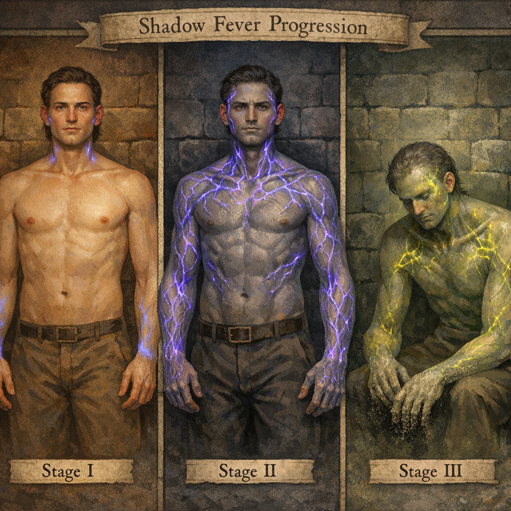
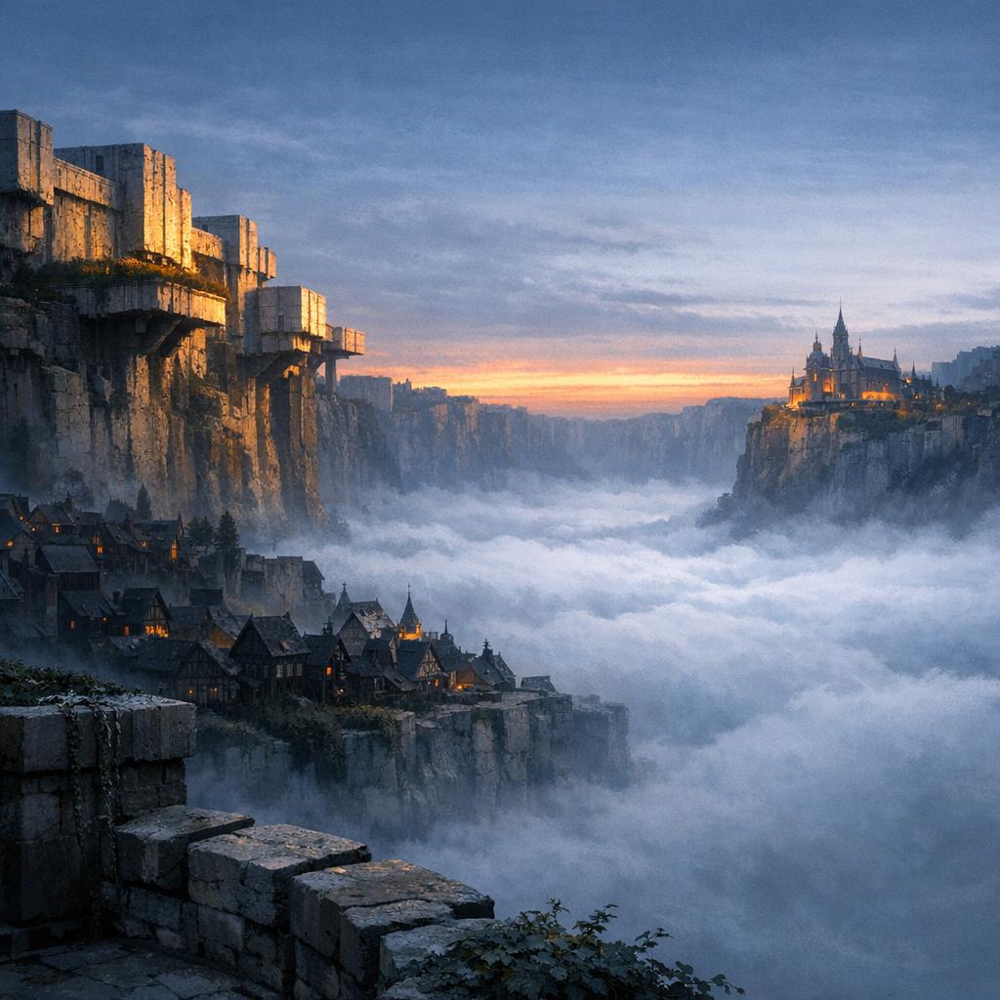
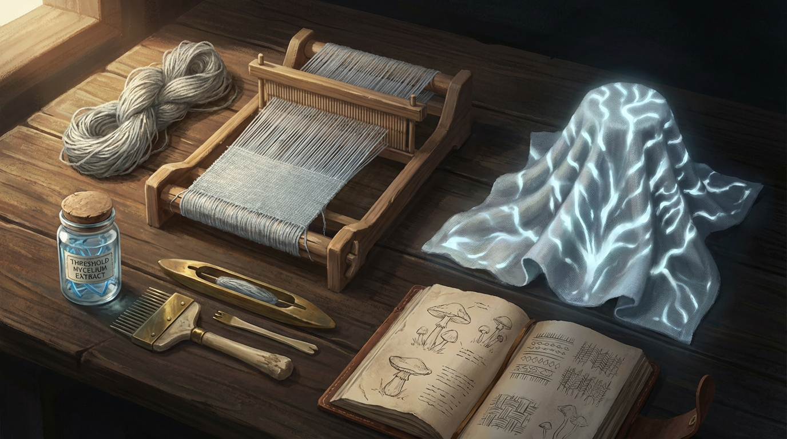
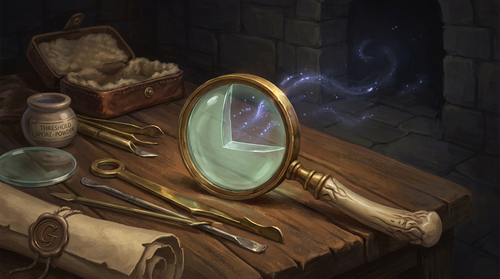

# GDD Kapitel 05 — Visuelle Designsprache & Art Direction

<!-- Vera: v3 | Tag 5, Freitag | Content-Lock-Version -->
<!-- Status: v3 — Finale Fassung. Alle freigegebenen Pinnwand-Bilder + 23 neue Tag-5-Bilder eingebettet. Orden-Symbol = Siegel (kein Kreuz). Gestrafft gegenüber v2: Referenz-Kanon gekürzt, redundante Beschreibungen entfernt. Neue Abschnitte: Schattenfieber-Progression (5.6) mit Bildern, Waffen/Ausrüstung (5.7), Spieler-Silhouetten (5.4.3). -->

---

## 5.0 Prämisse

RELICS ist kein generisches Mittelalter. **Materialien bedeuten Macht** — und das muss sofort lesbar sein. Wer welches Material trägt, aus welchem Stein sein Haus gebaut wurde, mit welchem Werkzeug er hantiert: das sagt mehr als jeder Dialog.

**Leitfrage für jede Design-Entscheidung:**
*Ist das auf 50 Meter lesbar?* (Silhouette-Regel, Dark Souls)

---

## 5.1 Visuelle Vision — Medieval Cyberpunk als Materialsprache

"Medieval Cyberpunk" ist Strukturprinzip, nicht Ästhetik-Label:

| Cyberpunk-Konzept | Visuelle Übersetzung |
|---|---|
| Megacorporations | Gildenheraldik in Stein, eisenbeschlagene Gildentore, Zunftzeichen an Fassaden |
| Neon-Ästhetik | Alchemische Laternen, phosphoreszierende Mineralkanäle, Biolumineszenz in Fugen |
| Vertikalität | Vier Stadtschichten — jede eine eigene Epoche, ein eigener Stil |
| High-Tech, Low-Life | Damaszener-Stahl oben, gestohlene Eisenreste unten — gezeigt, nie beschriftet |
| Überwachung | Ordenssiegel auf Torbögen, versiegelte Dokumente, Kapuzenträger an Weggabelungen |
| Augmentierung | Alchemische Narbenzeichnungen, Schattenfieber-Gefäßlinien, Knocheneinlagen |

**Verbindliche Ausschlüsse:**
- Keine Hexagone, kein Steampunk, keine Anachronismen (kein Schießpulver, kein Buchdruck)
- Keine Sci-Fi-Materialien, keine leuchtenden Augen als Magie-Signifier

---

## 5.2 Farbpalette & Materialsprache nach Fraktion

### 5.2.1 Die Krone — Kosmologie des Blutes

Einschüchterung durch Perfektion. Kein überflüssiges Element.

**Palette:** All-Black / Anthrazit. EIN Blutrot-Akzent. Kaltes Weißlicht auf poliertem Metall.

**Materialien:** Titan-Legierungen, Damaszener-Stahl (gebürstet), geschliffener Obsidian, schwere Brokatseide in Schwarz, Kristallglas-Phiolen, blutroter Siegellack als einziger Farbakzent.

**Architektur:** Massiver Stampflehm/Kalkstein in brutalisierten Blöcken. Keine Ornamentik außer Wappenzeichen. Cantilevierte Plattformen. Kristallglas-Lichtschächte — Licht von oben als Herrschaftssymbol.

<!-- Vera: Kronbastion erstmals als Concept Art — bisher nur beschrieben. Die cantilevierte Architektur und die gerichtete Stadtgeste (Lehnung zur Schwelle) sind das zentrale visuell-narrative Statement der Krone. -->

**Silhouette-Regel:** Kronensoldaten: breitere Schulterplatten, kürzere Silhouette, kein weißer Stoff sichtbar.

---

### 5.2.2 Der Orden — Kosmologie des Wissens

Reinheit als Drohung. Weiß, das keinen Fleck toleriert.

**Palette:** All-White / Hellgrau. EIN blassgrüner Lumineszenz-Akzent. Silberne Präzisionsdetails.

**Symbol:** Das Ordenssiegel — ein gepresstes Wachssiegel mit einem stilisierten Augen-Motiv (das Auge des Wissens) im Zentrum, umgeben von konzentrischen geometrischen Kreisen. Kein Kreuz. Das Siegel wird gestempelt auf Dokumente, gebrannt in Türstürze, gepresst in grünes Wachs auf Schriftrollen.

<!-- Vera: GEKLÄRT — Orden-Symbol ist SIEGEL, nicht Kreuz. Das Siegel-Designsheet zeigt Anwendungsvarianten: gestempelt, gebrannt, gepresst, getragen. Das Auge-im-Kreis-Motiv transportiert "Wissensmonopol als Überwachung" visuell stärker als ein religiöses Kreuz. -->

**Materialien:** Gebleichtes schweres Leinen, Kristallglas-Optiklinsen, Vellum, blassgrüne Alchemiephiolen, Knochen-Rosenkranz mit Obsidian-Mittelelement.

**Architektur:** Romanische Rundbögen, heller geschliffener Kalkstein, schmale Schlitzfenster, Bibliotheken in Turmform.

**Silhouette-Regel:** Ordensboten: hochgeschlossene schmale Silhouette, weißer Umhang, kein Metall sichtbar.

---

### 5.2.3 Die Gilden — Ontologie des Materials

Akkumulierter Reichtum. Jedes Objekt hat einen Preis.

**Palette:** Tiefbraun, Warmamber, Mitternachtsindigo, Malachitgrün. Bronze und Gold als Akzente.

**Materialien:** Brokatseide in Nachtindigo, polierter Malachit-Cabochon, Bernsteinkette, Bronzewerkzeug als Statussymbol, vegetabil gegerbtes Sattlerleder, Keramiktiegel mit Pigmenten.

**Architektur:** Bauhaus-Inspiration — klare Linien, Funktionalität als Ästhetik. Integrierte Werkstätten, Bronzebeschläge, modulare Fassaden.

**Silhouette-Regel:** Gildenmeister: breiter Stand, Lederschürze oder schweres Brokattuch, Werkzeughalter sichtbar.

---

## 5.3 Architektur — Die vier Schichten Schwarzrands

Schwarzrand ist eine **gerichtete Stadt**. Sie orientiert sich zur Schwelle hin — die Architektur schwillt, lehnt und greift in Richtung des Abgrunds.

### Schicht 1 — Slums (Untergrund, Schwellennähe)

Schwelle am nächsten. Realität porös. Biolumineszenz überall.

- **Material:** Gestohlene Ziegel, Holzreste, Lappen als Trennwände
- **Licht:** Biolumineszente Ablagerungen in Mörtelfugen — grünlich, schwach, unzuverlässig
- **Atmosphäre:** Deckenhöhe unter 2m. Tunnel, keine Straßen

**Designregel:** Slums dürfen NICHT pittoresk sein. Wenn es schön ist, ist es bedrohlich — die Biolumineszenz signalisiert das Fieber.

### Schicht 2 — Mittelstadt (Fachwerk und Romanik)

Historisches Herzstück. Hier verbringt der Spieler die meiste Zeit.

- **Material:** Fachwerk aus Eiche, Sandstein-Fundamente, Talgkerzenlicht
- **Hybridzonen:** Edelstahlbeschläge am Fachwerk, Bauhaus-Fensterrahmen in romanischen Bögen
- **Kanalzone:** Handelsader und Geruchskanal, Quais als informeller Markt

### Schicht 3 — Gilden- und Ordensdistrikte (Brutalistisch/Bauhaus)

Machtarchitektur. Hier wirkt der Spieler klein.

- **Material:** Geschlagener Kalkstein, Metallintarsien, geometrische Formen
- **Gildenhallen:** Offen nach vorn (Produktion sichtbar)
- **Ordensbibliotheken:** Geschlossen, schmale Schlitzfenster nach oben

### Schicht 4 — Kronenfestung (Geometrischer Brutalismus)

Das absolute Oben. Kein Ornament. Cantilevierte Plattformen über dem Abgrund. Licht als Privileg.

---

## 5.4 Charakter-Design

### 5.4.1 Hauptprinzip: Comme des Garcons trifft mittelalterliche Rüstung

Silhouetten: tailored, körperbetont, geschichtet. Kein Übergewicht an Schmuck. Jedes Detail hat Funktion.

**Schichtung:** Gambeson → Kettenhemd-Segmente → Platten-Elemente (nie vollständig)

**Oberfläche:** Gebürstetes Metall, geätzte Marker, Patina an Kanten

**Asymmetrie als Prinzip:** Avant-garde Silhouetten — eine Schulter breiter, eine Seite Kettenhemd, andere Seite Platte.

### 5.4.2 Spieler-Silhouetten

Drei Grundkonfigurationen, auf 50 Meter unterscheidbar:

**Leicht** (Scout/Alchemist): Quilted Gambeson, Lederbracers, kurzer asymmetrischer Umhang, Werkzeuggürtel. Silhouette: schlank, eckig, mobil.

**Mittel** (Standard): Kettenhemdsegmente, asymmetrische Schulterplatte, Halbgreaves. Silhouette: ausgewogen, funktional.

**Schwer** (Infanterie): Überlappende dunkle Plattensegmente, Großhelm, Schild am Rücken. Silhouette: breit, geerdet, festungsartig.

### 5.4.3 Das Tiervolk — Subtile anatomische Verschiebung

Das Tiervolk lebt in dauerhafter kosmologischer Symbiose. Das Tier ist erkennbar — Fuchs, Marder, Habicht — aber es trägt etwas in sich, das nicht hineingehört. Die Fremdheit ist nie theatralisch. Sie ist **subtil und präzise**.

**Designprinzipien:**
- **Augen:** Pupillen stimmen nicht — vertikal, horizontal oder interne Tiefe
- **Fell/Feder:** Konter-Wirbelmuster, sekundäre geometrische Schicht
- **Proportionen:** Fraktionell verschoben — Arme zu lang, Hals dreht zu weit
- **Stillstand:** Zu still. Kein Blinzeln im normalen Rhythmus

**Was es NICHT ist:** Kein Tribal, kein Monster, kein Disney, keine Furry-Ästhetik.

**CD-Feedback (Tag 5):** Tiervolk-Bilder etwas zu cartoon-y/anthropomorph. Neue Iteration: subtiler, menschlicher, weniger offensichtlich tierisch.

<!-- Vera: Salva ist der erste benannte Tiervolk-NPC als Concept Art. Die Feder-zu-Haut-Transition am Kiefer ist das Kerndesign-Element — nicht Fell, nicht Federkleid, sondern ein Übergang, der nicht ganz schlüssig ist. Die horizontalen Stabpupillen sind das Uncanny-Valley-Signal. -->

**Farbpalette Tiervolk:** Anthrazit, Kohleschwarz, Aschgrau (Kleidung). Warmes Sienna, Ochre (Fell). Maximal EIN gedämpfter Akzent. Keine Fraktionsfarben.

---

## 5.5 Relikt — Der Schwellenanker

### Formsprache

Eine **komprimierte gefaltete geologische Formation** — nicht Knochen, nicht Kristall. Zu regelmäßig für Zufall, zu organisch für Handwerk. Oberfläche: dichtes Netz von ossifizierten Mikro-Kanälen als visuelles Key-Feature.

### Drei Zustände

**Null — Ruhend:** Aschgrau, kein Licht. Mikro-Kanäle leer. Auf 10m ein Stein.

**Eins — Aktiviert:** Biolumineszenz von innen. Pale Blue-Violett füllt die Kanäle. Schön. Tief unsettling.

**Drei — Auflösung:** Ränder evaporieren. Gelbgrün, überhell, kränklich. Das Schöne ist weg.

### Hero-Shot

---

## 5.6 Schattenfieber — Visuelle Progression

Das Schattenfieber ist biologisch. Keine magische Aura, keine Spektraleffekte. Es verändert den Körper von innen.

### Stufe 1 — Sensorisch (reversibel)

Hauchfeine blassviolette Gefäßlinien unter der Haut an Handgelenken und Hals. Kaum sichtbar. Der Charakter wirkt nicht krank — er wirkt **interessant**. Das ist die Falle.

### Stufe 2 — Mutativ (managebar)

Gefäßlinien treten hervor als erhabene Kanäle. Hautton kühler, grauer. Lila Pulsieren sichtbar bei Tageslicht. In dieser Stufe ist Schattenfieber **spielbar** — Spezialfähigkeiten mit Körperkosten.

### Stufe 3 — Auflösung (irreversibel)

Haut wird transluzent. Darunter: kränklich gelbgrüne Kanäle (identisch mit Schwellenanker-Zustand-Drei). Die Person evaporiert an den Rändern als feiner Mineralstaub. Selten sichtbar. Immer isoliert. Immer traurig. Nie Monster.

### Körper-Detailsheet

### Farbkorrespondenz Schattenfieber ↔ Schwellenanker

| Stufe | Fieber-Farbe | Schwellenanker-Zustand |
|-------|-------------|----------------------|
| 1 | Blassviolett (kaum sichtbar) | Null → Eins (Aktivierung) |
| 2 | Violett (deutlich leuchtend) | Eins (stabil aktiv) |
| 3 | Kränklich Gelbgrün | Drei (Auflösung) |

Das ist kein Zufall. Der Spieler lernt die Farbsprache am Relikt und erkennt sie dann am eigenen Körper.

### UI-Korrespondenz

Die Levelingsicht (halbtransparentes Nervensystem — Cardio/Muskel/Lymph) entspricht der Schattenfieber-Visualisierung. Das Lymph-Subsystem leuchtet blassviolett bei aktivem Fieber.

---

## 5.7 Waffen & Ausrüstung — Material als Statussignal

Waffen und Ausrüstung erzählen soziale Herkunft. Derselbe Gegenstandstyp existiert in drei Qualitätsstufen:

| Schicht | Material | Oberfläche | Akzente |
|---------|----------|------------|---------|
| Oberschicht | Damaszener-Stahl, Titan-Legierung | Fließendes Faltmuster, poliert | Obsidian-Intarsien, Goldfaden, Wachssiegel |
| Mittelschicht | Tiegelstahl, Bronze | Geätzte Gildenmarken, geölt | Eschenholz, Ledergirff, Messingbeschlag |
| Unterschicht | Rohes Eisen, Zinn | Hammerspuren, ungleichmäßig | Geschnitzter Knochen, Kordel-Umwicklung |

### Rüstungsvergleich

### Alchemie-Ausrüstung

<!-- Vera: Der Alchemiegürtel ist gleichzeitig Spieler-Equipment und Weltbau — er zeigt, dass Alchemie die "Magie" dieser Welt ist, und dass sie handwerklich ist, nicht mystisch. Die grün leuchtende Phiole ist der einzige Farbakzent und verknüpft visuell mit der Orden-Palette. -->

---

## 5.8 Schwellenflora & -fauna — Organische Fremdheit

Die Schwellennatur ist die visuelle Unterschrift der tieferen Stadtschichten. Biolumineszenz ist kein Effekt — sie ist Lebenszeichen einer Biologie, die teilweise der Schwelle gehorcht.

**Designregel:** Schwellenflora und -fauna leuchten kalt (blassgrün bis violett). Die Farbe ist schön und bedrohlich gleichzeitig — sie signalisiert Schwellennähe.

---

## 5.9 Die Ankerkammer & Schwellenlandschaft

Der klimatische Ort der Hauptquest. Die Ankerkammer ist der tiefste erreichbare Punkt, wo Stoffwelt und Schwelle sich überlagern.

---

## 5.10 Atmosphäre & Stimmung

---

## 5.11 Schwellenmaterialien — Die Wirtschaftsbasis

---

## 5.12 Art Direction-Checkliste

Jedes Asset muss gegen diese Liste geprüft werden:

- [ ] **Fraktion lesbar?** — Welche Fraktion "spricht" dieses Asset?
- [ ] **Schicht lesbar?** — Materialien müssen Ober-/Mittel-/Unterschicht eindeutig zeigen
- [ ] **50m-Silhouette?** — Auf Distanz lesbar?
- [ ] **Farbpalette:** Dominante Neutralfarbe + max. EIN kräftiger Akzent
- [ ] **Keine Verbote:** Kein Hexagon, kein Zahnrad, kein Dampf, kein Sci-Fi
- [ ] **Materiallogik:** Material passt zum Wohlstand?
- [ ] **Schattenfieber:** Blassviolett-Kanäle bei relevanten Charakteren?
- [ ] **Licht als Privileg:** Beleuchtungshierarchie stimmt?
- [ ] **Tiervolk-Test:** Fremdheit subtil? Kein Tribal? Fraktionslos?

---

## 5.9 Referenz-Kanon

| Referenz | Relevanz für RELICS |
|----------|-------------------|
| Dark Souls / Elden Ring | Licht aus dem Körper, Architektur als Emotion, 50m-Silhouette |
| Control (Remedy) | Brutalismus als Raumsprache, Unheimliches durch Geometrie |
| Hollow Knight | Vertikalität, Biolumineszenz, Größenverhältnisse |
| Dishonored | Soziale Schichtung, Vertikalität im Level-Design |
| Gaudi | Organisch-strukturelle Formen (Biolumineszenz-Kanäle) |
| Le Corbusier / Bauhaus | Gilden-Architektur, Funktion als Ästhetik |
| Brutalismus (Smithson, Lasdun) | Kronenfestung, Ordensgebäude, Macht durch Masse |

**Anti-Referenzen:** WoW (übergesättigte Farben), Generic Fantasy Stock (Schmutz ohne Design), Steampunk-Ornamentik, Furry-Ästhetik.

---

<!-- Vera: GDD Kap 5 v3 — Content-Lock-Version für Freitag.

Neuerungen gegenüber v2:
- Orden-Symbol = SIEGEL (kein Kreuz) — mit dediziertem Designsheet
- Kronbastion erstmals als Concept Art (Außen + Cinematic Hero)
- Stille Bibliothek des Ordens
- Gildenhof-Innenansicht
- Schlund/Unterstadt-Atmosphäre
- Markt der Tausend Treppen
- 3 Fraktions-NPCs: Krone-Soldatin, Ordensbruder, Gildenmeisterin
- 3 Spieler-Silhouetten (leicht/mittel/schwer)
- Schlund-Bewohner als Unterschicht-Charakter
- Schattenfieber-Progression: 3 Stufen mit Bildern
- Waffen/Ausrüstung: Material-Hierarchie, Rüstungsvergleich, Alchemie-Set
- Tiervolk-Iteration: subtilere Variante + Salva (Habicht)
- Gestrafft: Referenz-Kanon als Tabelle, redundante Beschreibungen entfernt

Gesamtzahl eingebetteter Bilder: 30 (11 Pinnwand + 19 inline aus allen Tagen)
Gesamtzahl produzierte Concept Art (alle Tage): 31 Bilder
-->
