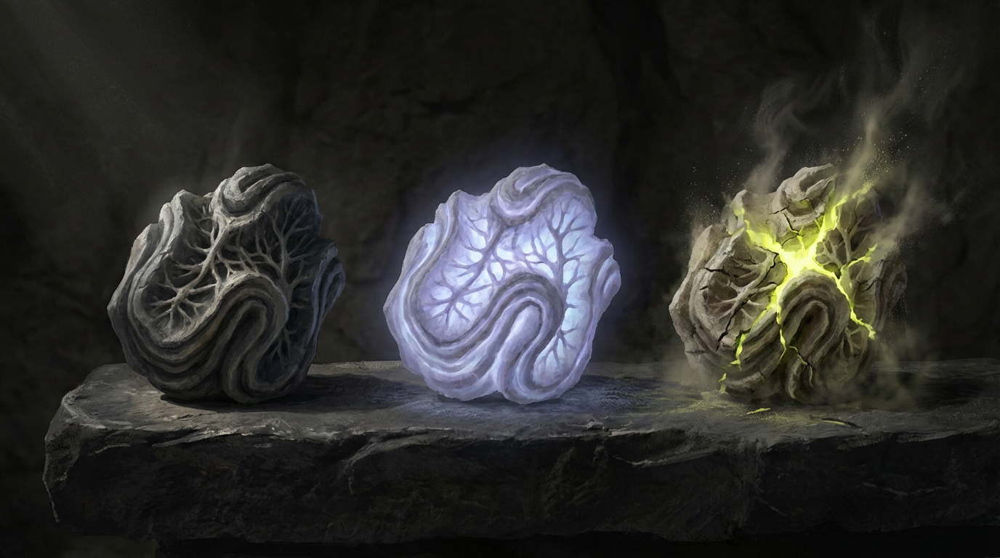

# WBB Kapitel 1 — Mythos

<!-- Emre: v4 — Tag 5, Finalisierung. Änderungen: (1) Bildpfade auf Pinnwand-Favoriten aktualisiert, (2) Gilden-Materialpalette eingefügt, (3) Relikt-Bilder (Drei-Zustände, Hero-Shot) in Schwellenanker-Abschnitt, (4) Orden-Symbol: Kreuz-Kommentar aktualisiert — CD-Entscheid: SIEGEL, (5) Ferne Dünnstelle bewusst vage gehalten (CD-Entscheid), (6) Kein neuer Inhalt — nur Finalisierung. -->

**RELICS: Schwellenanker — World Building Bible**
**Kapitel 1: Mythos**

---

## Vorbemerkung zur Methodik

Dieses Kapitel folgt Klastrup/Toscas (2004) Definition von *Mythos* als "das Hintergrundwissen, das man braucht, um Ereignisse in der Welt zu interpretieren." Es definiert die kosmologische Ordnung, den Ursprung des Schattenfiebers, die Natur des Tiervolks und die Schöpfungserzählungen der drei Fraktionen.

**Methodische Regel:** Es gibt EINE biologische Wahrheit hinter dem Schattenfieber. Die Fraktionen interpretieren diese Wahrheit verschieden. Das Kapitel stellt zuerst die Wahrheit dar (Autorenebene), dann die drei kulturellen Deutungen (Weltebene). Der Spieler erfährt die Wahrheit nie vollständig — er bewegt sich zwischen den Deutungen.

---

## 1. Die Schwelle — Kosmologische Ordnung

### 1.1 Die Struktur der Existenz

Die Welt von RELICS besteht aus zwei Existenzebenen:

**Die Diesseite** (*Stoffwelt*) — die materielle Realität, in der Menschen leben, sterben und bauen. Sie folgt erkennbaren Naturgesetzen. Materie hat Gewicht, Zeit hat Richtung, Körper haben Grenzen.

**Die Schwelle** (*das Jenseit*) — eine andere Existenzebene, die keine räumliche "Richtung" hat, sondern eher als Zustand beschrieben werden muss. Die Schwelle ist kein Ort, zu dem man reist. Sie ist eine Bedingung, die an manchen Stellen der Stoffwelt *näher* ist als an anderen. Wo die Schwelle nahe ist, werden die Gesetze der Stoffwelt porös: Materie verhält sich anders, Wahrnehmung verschiebt sich, die Grenze zwischen Selbst und Umgebung wird durchlässig.

Die Schwelle ist keine Hölle, kein Himmel, kein Geisterreich. Sie hat keine bekannte Absicht. Sie ist einfach *da* — wie Gravitation, wie Gezeiten. Aber sie ist fremd in einem Ausmaß, das menschliche Kategorien übersteigt.

### 1.2 Dünne Orte

Die Grenze zwischen Stoffwelt und Schwelle ist nicht überall gleich stark. Es gibt Stellen, an denen die Trennung dünner ist — sogenannte **dünne Orte** (*Dünnstellen*). An Dünnstellen treten Phänomene auf, die anderswo unmöglich wären:

- Mineralien bilden Kristallstrukturen, die keiner bekannten Geologie entsprechen
- Biolumineszenz tritt bei Organismen auf, die sonst nicht leuchten
- Menschen berichten von Wahrnehmungsverschiebungen: Echos ohne Quelle, Schatten ohne Werfer, das Gefühl beobachtet zu werden
- Flora wächst in Formen, die eher der Schwelle als der Stoffwelt zu gehorchen scheinen

Dünnstellen sind selten. Die meisten sind klein, flüchtig, unbedeutend. Aber es gibt eine Dünnstelle, die so groß und so beständig ist, dass eine ganze Zivilisation auf ihr errichtet wurde.

### 1.3 Die Yggdrasil-Analogie

<!-- Emre: Die germanische Mythologie-Inspiration ist Briefing-konform. Keine wörtliche Übernahme, sondern Strukturprinzip. -->

Die nordische Mythologie kennt Yggdrasil — den Weltenbaum, der neun Welten entlang einer vertikalen Achse verbindet. Oben Asgard (Ordnung, Macht), unten Niflheim (Dunkelheit, Ursprung). Die Bewegung zwischen oben und unten ist immer auch eine Bewegung zwischen Existenzformen.

RELICS übersetzt dieses Prinzip: Die Stadt ist auf einer massiven Dünnstelle gebaut. Die vertikale Achse der Stadt ist gleichzeitig eine kosmologische Achse. **Oben** bedeutet *größere Distanz zur Schwelle* — klarere Realität, festere Materie, stabilere Wahrnehmung. **Unten** bedeutet *größere Nähe zur Schwelle* — poröse Realität, fremde Materie, verschobene Wahrnehmung.

Das ist kein Zufall und keine Metapher. Es ist Geologie. Die Schwelle ist hier *unten* stärker, und die Stadt wurde so gebaut, dass Höhe Schutz bedeutet. Wer oben lebt, lebt sicherer. Wer unten lebt, ist dem Schattenfieber stärker ausgesetzt.

Die soziale Hierarchie (Krone und Gildenmeister oben, Slums unten) ist eine Konsequenz dieser kosmologischen Geographie — nicht ihre Ursache. Die Mächtigen klettern nicht nach oben, weil sie mächtig sind. Sie sind mächtig, weil ihre Vorfahren sich die sichersten Plätze gesichert haben.

### 1.4 Der dritte Faktor — Die Fremden

<!-- Emre: CD-Klärung Tag 4: Tiervolk = kosmologisch fremde Wesen, die in die Stoffwelt kamen und sich in Symbiose mit Tieren integrierten. NICHT Mutation, NICHT Schwellenexposition. W-004 geschlossen. -->

Die Kosmologie von RELICS kennt nicht nur zwei Pole. Neben Stoffwelt und Schwelle existiert ein dritter Faktor: **die Fremden**.

Die Fremden sind Wesen, deren Herkunft nicht in der Stoffwelt liegt — und nicht in der Schwelle, wie sie die Bewohner Schwarzrands kennen. Sie kamen von *woanders*. Ob aus einer anderen Dünnstelle, einer anderen Ebene jenseits der Schwelle oder einem Zustand, für den es keinen menschlichen Begriff gibt, ist unklar. Was feststeht: Sie sind da. Und sie sind geblieben.

**Die Symbiose:** Die Fremden kamen nicht als körperliche Wesen in die Stoffwelt. Sie integrierten sich in Tiere, die bereits hier lebten — eine Verschmelzung, die weder Parasitismus noch Besitz ist, sondern eine echte Symbiose. Das Wirtstier wird nicht übernommen, sondern *erweitert*: Seine Intelligenz steigt. Seine Physiologie verändert sich. Es entwickelt Fähigkeiten, die kein rein stoffweltliches Tier besitzen könnte. Im Gegenzug erhalten die Fremden das, was ihnen fehlte — einen Körper, der in der Stoffwelt existieren kann, eine materielle Verankerung, ein Zuhause.

Das Ergebnis dieser Symbiose ist das **Tiervolk**: Wesen, die äußerlich an die Wirtstierspezies erinnern, aber aufrecht gehen, sprechen, handeln und denken. Keine Tiere mit Menschenverstand. Keine Menschen in Tierkörpern. Sondern etwas Drittes — eine Existenzform, die es ohne die Begegnung zwischen Fremden und Stoffwelt-Fauna nie gegeben hätte.

**Kosmologische Bedeutung:** Das Tiervolk beweist, dass die Kosmologie komplexer ist als das Zweipolmodell Stoffwelt/Schwelle suggeriert. Es gibt *andere* Formen von Andersartigkeit als die Schwelle. Die Schwelle ist fremd und zerstörerisch (Schattenfieber). Die Fremden sind fremd und — in ihrer Symbiose — konstruktiv. Diese Unterscheidung ist fundamental: Nicht alles Unbekannte ist bedrohlich. Nicht jede Begegnung mit dem Anderen endet in Auflösung.

**Was das Tiervolk NICHT ist:**
- Nicht das Ergebnis von Schwellenexposition. Die Fremden haben mit dem Schattenfieber nichts gemeinsam.
- Nicht mutierte Tiere. Die Symbiose ist keine Krankheit, sondern eine Verbindung.
- Nicht "magisch". Die Symbiose folgt eigenen Gesetzmäßigkeiten, die die Bewohner Schwarzrands nicht verstehen, die aber konsistent sind.

<!-- Emre: Die Unterscheidung Fremde =/= Schwelle ist kosmologisch zentral. Das Tiervolk ist der Beweis, dass es mehr gibt als die bipolare Ordnung. Für den Spieler erzeugt das eine wichtige Irritation: Wenn die Fremden nicht von der Schwelle kommen — wovon dann? Und gibt es noch andere? -->

---

## 2. Schwarzrand — Die Stadt an der Schwelle

### 2.1 Der Name

Die Stadt heißt **Schwarzrand**.

Der Name verweist auf die sichtbare Schwellengrenze, die man an klaren Tagen von den oberen Ebenen der Stadt sehen kann — ein dunkler Schimmer am Horizont, wo die Stoffwelt in die Schwelle übergeht. Die Bewohner sagen: *"Wir leben am Rand des Schwarzen."* Im Volksmund wurde daraus *Schwarzrand*.

<!-- Emre: Der Name ist zweischichtig — geographische Beschreibung (Stadt am Rand von etwas Dunklem) und existenzielle Aussage (wir existieren an der Grenze). Die Silhouette der Stadt gegen einen dunklen Horizont ist das zentrale visuelle Motiv. -->

### 2.2 Geographische Lage

Schwarzrand liegt in einem tiefen Talkessel, der von steilen Felswänden umgeben ist. Die Stadt ist in die Felswände hineingebaut und klettert an ihnen empor — eine vertikale Siedlung, die sich von den tiefsten Kanälen und Kellern am Talboden bis zu den Kronplateaus an den Klippen erstreckt.

Der Talboden ist die Dünnstelle. Je tiefer man steigt, desto näher kommt man der Schwelle. Die Felswände sind das natürliche Schutzgerüst — Höhe ist hier buchstäblich Sicherheit.

Die Region erinnert an tiefe Flusstäler der Mittelgebirge — steile Hänge, dichter Wald an den Rändern, feuchtes Klima, häufiger Nebel. Der Nebel in Schwarzrand ist real, aber er vermischt sich in den unteren Ebenen mit Schwellenphänomenen, sodass niemand genau sagen kann, wo der gewöhnliche Dunst aufhört und das Fremde beginnt.

### 2.3 Die vertikale Ordnung

Schwarzrand gliedert sich grob in drei Höhenzonen:

| Zone | Bezeichnung | Bewohner | Schwellennähe |
|------|-------------|----------|---------------|
| **Obere Ränder** | *Die Krone*, *Gildengipfel* | Adel, Gildenmeister, Ordensführung | Gering — stabilste Realität |
| **Mittelwand** | *Der Gürtel* | Handwerker, Kaufleute, niederer Adel, Ordensbrüder | Moderat — gelegentliche Anomalien |
| **Tiefen** | *Der Schlund* | Tagelöhner, Gesetzlose, Schattenfieber-Betroffene, Tiervolk-Händler | Hoch — permanente Schwellenphänomene |

*Die Stadt verbirgt ihre Armut nicht nur sozial, sondern räumlich: Von den oberen Rändern sieht man den Schlund nicht. Er liegt im Nebel, im Dunkel, im Vergessen.*

---

## 3. Das Schattenfieber — Die eine Wahrheit

### 3.1 Biologische Realität (Autorenebene)

Das Schattenfieber ist **eine Infektion**. Es ist eine biologische Reaktion des Körpers auf ein fremdes Agens, das aus der Schwelle in die Stoffwelt eindringt.

Wo die Schwelle nahe ist, dringt eine Substanz in die Stoffwelt ein, die hier als **Schwellensubstrat** bezeichnet wird. Schwellensubstrat ist keine Materie im gewöhnlichen Sinn — es verhält sich wie ein Katalysator, der organisches Gewebe verändert, ohne selbst verbraucht zu werden. Es ist unsichtbar, geruchlos, und kann nur durch seine Wirkung nachgewiesen werden.

**Kontaminationsweg:** Schwellensubstrat wird eingeatmet, über die Haut aufgenommen oder über kontaminierte Nahrung und Wasser zugeführt. Es lagert sich bevorzugt im **Lymphsystem** ab — dem Netzwerk, das den Körper durchzieht und normalerweise für Immunabwehr zuständig ist.

**Transformation statt Zerstörung:** Das Schattenfieber zerstört den Körper nicht — es transformiert ihn. Die Art der Transformation variiert je nach individueller Körperreaktion. Kein Verlauf ist identisch. Manche entwickeln verstärkte Sinne, andere physische Veränderungen, wieder andere kognitive Verschiebungen. Die Infektion hat kein Ziel — sie ist ein biochemischer Prozess, der den Körper in etwas verwandelt, das teilweise der Stoffwelt und teilweise der Schwelle angehört.

<!-- Emre: CD-Klärung Tag 4: "Wie Infektion, transformiert je nach Körperreaktion." -->

### 3.2 Die drei Stufen

#### Stufe 1 — Sensorische Verschiebung (*Flüstern*)

**Biologie:** Schwellensubstrat hat sich im Lymphsystem abgelagert und beginnt, Nervenenden zu beeinflussen. Die Blut-Hirn-Schranke ist noch intakt, aber periphere Nerven reagieren verändert.

**Symptome:**
- Veränderte Sinneswahrnehmung: Farben wirken intensiver, Geräusche haben Nachklang, Gerüche werden synästhetisch (man "schmeckt" Metall, wenn man bestimmte Steine berührt)
- Kurze Momente der Schwellenwahrnehmung: Schatten bewegen sich einen Herzschlag zu spät, Reflexionen zeigen nicht ganz das Richtige
- Erhöhte Intuition — oder das, was sich so anfühlt. Betroffene "wissen" Dinge, die sie nicht wissen sollten

**Reversibilität:** Vollständig reversibel bei Entfernung von der Schwellenquelle. Symptome klingen innerhalb von Wochen ab. Lymphknoten schwellen vorübergehend an.

**Gesellschaftliche Wahrnehmung:** In den oberen Ebenen ein Skandal. Im Schlund alltäglich. Manche suchen Stufe 1 absichtlich auf — die erweiterte Wahrnehmung hat Nutzen für bestimmte Handwerke (Glasmacher berichten von besserer Farbwahrnehmung, Gerber von gesteigertem Tastsinn).

#### Stufe 2 — Mutative Transformation (*Wandlung*)

**Biologie:** Schwellensubstrat hat die Blut-Hirn-Schranke durchbrochen und beginnt, Gewebestruktur auf zellulärer Ebene zu verändern. Das Lymphsystem selbst mutiert — es wird zum Transportnetzwerk für Schwellensubstrat statt gegen es zu arbeiten.

**Symptome:**
- Sichtbare physische Veränderungen: Haut wird stellenweise transluzent, dunkle Adern werden sichtbar, Gelenke verformen sich
- Gewebe wird *fremd* — härter, elastischer oder biolumineszent, je nach individueller Körperreaktion. Keine zwei Fälle sind identisch
- Kognitive Veränderungen: Erinnerungen werden unzuverlässig. Betroffene können nicht mehr sicher unterscheiden, was sie erlebt und was sie "durch die Schwelle" wahrgenommen haben
- Physische Stärke und Ausdauer steigen — der Körper wird in mancher Hinsicht *besser*, aber auf Kosten seiner Menschlichkeit

**Reversibilität:** Nicht mehr heilbar. Managebar durch alchemistische Präparate, die das Schwellensubstrat im Lymphsystem binden (aber nicht entfernen). Diese Präparate sind teuer. Die Gilden kontrollieren die Zutaten.

**Gesellschaftliche Wahrnehmung:** Betroffene werden aus den oberen Ebenen verbannt. Im Schlund bilden sich Gemeinschaften von Stufe-2-Betroffenen — mit eigenen Hierarchien, eigenen Regeln. Manche sehen die Wandlung als Gabe. Die meisten als Fluch.

#### Stufe 3 — Auflösung (*Entgrenzung*)

**Biologie:** Die Grenze zwischen dem Gewebe des Betroffenen und dem Schwellensubstrat ist aufgelöst. Der Körper ist kein rein stoffweltliches Objekt mehr — er existiert teilweise in der Schwelle. Das Lymphsystem hat aufgehört, als abgrenzbares System zu funktionieren; es ist zum Medium geworden, durch das die Schwelle den Körper durchwirkt.

**Symptome:**
- Der Körper verliert seine feste Form zeitweise — Gliedmaßen werden transparent, lösen sich in Dunkelheit auf und reformieren sich
- Die Identität des Betroffenen fragmentiert. *Wer bin ich? Wo höre ich auf?* Diese Fragen haben keine Antwort mehr
- Betroffene "sehen" die Schwelle permanent — sie können nicht mehr zwischen Stoffwelt und Schwelle unterscheiden
- Manche werden zu etwas, das nur noch entfernt menschlich ist. Andere verschwinden einfach

**Reversibilität:** Irreversibel. Es gibt keine Rückkehr.

**Gesellschaftliche Wahrnehmung:** Furcht. Tiefe, stille, allgegenwärtige Furcht. Stufe-3-Betroffene sind der Grund, warum der Orden das Schattenfieber als göttliche Strafe deutet. Sie sind der Grund, warum die Krone Quarantänezonen durchsetzt. Und sie sind der Grund, warum die Gilden heimlich Substanzen sammeln, die bei der Entgrenzung entstehen — Materialien, die in keiner Schmiede der Stoffwelt erzeugt werden können.

### 3.3 Schattenfieber und Tiervolk — Die Abgrenzung

Das Schattenfieber ist eine Schwelleninfektion. Die Tiervolk-Symbiose ist keine Schwelleninfektion. Diese Unterscheidung ist nicht akademisch — sie hat politische Sprengkraft.

**Gemeinsamkeiten (oberflächlich):** Beide Phänomene verändern biologische Körper. Beide erzeugen Wesen, die nicht rein menschlich/tierisch sind. Beide wirken auf Unbeteiligte *fremd*.

**Unterschiede (fundamental):**
- Schattenfieber ist unkontrolliert, progressiv, potentiell zerstörerisch. Die Symbiose ist stabil und konstruktiv.
- Schattenfieber kommt von der Schwelle. Die Fremden kommen von *woanders*.
- Schattenfieber verändert den Befallenen gegen seinen Willen. Die Symbiose ist — soweit erkennbar — einvernehmlich.
- Schattenfieber endet im schlimmsten Fall in Auflösung. Die Symbiose endet in einer neuen, stabilen Existenzform.

**Die Verwechslung als politisches Werkzeug:** Der Orden behandelt beides als dasselbe — als Unreinheit, als Abweichung von der geschöpflichen Ordnung. Diese Gleichsetzung legitimiert die Marginalisierung des Tiervolks. Die Krone nutzt sie, um das Tiervolk als potentielle Bedrohung zu framen (was passiert, wenn die Symbiose *kippt*?). Nur die Gilden differenzieren pragmatisch — weil das Tiervolk nützliche Handelspartner sind und sich niemand leisten kann, profitable Beziehungen aus Vorurteil zu beenden.

### 3.4 Die Pest-Analogie als Designprinzip

Historisch war die Beulenpest eine reale biologische Krankheit. Aber die Erklärungen, die mittelalterliche Gesellschaften dafür fanden, verrieten mehr über die Erklärenden als über die Krankheit. Juden wurden beschuldigt. Astrologen deuteten Planetenkonstellationen. Flagellanten sahen Gottes Zorn. Die Krankheit war dieselbe. Die Deutungen waren Spiegel.

Das Schattenfieber funktioniert identisch. Die Biologie (Abschnitt 3.1–3.2) ist die eine Wahrheit. Die drei Schöpfungsmythen (Abschnitt 4) sind die Spiegel.

---

## 4. Drei Schöpfungsmythen — Drei Spiegel

Jede der drei Fraktionen hat eine eigene Kosmologie. Keine ist vollständig falsch. Keine ist vollständig wahr. Jede verrät mehr über die Fraktion, die sie erzählt, als über die Welt, die sie beschreibt.

### 4.1 Die Erzählung der Krone — *Das Erste Siegel*

> *"Im Anbeginn war die Welt ganz. Es gab kein Oben und kein Unten, keine Schwelle und keine Stoffwelt — nur das Eine, ungeteilt. Dann kam der Riss. Niemand weiß, warum. Aber die Welt zerbrach in zwei Hälften, und zwischen den Hälften lag das Schwarze.*
>
> *Die ersten Könige sahen den Riss und verstanden: Wenn das Schwarze nicht versiegelt wird, frisst es alles. Sie schmiedeten das Erste Siegel — ein Bündnis aus Blut und Stein, das die Grenze hielt. Die Königslinie IST das Siegel. Solange die Krone besteht, besteht die Grenze. Fällt die Krone, fällt die Welt."*

**Was die Erzählung verrät:** Die Krone legitimiert ihre Herrschaft kosmologisch. Monarchie ist kein politisches System — sie ist Naturgesetz. Die Krone hält die Welt zusammen. Wer die Krone angreift, gefährdet nicht nur die Ordnung, sondern die Existenz selbst.

**Was sie verschweigt:** Die Krone hat das Siegel nicht geschmiedet. Sie hat sich neben einem Phänomen angesiedelt, das sie nicht versteht, und dann behauptet, es zu kontrollieren.

**Kernfunktion:** Herrschaftslegitimation. Die Krone *braucht* das Schattenfieber als existenzielle Bedrohung, weil ohne Bedrohung kein Bedarf für einen Beschützer besteht.


Die Materialsprache der Krone spiegelt ihre Kosmologie: Schwarz als Farbe der Souveränität, Stahl als Manifestation der Grenze, Siegel aus Blut und Wachs als Bindungsritual. Jedes Material behauptet Kontrolle über das Unbeherrschbare. Die Krone trägt die Schwelle nicht auf der Haut — sie versiegelt sie.

### 4.2 Die Erzählung des Ordens — *Die Prüfung*

> *"Die Welt wurde geschaffen als Prüfung. Das Schwarze jenseits der Schwelle ist das, was existierte bevor die Schöpfung es ordnete. Es ist das Ungeformte, das Vorige, der Zustand vor aller Unterscheidung.*
>
> *Das Schattenfieber ist die Rückkehr des Ungeformten. Es tritt ein, wo die Seele schwach ist — wo Disziplin fehlt, wo Reinheit verloren ging. Nicht als Strafe, sondern als Konsequenz. So wie Wasser durch Risse in einer Mauer dringt, dringt das Ungeformte durch Risse im Geist.*
>
> *Der Orden bewahrt das Wissen, das die Schöpfung ordnete. Jede Schrift, die wir hüten, ist ein Baustein der Mauer. Wer liest, wer lernt, wer versteht — der schließt die Risse. Unwissenheit ist nicht harmlos. Unwissenheit ist ein offenes Tor."*

**Was die Erzählung verrät:** Der Orden verbindet Wissen mit kosmologischer Notwendigkeit. Sein Bildungsmonopol ist keine Machtgier — es ist Weltrettung. Wer dem Orden das Wissensmonopol entzieht, öffnet buchstäblich Tore zum Ungeformten.

**Was sie verschweigt:** Die "Reinheit der Seele" als Schutzmechanismus ist empirisch falsch. Das Schattenfieber befällt nicht die moralisch Schwachen — es befällt die geographisch Exponierten. Dass die Armen im Schlund stärker betroffen sind, liegt an der Schwellennähe, nicht an ihrer Seele. Aber diese Wahrheit würde den Orden seiner stärksten Kontrolltechnik berauben: der Schuldzuweisung.

**Kernfunktion:** Wissenslegitimation und soziale Kontrolle. Der Orden definiert, wer "rein" ist und wer nicht. Das Schattenfieber als moralisches Versagen zu deuten, erlaubt die Pathologisierung von Armut und Dissidenz.


<!-- Emre: CD-Entscheid Tag 5: Orden-Symbol = SIEGEL (nicht Kreuz). Orden ist keine christliche Institution. Siegel verweist auf Überwachung + Wissensmonopol. Entscheidung bestätigt. -->

Die Materialsprache des Ordens erzählt von Reinheit als Monopol: Weiß als Abwesenheit von Schwelleneinfluss, Glas als Instrument der Durchsicht (wer sieht, versteht; wer versteht, ist rein), Pergament als kodifizierte Ordnung. Das Siegel verweist auf Überwachung als theologische Pflicht. Der Orden sieht — und was er sieht, beurteilt er.

### 4.3 Die Erzählung der Gilden — *Der Rohstoff*

> *"Das Schwarze war schon immer da. Es ist kein Riss und keine Prüfung — es ist eine Ressource. So wie Erz in der Erde liegt und darauf wartet, verhüttet zu werden, liegt jenseits der Schwelle Material, das diese Welt nicht kennt.*
>
> *Das Schattenfieber ist der Preis des Abbaus. Bergleute bekommen Staublunge. Gerber bekommen Hautfäule. Wer am Schwarzen arbeitet, wird vom Schwarzen gezeichnet. Das ist tragisch, aber es ist nicht mystisch. Es ist Arbeit. Und Arbeit hat Kosten.*
>
> *Die Frage ist nicht, ob wir das Schwarze nutzen. Die Frage ist, wer den Preis zahlt — und wer den Gewinn einstreicht."*

**Was die Erzählung verrät:** Die Gilden entmystifizieren die Schwelle. Für sie ist das Schattenfieber ein Arbeitsrisiko, kein kosmisches Drama. Das ist pragmatisch, nüchtern — und zutiefst zynisch. Denn wer den Preis als "Arbeitskosten" framed, kann ihn auf andere abwälzen. Die Gilden brauchen das Schwellensubstrat für Materialien, die kein anderer Prozess erzeugt. Und die Arbeiter, die es abbauen, sind ersetzbar.

**Was sie verschweigt:** Die Gilden wissen mehr über die Schwelle als sie zugeben. Ihre Glasmacher haben Linsen geschliffen, durch die man Schwellensubstrat sehen kann. Ihre Schmiede haben Legierungen erzeugt, die nur unter Schwelleneinfluss möglich sind. Dieses Wissen ist ihr wertvollstes Kapital — und es ist streng geheim.

**Kernfunktion:** Profitlegitimation. Die Schwelle als Rohstoffquelle zu behandeln, erlaubt Ausbeutung ohne schlechtes Gewissen. Der Preis wird externalisiert, der Gewinn privatisiert.


Die Materialsprache der Gilden spiegelt ihre Kosmologie: Erdtöne als Zeichen nüchterner Bodenhaftung, Bronze und Werkzeugstahl als Werkzeuge der Aneignung, Leder als Arbeitshaut. Kein Material behauptet Transzendenz — alles ist Mittel zum Zweck. Die Gilden schmücken sich nicht mit der Schwelle. Sie verarbeiten sie.

### 4.4 Die Wahrheit zwischen den Spiegeln

Keine der drei Erzählungen ist die Wahrheit. Aber jede enthält Fragmente:

- Die Krone hat recht, dass es eine Grenze gibt, die gehalten werden muss
- Der Orden hat recht, dass Wissen Schutz bietet (wer die Biologie versteht, kann sich schützen)
- Die Gilden haben recht, dass die Schwelle Material produziert, das nutzbar ist

Und keine der drei Erzählungen weiß, was sie mit dem Tiervolk anfangen soll — denn das Tiervolk passt in kein Narrativ. Es ist nicht bedrohlich genug für die Krone. Es ist nicht unrein genug für den Orden. Und es ist zu eigenständig für die Gilden. Das Tiervolk ist der kosmologische Rest, der in keinem Spiegel ganz auftaucht.

Der Spieler wird im Verlauf des Spiels Fragmente aller drei Erzählungen sammeln — und muss selbst entscheiden, was er glaubt. Es gibt keinen Moment, in dem ein NPC sagt: "Und so war es wirklich." Die Wahrheit ist eine Arbeit, die der Spieler leisten muss.

---

## 5. Der historische Wendepunkt — Die Seuche und die Öffnung

<!-- Emre: v3 — Zeitlinie mit Covid-Analogie. W-006 geschlossen. v4: Ferne Dünnstelle bewusst VAGE — CD-Entscheid Tag 5: keine konkreten Namen, keine konkreten Orte. -->

### 5.1 Die lange Anbahnung

Das Schattenfieber kam nicht über Nacht. Es bahnte sich **über Jahrzehnte** an — ein langsames Anschwellen, das die meisten erst bemerkten, als es zu spät war.

**Vor Generationen:** An weit entfernten Dünnstellen — jenseits der Handelsrouten, in Regionen, die Schwarzrand nur vom Hörensagen kennt — begannen erste Berichte über "seltsame Krankheiten" zu kursieren. Händler erzählten von Siedlungen, in denen die Bewohner sich veränderten. Von Orten, die über Nacht aufgegeben wurden. Die Berichte waren vage, widersprüchlich, leicht abzutun. Schwarzrand lag weit genug weg, um sich sicher zu fühlen.

<!-- Emre: CD-Entscheid Tag 5: Die ferne Dünnstelle bleibt VAGE. Keine konkreten Namen, keine konkreten Orte. Details offen für zukünftige Iterationen der RELICS-Serie. -->

**Vor einer Generation:** In einer entfernten Region kam es zu einem **großen Ausbruch**. Eine Siedlung an einer größeren Dünnstelle wurde vom Schattenfieber überrollt. Tausende betroffen, Hunderte in Stufe 2 oder darüber, die Siedlung faktisch aufgegeben. Flüchtlinge brachten Geschichten mit, die man nicht vergisst. Schwarzrand reagierte mit mildem Interesse und Achselzucken: tragisch, aber fern.

**Gleichzeitig in Schwarzrand:** Die Dünnstelle unter der Stadt war stabil — *zu* stabil, wie manche sagten. Die Ankerkammer lag versiegelt, der Schwellenanker hielt die Grenze. Das Schattenfieber existierte als seltene Kuriosität der tiefsten Ebenen. Gelegentlich ein Arbeiter, der Symptome zeigte. Gelegentlich ein Ordensbruder, der zu tief forschte. Nichts, worüber man sprach.

### 5.2 Die Öffnung

Im tiefsten Punkt von Schwarzrand, weit unterhalb des Schlunds, existiert eine natürliche Formation, die als **Ankerkammer** bekannt ist. Dort ist die Grenze zwischen Stoffwelt und Schwelle am dünnsten. Jahrhundertelang war die Ankerkammer versiegelt — nicht durch Magie, sondern durch massive Steinarchitektur, die die frühesten Bewohner errichtet hatten. Sie verstanden nicht, *was* sie versiegelten, aber sie verstanden, dass es versiegelt bleiben musste.

Vor etwa fünfundzwanzig Jahren öffnete eine Koalition die Ankerkammer.

**Wer** es getan hat, ist offiziell umstritten. Die Autorenwahrheit: Alle drei Fraktionen waren beteiligt. Ein Ordensgelehrter lieferte das Wissen. Eine Gildenexpedition lieferte die Mittel. Ein Kronbeauftragter gab die Genehmigung. Jeder glaubte, die Situation kontrollieren zu können. Keiner konnte es. Die Koalition zerbrach in dem Moment, als die Konsequenzen sichtbar wurden, und seither beschuldigt jede Fraktion die anderen.

**Was danach geschah:** Der Schwellenanker wurde aus seiner Position entfernt. Die Dünnstelle verlor ihren Stabilisator. Schwellensubstrat begann unkontrolliert durchzusickern — nicht explosionsartig, sondern schleichend, wie steigendes Grundwasser. Erst die tiefsten Kanäle. Dann der Schlund. Dann die unteren Gürtel-Ebenen.

### 5.3 Die Covid-Analogie als Zeitlinie

Das Schattenfieber in Schwarzrand folgt derselben Eskalationslogik wie eine Pandemie:

| Phase | Zeitraum | Analogie |
|-------|----------|----------|
| **Ferne Berichte** | Jahrzehnte vor Spielbeginn | Erste Fälle weit weg — abstrakt, ignorierbar |
| **Großer Ausbruch anderswo** | ~25 Jahre vor Spielbeginn | Schockierend, aber noch "deren Problem" |
| **Die Öffnung** | ~25 Jahre vor Spielbeginn | Lokaler Superspreader-Event — die Ankerkammer wird geöffnet |
| **Langsame Eskalation** | 25 Jahre bis Spielbeginn | Schattenfieber breitet sich nach oben aus, Normalität erodiert |
| **Akute Krise** | Spielbeginn | Zweite Welle: Die Fälle steigen wieder. Angst kehrt zurück. |

**Zum Zeitpunkt des Spielbeginns** hat sich Schwarzrand an das Schattenfieber *gewöhnt* — so wie Gesellschaften sich an Pandemien gewöhnen. Der Schlund ist Quarantänezone. Der Gürtel lebt mit gelegentlichen Fällen. Die Oberen Ränder tun so, als gäbe es kein Problem. Aber jetzt steigen die Zahlen wieder. Neue Fälle im Gürtel. Gerüchte über Stufe-2-Betroffene in den Oberen Rändern. Das Gefühl, dass etwas kippt.

### 5.4 Der Schwellenanker

In der Ankerkammer fanden die Expeditionsteilnehmer etwas. Ein Objekt, das an der Grenze zwischen Stoffwelt und Schwelle existiert. Es ist nicht ganz Materie und nicht ganz *nicht* Materie.

**Der Schwellenanker ist ein Grenzstabilisator.**

In seiner natürlichen Position — eingebettet in die Ankerkammer — hielt er die Grenze stabil. Nicht geschlossen, nicht geöffnet, sondern in einem Gleichgewicht. Die alten Bewohner hatten die Kammer nicht versiegelt, um den Schwellenanker *einzusperren*, sondern um ihn *ungestört* arbeiten zu lassen.

Die Expedition entfernte den Schwellenanker aus seiner Position. In diesem Moment verlor die Dünnstelle ihren Stabilisator, und die Schwelle begann unkontrolliert durchzusickern.



Der Schwellenanker existiert in mindestens drei wahrnehmbaren Zuständen: **ruhend** (in der Ankerkammer, stabilisierend — kaum sichtbar, eher spürbar), **resonant** (reagierend auf Schwellennähe oder Kontaktpersonen — Kontur wird sichtbar, kaltes blau-violettes Leuchten) und **aktiviert** (vollständige Interaktion mit der Schwelle — instabil, gefährlich, faszinierend). Die Übergänge zwischen den Zuständen sind fließend und nicht vollständig verstanden.


Im aktivierten Zustand wird der Schwellenanker zum visuellen Brennpunkt der Kosmologie: ein Objekt, das gleichzeitig in der Stoffwelt und in der Schwelle existiert, dessen Licht kalt und fremd ist — nicht die Wärme einer Kerze, sondern das Leuchten einer Quallenkolonie in der Tiefsee. Beide leuchten. Nur eines davon ist für den Betrachter gedacht.


<!-- Emre: CD bestätigt (Tag 3): Spieler darf Fragment des Schwellenankers ablehnen. Kein konkretes Wirbelsäule-Artefakt. Der Schwellenanker ist kein Gegenstand, den man "benutzt" — er ist eine Verantwortung, der man sich stellt oder entzieht. -->

**Das Resonanz-Dreieck:**

```
          Spieler
         /        \
        /          \
   Schwellen-    Schwelle
    anker
```

- **Schwellenanker — Schwelle:** Der Schwellenanker reguliert den Durchfluss. Ohne ihn in der Kammer fließt Schwellensubstrat unkontrolliert.
- **Spieler — Schwellenanker:** Der Schwellenanker reagiert auf den Spieler — möglicherweise wegen dessen eigenem Schattenfieber-Status. Je höher die Kontamination, desto stärker die Resonanz.
- **Spieler — Schwelle:** Der Spieler nimmt die Schwelle je nach Schattenfieber-Stufe anders wahr. Was er sieht, was er fühlt, was er für real hält — alles verschiebt sich.

**Wo ist der Schwellenanker jetzt?** Unbekannt. Er wurde aus der Kammer genommen und ist seither verschwunden. Die drei Fraktionen suchen ihn. Die Hauptquest dreht sich um diese Suche.

---

## 6. Gilden-Monopolstruktur — Die Materialherren

### 6.1 Organisationsprinzip

Die Gilden von Schwarzrand sind keine mittelalterlichen Handwerkervereinigungen. Sie sind **Monopolisten**, die vertikale Kontrolle über ganze Versorgungsketten ausüben — vom Rohstoff über die Verarbeitung bis zum Verkauf. Sie funktionieren als Megacorporations in mittelalterlicher Verpackung.

Jede Gilde kontrolliert:
- **Rohstoffzugang** (Minen, Zulieferer, Handelsrouten)
- **Verarbeitungswissen** (geheime Rezepturen, patentierte Techniken)
- **Vertrieb** (wer kaufen darf, zu welchem Preis, unter welchen Bedingungen)
- **Ausbildung** (Lehrlinge werden vertraglich gebunden, Wissen ist nicht frei)

### 6.2 Die großen Gilden von Schwarzrand

| Gilde | Monopol | Schwellenverbindung | Machtinstrument |
|-------|---------|---------------------|-----------------|
| **Schmiede-Gilde** | Tiegelstahl, Legierungen, Waffen | Schwellenlegierungen — Metalle, die nur unter Schwelleneinfluss verschmelzen | Militärische Abhängigkeit: Die Krone braucht Waffen |
| **Glasmacher-Gilde** | Optische Instrumente, Linsen | Schwellenlinsen — Glas, das Schwellensubstrat sichtbar macht | Informationsmonopol: Kontamination messen, Dünnstellen kartieren |
| **Weber-Gilde** | Textilien, Färbetechnik | Schwellenfäden — biolumineszente, selbstreparierende Fasern | Statusmonopol: Schwellentextilien demonstrieren Reichtum |
| **Gerber-Gilde** | Leder, Panzerung, Abwasser | Kontrolliert die Kanäle im Schlund | Infrastrukturmonopol: Zugang zu den tiefsten Dünnstellen |
| **Goldschmiede-Gilde** | Edelmetall, Emaille, Bankwesen | Schwellenmetalle für unfälschbare Siegeltechnik | Finanzmonopol |
| **Kerzenzieher & Seifensieder** | Beleuchtung, Talg, Wachs | Schwellentalg — brennt bläulich, vertreibt Schwellenphänomene | Alltagsmonopol: Beleuchtung ist existenziell |
| **Pergamenter & Buchbinder** | Schreibmaterial | Liefern das Material für alles gespeicherte Wissen | Schnittstelle Gilden/Orden |
| **Steinmetze** | Architektur, Gewölbetechnik | Kenntnis der geologischen Strukturen | Wissensmonopol: Geheime Baupläne |

### 6.3 Schwellenwirtschaft — Das dreckige Geheimnis

Die offizielle Position aller Gilden: Schwellenmaterialien sind gefährlich, selten und werden nur unter strengsten Sicherheitsvorkehrungen verarbeitet.

Die Realität: Schwarzrand lebt von der Schwelle. Die gesamte wirtschaftliche Sonderstellung der Stadt liegt in den Materialien, die nirgendwo sonst existieren.

**Die Gilden externalisieren die Kosten.** Die Arbeiter, die Schwellenmaterialien abbauen, leben im Schlund. Sie sind arm, oft bereits kontaminiert, und haben keine Verhandlungsmacht. Die Materialien werden in den Mittelwand-Werkstätten veredelt und in den oberen Rändern verkauft. Der Profit steigt; das Risiko bleibt unten.

**Der Orden toleriert es stillschweigend.** Die Ordensführung weiß, dass die Gilden Schwellenmaterialien nutzen. Aber ein offener Konflikt würde die wirtschaftliche Basis der Stadt zerstören. Also predigt der Orden Reinheit — und kauft Schwellenlinsen für seine eigenen Bibliotheken.

**Die Krone profitiert.** Schwellenlegierungs-Waffen sind der Grund, warum Schwarzrands Garnison trotz leerer Kassen schlagkräftig bleibt. Die Krone verurteilt die Gilden offiziell und bestellt heimlich.

Diese Dreier-Heuchelei ist das politische Fundament von Schwarzrand. Alle drei Fraktionen predigen Wasser und trinken Wein. Der Spieler wird dieses Netz aus Scheinheiligkeit aufdecken — und muss entscheiden, ob er es ausspielt, vertuscht oder ignoriert.

---

<!-- Emre: Widerspruchs-Log — finale Version v4.

| Nr. | Betrifft | Widerspruch/Frage | Status |
|-----|----------|-------------------|--------|
| W-001 | Schwellensubstrat | Substanz oder Bedingung? Aktuell als Katalysator beschrieben. | Bewusst offen — erlaubt narrative Ambiguität |
| W-002 | Stufe 1 → 2 Kippmoment | Zeitbasiert, dosisbasiert oder individuell? CD sagt "je nach Körperreaktion" — individuell. | Designentscheidung: individuell. Darius implementiert |
| W-003 | Biotech-Flora/Fauna | In Kap. 2 (Topos) definiert. Schwellenadaption als Prinzip. | Geschlossen |
| W-004 | Tiervolk | Kosmologisch fremde Wesen in Symbiose mit Tieren. NICHT Schwellenexposition. | Geschlossen (v3) |
| W-005 | Schwellenanker-Physik | Heißt Schwellenanker, keine Wirbelsäulenform. Drei Zustände visualisiert. | Geschlossen (v4) |
| W-006 | Zeitlinie | Covid-Analogie. Ferne Dünnstelle bewusst VAGE (CD-Entscheid Tag 5). | Geschlossen (v3/v4) |
| W-007 | Lichttemperatur Schwellenanker | Blau-violett, nicht warm. Quallen-Analogie. In Bildunterschriften verankert (v4). | Geschlossen (v4) |

-->

<!-- Emre: Wolf-Infrastruktur-Checkliste — finale Version v4.

| Infrastruktur | Abgedeckt? | Verweis |
|---|---|---|
| Karten | Teilweise | Vertikale Ordnung, Dünnstellen. Detailkarten in Kap. 2 |
| Zeitleisten | Ja | Covid-Analogie-Zeitlinie (5.3), Öffnung (5.2) |
| Genealogien | Nein | Kap. 3 (Ethos) |
| Natur | Teilweise | Schwellenflora/-fauna angedeutet, Details in Kap. 2 |
| Kultur | Ja | Materialsprache, Gildenstruktur, Fraktionskosmologien, Fraktionspaletten |
| Sprache | Minimal | Schwarzrand, Dünnstellen, Flüstern/Wandlung/Entgrenzung |
| Mythologie | Ja | Drei Schöpfungsmythen, Kosmologie, Schwelle, Tiervolk-Kosmologie |
| Philosophie | Ja | Materialismus (Gilden), Providentialismus (Orden), Souveränismus (Krone) |
| Verknüpfung | Ja | Schwelle → Schattenfieber → Gilden → Politik → Architektur → Tiervolk |

-->
